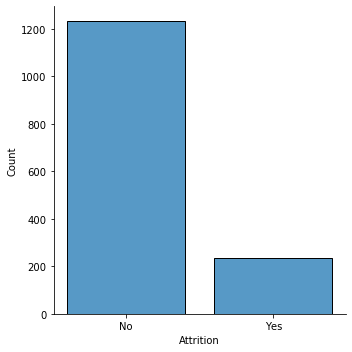
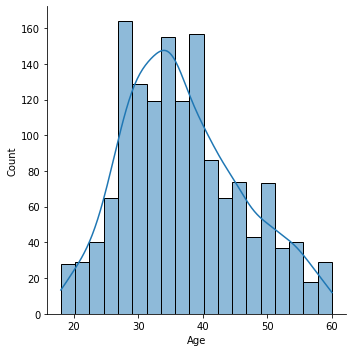
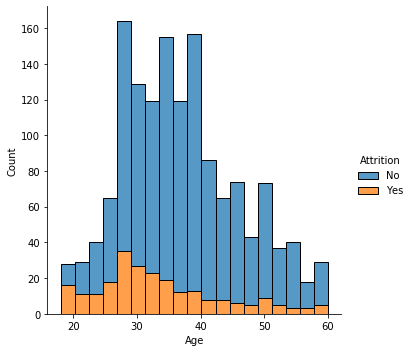
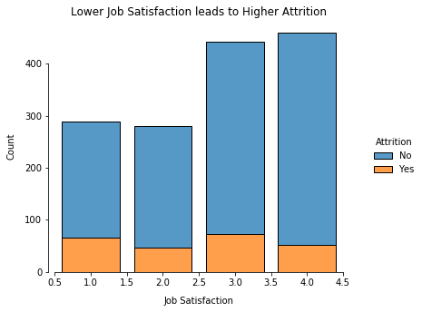
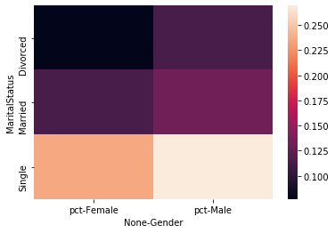
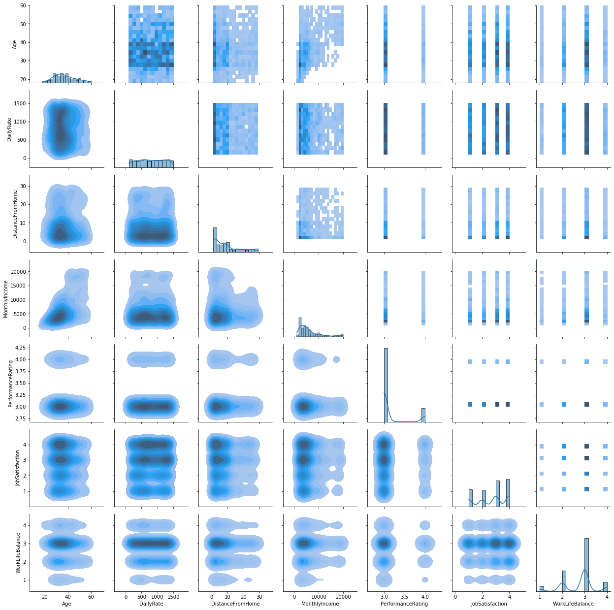
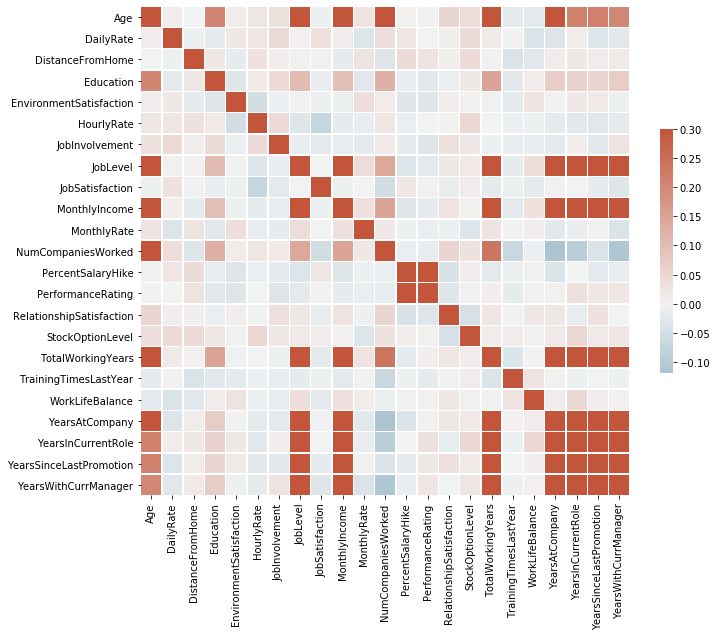
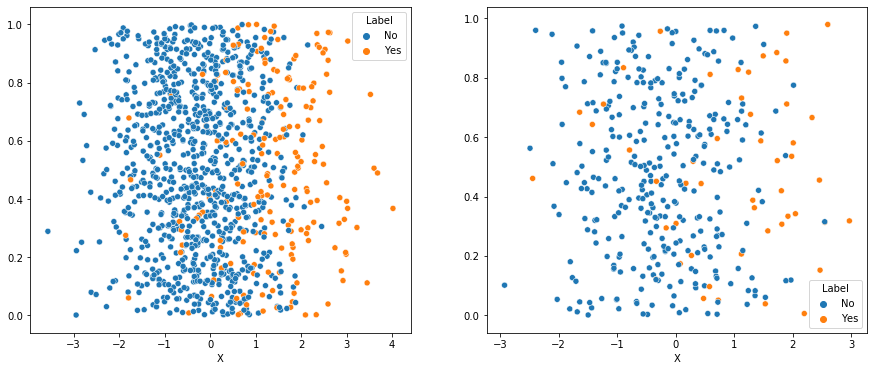
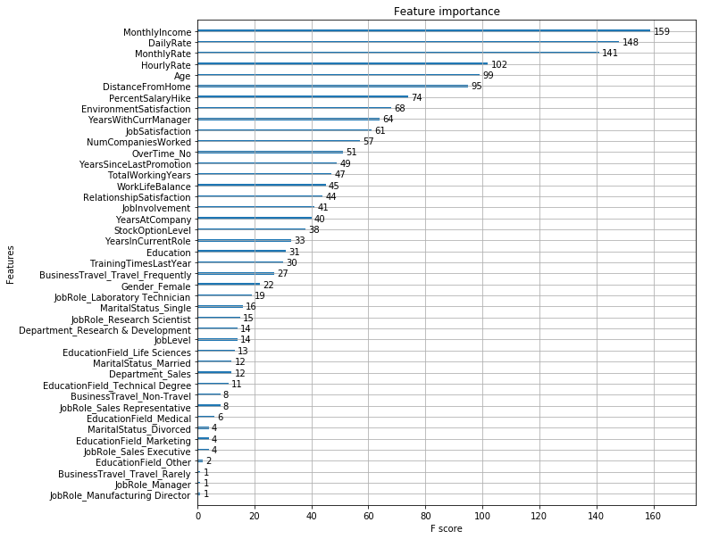

# HR Churn Analysis

This is me fiddling around with an employee attrition dataset on my last few days at PNC.

## Description

Uncover the factors that lead to employee attrition and explore important questions such as ‘show me a breakdown of distance from home by job role and attrition’ or ‘compare average monthly income by education and attrition’. This is a fictional data set created by IBM data scientists.

Education
1 'Below College'
2 'College'
3 'Bachelor'
4 'Master'
5 'Doctor'

EnvironmentSatisfaction
1 'Low'
2 'Medium'
3 'High'
4 'Very High'

JobInvolvement
1 'Low'
2 'Medium'
3 'High'
4 'Very High'

JobSatisfaction
1 'Low'
2 'Medium'
3 'High'
4 'Very High'

PerformanceRating
1 'Low'
2 'Good'
3 'Excellent'
4 'Outstanding'


RelationshipSatisfaction
1 'Low'
2 'Medium'
3 'High'
4 'Very High'

WorkLifeBalance
1 'Bad'
2 'Good'
3 'Better'
4 'Best'

## Libraries


```python
import pandas as pd
import numpy as np
import matplotlib.pyplot as plt
import plotly.express as px
import seaborn as sns
import sklearn

from IPython.core.interactiveshell import InteractiveShell
InteractiveShell.ast_node_interactivity = 'all'
%load_ext autoreload
```

## Read in Data


```python
df = pd.read_csv('ibm_attrition_file.csv').sort_values('Attrition')

df.head()
df.shape
df.dtypes

sns.displot(df, x='Attrition', shrink = .8)
```


<div>
<style scoped>
    .dataframe tbody tr th:only-of-type {
        vertical-align: middle;
    }

    .dataframe tbody tr th {
        vertical-align: top;
    }

    .dataframe thead th {
        text-align: right;
    }
</style>
<table border="1" class="dataframe">
  <thead>
    <tr style="text-align: right;">
      <th></th>
      <th>Age</th>
      <th>Attrition</th>
      <th>BusinessTravel</th>
      <th>DailyRate</th>
      <th>Department</th>
      <th>DistanceFromHome</th>
      <th>Education</th>
      <th>EducationField</th>
      <th>EmployeeCount</th>
      <th>EmployeeNumber</th>
      <th>...</th>
      <th>RelationshipSatisfaction</th>
      <th>StandardHours</th>
      <th>StockOptionLevel</th>
      <th>TotalWorkingYears</th>
      <th>TrainingTimesLastYear</th>
      <th>WorkLifeBalance</th>
      <th>YearsAtCompany</th>
      <th>YearsInCurrentRole</th>
      <th>YearsSinceLastPromotion</th>
      <th>YearsWithCurrManager</th>
    </tr>
  </thead>
  <tbody>
    <tr>
      <th>734</th>
      <td>22</td>
      <td>No</td>
      <td>Travel_Rarely</td>
      <td>217</td>
      <td>Research &amp; Development</td>
      <td>8</td>
      <td>1</td>
      <td>Life Sciences</td>
      <td>1</td>
      <td>1019</td>
      <td>...</td>
      <td>1</td>
      <td>80</td>
      <td>1</td>
      <td>4</td>
      <td>3</td>
      <td>2</td>
      <td>4</td>
      <td>3</td>
      <td>1</td>
      <td>1</td>
    </tr>
    <tr>
      <th>949</th>
      <td>39</td>
      <td>No</td>
      <td>Travel_Rarely</td>
      <td>524</td>
      <td>Research &amp; Development</td>
      <td>18</td>
      <td>2</td>
      <td>Life Sciences</td>
      <td>1</td>
      <td>1322</td>
      <td>...</td>
      <td>1</td>
      <td>80</td>
      <td>0</td>
      <td>9</td>
      <td>6</td>
      <td>3</td>
      <td>8</td>
      <td>7</td>
      <td>1</td>
      <td>7</td>
    </tr>
    <tr>
      <th>948</th>
      <td>30</td>
      <td>No</td>
      <td>Travel_Rarely</td>
      <td>634</td>
      <td>Research &amp; Development</td>
      <td>17</td>
      <td>4</td>
      <td>Medical</td>
      <td>1</td>
      <td>1321</td>
      <td>...</td>
      <td>4</td>
      <td>80</td>
      <td>2</td>
      <td>9</td>
      <td>2</td>
      <td>3</td>
      <td>9</td>
      <td>1</td>
      <td>0</td>
      <td>8</td>
    </tr>
    <tr>
      <th>945</th>
      <td>50</td>
      <td>No</td>
      <td>Travel_Rarely</td>
      <td>1322</td>
      <td>Research &amp; Development</td>
      <td>28</td>
      <td>3</td>
      <td>Life Sciences</td>
      <td>1</td>
      <td>1317</td>
      <td>...</td>
      <td>2</td>
      <td>80</td>
      <td>0</td>
      <td>25</td>
      <td>2</td>
      <td>3</td>
      <td>3</td>
      <td>2</td>
      <td>1</td>
      <td>2</td>
    </tr>
    <tr>
      <th>944</th>
      <td>28</td>
      <td>No</td>
      <td>Non-Travel</td>
      <td>1476</td>
      <td>Research &amp; Development</td>
      <td>1</td>
      <td>3</td>
      <td>Life Sciences</td>
      <td>1</td>
      <td>1315</td>
      <td>...</td>
      <td>1</td>
      <td>80</td>
      <td>3</td>
      <td>10</td>
      <td>6</td>
      <td>3</td>
      <td>9</td>
      <td>8</td>
      <td>7</td>
      <td>5</td>
    </tr>
  </tbody>
</table>
<p>5 rows × 35 columns</p>
</div>


    (1470, 35)


    Age                          int64
    Attrition                   object
    BusinessTravel              object
    DailyRate                    int64
    Department                  object
    DistanceFromHome             int64
    Education                    int64
    EducationField              object
    EmployeeCount                int64
    EmployeeNumber               int64
    EnvironmentSatisfaction      int64
    Gender                      object
    HourlyRate                   int64
    JobInvolvement               int64
    JobLevel                     int64
    JobRole                     object
    JobSatisfaction              int64
    MaritalStatus               object
    MonthlyIncome                int64
    MonthlyRate                  int64
    NumCompaniesWorked           int64
    Over18                      object
    OverTime                    object
    PercentSalaryHike            int64
    PerformanceRating            int64
    RelationshipSatisfaction     int64
    StandardHours                int64
    StockOptionLevel             int64
    TotalWorkingYears            int64
    TrainingTimesLastYear        int64
    WorkLifeBalance              int64
    YearsAtCompany               int64
    YearsInCurrentRole           int64
    YearsSinceLastPromotion      int64
    YearsWithCurrManager         int64
    dtype: object


    <seaborn.axisgrid.FacetGrid at 0x7ffca1cf6510>


    

    


## EDA

I first look at some features that might be important in the dataset.

### Attrition by Age

Attrition rates are higher among younger employees.


```python
sns.displot(
    df.Age,
    kde = True
)
```


    <seaborn.axisgrid.FacetGrid at 0x7ffc9e629ed0>


    

    


```python
sns.displot(data=df, x="Age", hue="Attrition", multiple="stack")
```


    <seaborn.axisgrid.FacetGrid at 0x7ffca2c9f410>


    

    


### Job Satisfaction

Lower job satisfaction unsurprisingly yields a higher attrition rate although perhaps not as high as one might expect.


```python
g = sns.displot(
    data = df,
    x = 'JobSatisfaction',
    hue = 'Attrition',
    multiple = 'stack',
    discrete=True,
    shrink = .8
    )

g.set_axis_labels("Job Satisfaction", "Count", labelpad=10)
g.set(title="Lower Job Satisfaction leads to Higher Attrition")
g.fig.set_size_inches(6.5, 4.5)
g.despine(trim=True)
```


    <seaborn.axisgrid.FacetGrid at 0x7ffca3e423d0>


    <seaborn.axisgrid.FacetGrid at 0x7ffca3e423d0>


    <seaborn.axisgrid.FacetGrid at 0x7ffca3e423d0>


    

    

### Gender and Marital Status

Single men and women are more likely to leave the company but age may be a confounder. Men are slightly more likely to leave than women.


```python
df_new = df.copy()
df_new['Attr'] = df_new['Attrition'].apply(lambda x: 1 if x == 'Yes' else 0)
df_new['Count'] = 1
df_new_group = df_new.groupby(['Gender', 'MaritalStatus'])[['Attr', 'Count']].sum()
df_new_group['pct'] = df_new_group['Attr'] / df_new_group['Count']

df_heat = df_new_group.reset_index()[['Gender','MaritalStatus','pct']]\
    .pivot('MaritalStatus', 'Gender')

sns.heatmap(
    data=df_heat
)

```


    <matplotlib.axes._subplots.AxesSubplot at 0x7ffca5c05c10>


    

    


### Correlation Plots


```python
df_num = df[df.columns[df.dtypes == 'int64']][['Age', 'DailyRate', 'DistanceFromHome',\
                                              'MonthlyIncome', 'PerformanceRating', 'JobSatisfaction', \
                                             'WorkLifeBalance']]


g = sns.PairGrid(df_num)
g.map_upper(sns.histplot)
g.map_lower(sns.kdeplot, fill=True)
g.map_diag(sns.histplot, kde=True)
```


    <seaborn.axisgrid.PairGrid at 0x7ffca5c05cd0>


    <seaborn.axisgrid.PairGrid at 0x7ffca5c05cd0>


    <seaborn.axisgrid.PairGrid at 0x7ffca5c05cd0>


    

    

Many features are correlated although no features have a higher correlation than 0.3 or less than -0.1.


```python
df_heat = df[df.columns[df.dtypes == 'int64']]\
    .drop(['EmployeeCount', 'EmployeeNumber', 'StandardHours'], axis=1)

corr = df_heat.corr()

# Set up the matplotlib figure
f, ax = plt.subplots(figsize=(11, 9))

# Generate a custom diverging colormap
cmap = sns.diverging_palette(230, 20, as_cmap=True)

# Draw the heatmap with the mask and correct aspect ratio
sns.heatmap(corr,  cmap=cmap, vmax=.3, center=0,
            square=True, linewidths=.5, cbar_kws={"shrink": .5})
```


    <matplotlib.axes._subplots.AxesSubplot at 0x7ffca7201b10>


    

    


## Predictive Analytics - LDA

Linear Discriminant Analysis (LDA) is a feature reduction method for data with discrete classes. It is like PCA except that it takes advantage of information about the classification in the training data. It projects data into fewer dimensions by maximizing both the mean distance between the median data point of each class and minimizing the "spread" within each class.

```python
# Drop columns with no information
df.columns
df_clean = df.drop(['EmployeeCount', 'EmployeeNumber', 'StandardHours', 'Over18'], axis=1)
df_clean['Attrition'] = df_clean['Attrition'].apply(lambda x: 1 if x == 'Yes' else 0)
```


    Index(['Age', 'Attrition', 'BusinessTravel', 'DailyRate', 'Department',
           'DistanceFromHome', 'Education', 'EducationField', 'EmployeeCount',
           'EmployeeNumber', 'EnvironmentSatisfaction', 'Gender', 'HourlyRate',
           'JobInvolvement', 'JobLevel', 'JobRole', 'JobSatisfaction',
           'MaritalStatus', 'MonthlyIncome', 'MonthlyRate', 'NumCompaniesWorked',
           'Over18', 'OverTime', 'PercentSalaryHike', 'PerformanceRating',
           'RelationshipSatisfaction', 'StandardHours', 'StockOptionLevel',
           'TotalWorkingYears', 'TrainingTimesLastYear', 'WorkLifeBalance',
           'YearsAtCompany', 'YearsInCurrentRole', 'YearsSinceLastPromotion',
           'YearsWithCurrManager'],
          dtype='object')


### Encode Features


```python
df_objs = df_clean.columns[df_clean.dtypes == 'object']

df_clean[df_objs]
df_enc = pd.get_dummies(df_clean, prefix = df_objs)
df_enc['Attrition'] = df_clean['Attrition'].apply(lambda x: 'Yes' if x == 1 else 'No')
df_enc.head()
```


<div>
<style scoped>
    .dataframe tbody tr th:only-of-type {
        vertical-align: middle;
    }

    .dataframe tbody tr th {
        vertical-align: top;
    }

    .dataframe thead th {
        text-align: right;
    }
</style>
<table border="1" class="dataframe">
  <thead>
    <tr style="text-align: right;">
      <th></th>
      <th>BusinessTravel</th>
      <th>Department</th>
      <th>EducationField</th>
      <th>Gender</th>
      <th>JobRole</th>
      <th>MaritalStatus</th>
      <th>OverTime</th>
    </tr>
  </thead>
  <tbody>
    <tr>
      <th>734</th>
      <td>Travel_Rarely</td>
      <td>Research &amp; Development</td>
      <td>Life Sciences</td>
      <td>Male</td>
      <td>Laboratory Technician</td>
      <td>Married</td>
      <td>No</td>
    </tr>
    <tr>
      <th>949</th>
      <td>Travel_Rarely</td>
      <td>Research &amp; Development</td>
      <td>Life Sciences</td>
      <td>Male</td>
      <td>Manufacturing Director</td>
      <td>Single</td>
      <td>No</td>
    </tr>
    <tr>
      <th>948</th>
      <td>Travel_Rarely</td>
      <td>Research &amp; Development</td>
      <td>Medical</td>
      <td>Female</td>
      <td>Manager</td>
      <td>Married</td>
      <td>Yes</td>
    </tr>
    <tr>
      <th>945</th>
      <td>Travel_Rarely</td>
      <td>Research &amp; Development</td>
      <td>Life Sciences</td>
      <td>Female</td>
      <td>Research Director</td>
      <td>Married</td>
      <td>Yes</td>
    </tr>
    <tr>
      <th>944</th>
      <td>Non-Travel</td>
      <td>Research &amp; Development</td>
      <td>Life Sciences</td>
      <td>Female</td>
      <td>Laboratory Technician</td>
      <td>Married</td>
      <td>No</td>
    </tr>
    <tr>
      <th>...</th>
      <td>...</td>
      <td>...</td>
      <td>...</td>
      <td>...</td>
      <td>...</td>
      <td>...</td>
      <td>...</td>
    </tr>
    <tr>
      <th>370</th>
      <td>Travel_Rarely</td>
      <td>Sales</td>
      <td>Life Sciences</td>
      <td>Female</td>
      <td>Sales Representative</td>
      <td>Single</td>
      <td>No</td>
    </tr>
    <tr>
      <th>1036</th>
      <td>Travel_Frequently</td>
      <td>Research &amp; Development</td>
      <td>Life Sciences</td>
      <td>Male</td>
      <td>Laboratory Technician</td>
      <td>Married</td>
      <td>Yes</td>
    </tr>
    <tr>
      <th>1033</th>
      <td>Travel_Frequently</td>
      <td>Research &amp; Development</td>
      <td>Life Sciences</td>
      <td>Female</td>
      <td>Manufacturing Director</td>
      <td>Single</td>
      <td>No</td>
    </tr>
    <tr>
      <th>1057</th>
      <td>Travel_Frequently</td>
      <td>Sales</td>
      <td>Technical Degree</td>
      <td>Female</td>
      <td>Sales Executive</td>
      <td>Single</td>
      <td>No</td>
    </tr>
    <tr>
      <th>0</th>
      <td>Travel_Rarely</td>
      <td>Sales</td>
      <td>Life Sciences</td>
      <td>Female</td>
      <td>Sales Executive</td>
      <td>Single</td>
      <td>Yes</td>
    </tr>
  </tbody>
</table>
<p>1470 rows × 7 columns</p>
</div>


<div>
<style scoped>
    .dataframe tbody tr th:only-of-type {
        vertical-align: middle;
    }

    .dataframe tbody tr th {
        vertical-align: top;
    }

    .dataframe thead th {
        text-align: right;
    }
</style>
<table border="1" class="dataframe">
  <thead>
    <tr style="text-align: right;">
      <th></th>
      <th>Age</th>
      <th>Attrition</th>
      <th>DailyRate</th>
      <th>DistanceFromHome</th>
      <th>Education</th>
      <th>EnvironmentSatisfaction</th>
      <th>HourlyRate</th>
      <th>JobInvolvement</th>
      <th>JobLevel</th>
      <th>JobSatisfaction</th>
      <th>...</th>
      <th>JobRole_Manufacturing Director</th>
      <th>JobRole_Research Director</th>
      <th>JobRole_Research Scientist</th>
      <th>JobRole_Sales Executive</th>
      <th>JobRole_Sales Representative</th>
      <th>MaritalStatus_Divorced</th>
      <th>MaritalStatus_Married</th>
      <th>MaritalStatus_Single</th>
      <th>OverTime_No</th>
      <th>OverTime_Yes</th>
    </tr>
  </thead>
  <tbody>
    <tr>
      <th>734</th>
      <td>22</td>
      <td>No</td>
      <td>217</td>
      <td>8</td>
      <td>1</td>
      <td>2</td>
      <td>94</td>
      <td>1</td>
      <td>1</td>
      <td>1</td>
      <td>...</td>
      <td>0</td>
      <td>0</td>
      <td>0</td>
      <td>0</td>
      <td>0</td>
      <td>0</td>
      <td>1</td>
      <td>0</td>
      <td>1</td>
      <td>0</td>
    </tr>
    <tr>
      <th>949</th>
      <td>39</td>
      <td>No</td>
      <td>524</td>
      <td>18</td>
      <td>2</td>
      <td>1</td>
      <td>32</td>
      <td>3</td>
      <td>2</td>
      <td>3</td>
      <td>...</td>
      <td>1</td>
      <td>0</td>
      <td>0</td>
      <td>0</td>
      <td>0</td>
      <td>0</td>
      <td>0</td>
      <td>1</td>
      <td>1</td>
      <td>0</td>
    </tr>
    <tr>
      <th>948</th>
      <td>30</td>
      <td>No</td>
      <td>634</td>
      <td>17</td>
      <td>4</td>
      <td>2</td>
      <td>95</td>
      <td>3</td>
      <td>3</td>
      <td>1</td>
      <td>...</td>
      <td>0</td>
      <td>0</td>
      <td>0</td>
      <td>0</td>
      <td>0</td>
      <td>0</td>
      <td>1</td>
      <td>0</td>
      <td>0</td>
      <td>1</td>
    </tr>
    <tr>
      <th>945</th>
      <td>50</td>
      <td>No</td>
      <td>1322</td>
      <td>28</td>
      <td>3</td>
      <td>4</td>
      <td>43</td>
      <td>3</td>
      <td>4</td>
      <td>1</td>
      <td>...</td>
      <td>0</td>
      <td>1</td>
      <td>0</td>
      <td>0</td>
      <td>0</td>
      <td>0</td>
      <td>1</td>
      <td>0</td>
      <td>0</td>
      <td>1</td>
    </tr>
    <tr>
      <th>944</th>
      <td>28</td>
      <td>No</td>
      <td>1476</td>
      <td>1</td>
      <td>3</td>
      <td>3</td>
      <td>55</td>
      <td>1</td>
      <td>2</td>
      <td>4</td>
      <td>...</td>
      <td>0</td>
      <td>0</td>
      <td>0</td>
      <td>0</td>
      <td>0</td>
      <td>0</td>
      <td>1</td>
      <td>0</td>
      <td>1</td>
      <td>0</td>
    </tr>
  </tbody>
</table>
<p>5 rows × 52 columns</p>
</div>


### Split and Normalize Data


```python
import sklearn.preprocessing as sp
import sklearn.model_selection as skms
train, test = skms.train_test_split(df_enc, random_state=42)
trainY, testY = train.Attrition, test.Attrition
trainX, testX = train.drop(['Attrition'], axis=1), test.drop(['Attrition'], axis=1)

df_objs = df_clean.columns[df_clean.dtypes == 'object']

df_clean[df_objs]
df_enc = pd.get_dummies(df_clean, prefix = df_objs)
df_enc.head()

scaler = sp.StandardScaler().fit(trainX)
scale_train = scaler.transform(trainX)
scale_test = scaler.transform(testX)
```


<div>
<style scoped>
    .dataframe tbody tr th:only-of-type {
        vertical-align: middle;
    }

    .dataframe tbody tr th {
        vertical-align: top;
    }

    .dataframe thead th {
        text-align: right;
    }
</style>
<table border="1" class="dataframe">
  <thead>
    <tr style="text-align: right;">
      <th></th>
      <th>BusinessTravel</th>
      <th>Department</th>
      <th>EducationField</th>
      <th>Gender</th>
      <th>JobRole</th>
      <th>MaritalStatus</th>
      <th>OverTime</th>
    </tr>
  </thead>
  <tbody>
    <tr>
      <th>734</th>
      <td>Travel_Rarely</td>
      <td>Research &amp; Development</td>
      <td>Life Sciences</td>
      <td>Male</td>
      <td>Laboratory Technician</td>
      <td>Married</td>
      <td>No</td>
    </tr>
    <tr>
      <th>949</th>
      <td>Travel_Rarely</td>
      <td>Research &amp; Development</td>
      <td>Life Sciences</td>
      <td>Male</td>
      <td>Manufacturing Director</td>
      <td>Single</td>
      <td>No</td>
    </tr>
    <tr>
      <th>948</th>
      <td>Travel_Rarely</td>
      <td>Research &amp; Development</td>
      <td>Medical</td>
      <td>Female</td>
      <td>Manager</td>
      <td>Married</td>
      <td>Yes</td>
    </tr>
    <tr>
      <th>945</th>
      <td>Travel_Rarely</td>
      <td>Research &amp; Development</td>
      <td>Life Sciences</td>
      <td>Female</td>
      <td>Research Director</td>
      <td>Married</td>
      <td>Yes</td>
    </tr>
    <tr>
      <th>944</th>
      <td>Non-Travel</td>
      <td>Research &amp; Development</td>
      <td>Life Sciences</td>
      <td>Female</td>
      <td>Laboratory Technician</td>
      <td>Married</td>
      <td>No</td>
    </tr>
    <tr>
      <th>...</th>
      <td>...</td>
      <td>...</td>
      <td>...</td>
      <td>...</td>
      <td>...</td>
      <td>...</td>
      <td>...</td>
    </tr>
    <tr>
      <th>370</th>
      <td>Travel_Rarely</td>
      <td>Sales</td>
      <td>Life Sciences</td>
      <td>Female</td>
      <td>Sales Representative</td>
      <td>Single</td>
      <td>No</td>
    </tr>
    <tr>
      <th>1036</th>
      <td>Travel_Frequently</td>
      <td>Research &amp; Development</td>
      <td>Life Sciences</td>
      <td>Male</td>
      <td>Laboratory Technician</td>
      <td>Married</td>
      <td>Yes</td>
    </tr>
    <tr>
      <th>1033</th>
      <td>Travel_Frequently</td>
      <td>Research &amp; Development</td>
      <td>Life Sciences</td>
      <td>Female</td>
      <td>Manufacturing Director</td>
      <td>Single</td>
      <td>No</td>
    </tr>
    <tr>
      <th>1057</th>
      <td>Travel_Frequently</td>
      <td>Sales</td>
      <td>Technical Degree</td>
      <td>Female</td>
      <td>Sales Executive</td>
      <td>Single</td>
      <td>No</td>
    </tr>
    <tr>
      <th>0</th>
      <td>Travel_Rarely</td>
      <td>Sales</td>
      <td>Life Sciences</td>
      <td>Female</td>
      <td>Sales Executive</td>
      <td>Single</td>
      <td>Yes</td>
    </tr>
  </tbody>
</table>
<p>1470 rows × 7 columns</p>
</div>


<div>
<style scoped>
    .dataframe tbody tr th:only-of-type {
        vertical-align: middle;
    }

    .dataframe tbody tr th {
        vertical-align: top;
    }

    .dataframe thead th {
        text-align: right;
    }
</style>
<table border="1" class="dataframe">
  <thead>
    <tr style="text-align: right;">
      <th></th>
      <th>Age</th>
      <th>Attrition</th>
      <th>DailyRate</th>
      <th>DistanceFromHome</th>
      <th>Education</th>
      <th>EnvironmentSatisfaction</th>
      <th>HourlyRate</th>
      <th>JobInvolvement</th>
      <th>JobLevel</th>
      <th>JobSatisfaction</th>
      <th>...</th>
      <th>JobRole_Manufacturing Director</th>
      <th>JobRole_Research Director</th>
      <th>JobRole_Research Scientist</th>
      <th>JobRole_Sales Executive</th>
      <th>JobRole_Sales Representative</th>
      <th>MaritalStatus_Divorced</th>
      <th>MaritalStatus_Married</th>
      <th>MaritalStatus_Single</th>
      <th>OverTime_No</th>
      <th>OverTime_Yes</th>
    </tr>
  </thead>
  <tbody>
    <tr>
      <th>734</th>
      <td>22</td>
      <td>0</td>
      <td>217</td>
      <td>8</td>
      <td>1</td>
      <td>2</td>
      <td>94</td>
      <td>1</td>
      <td>1</td>
      <td>1</td>
      <td>...</td>
      <td>0</td>
      <td>0</td>
      <td>0</td>
      <td>0</td>
      <td>0</td>
      <td>0</td>
      <td>1</td>
      <td>0</td>
      <td>1</td>
      <td>0</td>
    </tr>
    <tr>
      <th>949</th>
      <td>39</td>
      <td>0</td>
      <td>524</td>
      <td>18</td>
      <td>2</td>
      <td>1</td>
      <td>32</td>
      <td>3</td>
      <td>2</td>
      <td>3</td>
      <td>...</td>
      <td>1</td>
      <td>0</td>
      <td>0</td>
      <td>0</td>
      <td>0</td>
      <td>0</td>
      <td>0</td>
      <td>1</td>
      <td>1</td>
      <td>0</td>
    </tr>
    <tr>
      <th>948</th>
      <td>30</td>
      <td>0</td>
      <td>634</td>
      <td>17</td>
      <td>4</td>
      <td>2</td>
      <td>95</td>
      <td>3</td>
      <td>3</td>
      <td>1</td>
      <td>...</td>
      <td>0</td>
      <td>0</td>
      <td>0</td>
      <td>0</td>
      <td>0</td>
      <td>0</td>
      <td>1</td>
      <td>0</td>
      <td>0</td>
      <td>1</td>
    </tr>
    <tr>
      <th>945</th>
      <td>50</td>
      <td>0</td>
      <td>1322</td>
      <td>28</td>
      <td>3</td>
      <td>4</td>
      <td>43</td>
      <td>3</td>
      <td>4</td>
      <td>1</td>
      <td>...</td>
      <td>0</td>
      <td>1</td>
      <td>0</td>
      <td>0</td>
      <td>0</td>
      <td>0</td>
      <td>1</td>
      <td>0</td>
      <td>0</td>
      <td>1</td>
    </tr>
    <tr>
      <th>944</th>
      <td>28</td>
      <td>0</td>
      <td>1476</td>
      <td>1</td>
      <td>3</td>
      <td>3</td>
      <td>55</td>
      <td>1</td>
      <td>2</td>
      <td>4</td>
      <td>...</td>
      <td>0</td>
      <td>0</td>
      <td>0</td>
      <td>0</td>
      <td>0</td>
      <td>0</td>
      <td>1</td>
      <td>0</td>
      <td>1</td>
      <td>0</td>
    </tr>
  </tbody>
</table>
<p>5 rows × 52 columns</p>
</div>


### Cross Validation Training


```python
import sklearn.discriminant_analysis as sda
import sklearn.metrics as sm

from sklearn.model_selection import cross_val_score
from sklearn.model_selection import RepeatedStratifiedKFold

model = sda.LinearDiscriminantAnalysis()

# model.fit(scale_train, trainY)
# define model evaluation method
cv = RepeatedStratifiedKFold(n_splits=10, n_repeats=3, random_state=42)
# evaluate model
scores = cross_val_score(model, scale_train, trainY, scoring='accuracy', cv=cv, n_jobs=2)
# summarize result
scores

print('Mean Accuracy: %.3f (%.3f)' % (np.mean(scores), np.std(scores)))

model.fit(scale_train, trainY)

test_preds = model.predict(scale_test)

```


    array([0.84684685, 0.87387387, 0.86363636, 0.88181818, 0.85454545,
           0.89090909, 0.89090909, 0.85454545, 0.90909091, 0.88181818,
           0.86486486, 0.87387387, 0.88181818, 0.88181818, 0.85454545,
           0.81818182, 0.89090909, 0.88181818, 0.86363636, 0.9       ,
           0.91891892, 0.87387387, 0.89090909, 0.85454545, 0.82727273,
           0.88181818, 0.84545455, 0.88181818, 0.89090909, 0.87272727])


    Mean Accuracy: 0.873 (0.022)


    LinearDiscriminantAnalysis(n_components=None, priors=None, shrinkage=None,
                               solver='svd', store_covariance=False, tol=0.0001)


### Quick evaluation on test set


```python
model = sda.LinearDiscriminantAnalysis()
model.fit(scale_train, trainY)

test_preds = model.predict(scale_test)
sm.confusion_matrix(test_preds, testY)
print(f'Test Accuracy: {round(sm.accuracy_score(test_preds, testY),3)*100}%')
```


    LinearDiscriminantAnalysis(n_components=None, priors=None, shrinkage=None,
                               solver='svd', store_covariance=False, tol=0.0001)


    array([[310,  30],
           [  8,  20]])


    Test Accuracy: 89.7%


### Extract Feature Importances


```python
lda_features = pd.DataFrame(data={'Feature': trainX.columns, 'Contribution':model.coef_[0], 'abs_cont': np.abs(model.coef_[0])})\
    .sort_values('abs_cont', ascending = False)[['Feature', 'Contribution']]

```

The test accuracy is actually even higher than the cross validated training accuracy

### Visualize in one dimension

The accuracy is pretty high even reducing everything down to just one dimension which is pretty impressive. I show with some jitter below.


```python
fitted_model = model.fit(scale_train, trainY)

one_d_train = fitted_model.transform(scale_train)
one_d_train = pd.DataFrame(one_d_train, columns = ['X'])
one_d_train['Label'] = trainY.values

jitter = np.random.random(one_d_train.shape[0])

fig, axs = plt.subplots(ncols=2)

fig.set_size_inches(15, 6)
# df['korisnika'].plot(ax=axs[0])
# df['osiguranika'].plot(ax=axs[1])

sns.scatterplot(data=one_d_train, x = 'X', y=jitter,  hue="Label", hue_order = ['No', 'Yes'], ax = axs[0])

one_d_test = fitted_model.transform(scale_test)
one_d_test = pd.DataFrame(one_d_test, columns = ['X'])
one_d_test['Label'] = testY.values

jitter = np.random.random(one_d_test.shape[0])

sns.scatterplot(data=one_d_test, x = 'X', y=jitter,  hue="Label", hue_order = ['No', 'Yes'], ax = axs[1])

```


    <matplotlib.axes._subplots.AxesSubplot at 0x7ffca2b77490>


    <matplotlib.axes._subplots.AxesSubplot at 0x7ffca58f45d0>


    

    


### But how does this compare to XGBoost?


```python
from xgboost import XGBClassifier
from xgboost import plot_importance

model = XGBClassifier()
model.fit(trainX, trainY)

train_xgb_preds = model.predict(trainX)
test_xgb_preds = model.predict(testX)

sm.confusion_matrix(train_xgb_preds, trainY)
print(f'Test Accuracy: {round(sm.accuracy_score(train_xgb_preds, trainY),3)*100}%')

sm.confusion_matrix(test_xgb_preds, testY)
print(f'Test Accuracy: {round(sm.accuracy_score(test_xgb_preds, testY),3)*100}%')
```

    XGBClassifier(base_score=0.5, booster='gbtree', colsample_bylevel=1,
                  colsample_bynode=1, colsample_bytree=1, gamma=0, gpu_id=-1,
                  importance_type='gain', interaction_constraints='',
                  learning_rate=0.300000012, max_delta_step=0, max_depth=6,
                  min_child_weight=1, missing=nan, monotone_constraints='()',
                  n_estimators=100, n_jobs=4, num_parallel_tree=1,
                  objective='binary:logistic', random_state=0, reg_alpha=0,
                  reg_lambda=1, scale_pos_weight=1, subsample=1,
                  tree_method='exact', use_label_encoder=True,
                  validate_parameters=1, verbosity=None)


    array([[915,   0],
           [  0, 187]])


    Test Accuracy: 100.0%


    array([[311,  35],
           [  7,  15]])


    Test Accuracy: 88.6%


Untrained, XGBoost classifies the training data perfectly but is actually outperformed by LDA on the test data. I suspect a simple grid search would amerliorate this. First, however I want to compare the feature imporance in the two jobs.


```python
ax = plot_importance(model)
fig = ax.figure
fig.set_size_inches(10, 10)

```


    

    


```python
lda_features
```


<div>
<style scoped>
    .dataframe tbody tr th:only-of-type {
        vertical-align: middle;
    }

    .dataframe tbody tr th {
        vertical-align: top;
    }

    .dataframe thead th {
        text-align: right;
    }
</style>
<table border="1" class="dataframe">
  <thead>
    <tr style="text-align: right;">
      <th></th>
      <th>Feature</th>
      <th>Contribution</th>
    </tr>
  </thead>
  <tbody>
    <tr>
      <th>50</th>
      <td>OverTime_Yes</td>
      <td>0.507787</td>
    </tr>
    <tr>
      <th>49</th>
      <td>OverTime_No</td>
      <td>-0.507787</td>
    </tr>
    <tr>
      <th>4</th>
      <td>EnvironmentSatisfaction</td>
      <td>-0.491681</td>
    </tr>
    <tr>
      <th>45</th>
      <td>JobRole_Sales Representative</td>
      <td>0.489383</td>
    </tr>
    <tr>
      <th>11</th>
      <td>NumCompaniesWorked</td>
      <td>0.487821</td>
    </tr>
    <tr>
      <th>8</th>
      <td>JobSatisfaction</td>
      <td>-0.445302</td>
    </tr>
    <tr>
      <th>6</th>
      <td>JobInvolvement</td>
      <td>-0.417925</td>
    </tr>
    <tr>
      <th>21</th>
      <td>YearsSinceLastPromotion</td>
      <td>0.389570</td>
    </tr>
    <tr>
      <th>16</th>
      <td>TotalWorkingYears</td>
      <td>-0.380487</td>
    </tr>
    <tr>
      <th>22</th>
      <td>YearsWithCurrManager</td>
      <td>-0.299832</td>
    </tr>
    <tr>
      <th>48</th>
      <td>MaritalStatus_Single</td>
      <td>0.295092</td>
    </tr>
    <tr>
      <th>18</th>
      <td>WorkLifeBalance</td>
      <td>-0.284870</td>
    </tr>
    <tr>
      <th>2</th>
      <td>DistanceFromHome</td>
      <td>0.262430</td>
    </tr>
    <tr>
      <th>0</th>
      <td>Age</td>
      <td>-0.254437</td>
    </tr>
    <tr>
      <th>14</th>
      <td>RelationshipSatisfaction</td>
      <td>-0.252732</td>
    </tr>
    <tr>
      <th>20</th>
      <td>YearsInCurrentRole</td>
      <td>-0.251739</td>
    </tr>
    <tr>
      <th>41</th>
      <td>JobRole_Manufacturing Director</td>
      <td>-0.241343</td>
    </tr>
    <tr>
      <th>24</th>
      <td>BusinessTravel_Travel_Frequently</td>
      <td>0.238570</td>
    </tr>
    <tr>
      <th>23</th>
      <td>BusinessTravel_Non-Travel</td>
      <td>-0.219165</td>
    </tr>
    <tr>
      <th>37</th>
      <td>JobRole_Healthcare Representative</td>
      <td>-0.215543</td>
    </tr>
    <tr>
      <th>15</th>
      <td>StockOptionLevel</td>
      <td>-0.199956</td>
    </tr>
    <tr>
      <th>43</th>
      <td>JobRole_Research Scientist</td>
      <td>-0.195798</td>
    </tr>
    <tr>
      <th>19</th>
      <td>YearsAtCompany</td>
      <td>0.193145</td>
    </tr>
    <tr>
      <th>17</th>
      <td>TrainingTimesLastYear</td>
      <td>-0.191518</td>
    </tr>
    <tr>
      <th>39</th>
      <td>JobRole_Laboratory Technician</td>
      <td>0.184980</td>
    </tr>
    <tr>
      <th>42</th>
      <td>JobRole_Research Director</td>
      <td>-0.179125</td>
    </tr>
    <tr>
      <th>38</th>
      <td>JobRole_Human Resources</td>
      <td>0.176008</td>
    </tr>
    <tr>
      <th>47</th>
      <td>MaritalStatus_Married</td>
      <td>-0.157675</td>
    </tr>
    <tr>
      <th>29</th>
      <td>EducationField_Human Resources</td>
      <td>0.153075</td>
    </tr>
    <tr>
      <th>27</th>
      <td>Department_Research &amp; Development</td>
      <td>0.144829</td>
    </tr>
    <tr>
      <th>34</th>
      <td>EducationField_Technical Degree</td>
      <td>0.144608</td>
    </tr>
    <tr>
      <th>26</th>
      <td>Department_Human Resources</td>
      <td>-0.139333</td>
    </tr>
    <tr>
      <th>46</th>
      <td>MaritalStatus_Divorced</td>
      <td>-0.137834</td>
    </tr>
    <tr>
      <th>9</th>
      <td>MonthlyIncome</td>
      <td>0.136029</td>
    </tr>
    <tr>
      <th>7</th>
      <td>JobLevel</td>
      <td>-0.122578</td>
    </tr>
    <tr>
      <th>36</th>
      <td>Gender_Male</td>
      <td>0.105500</td>
    </tr>
    <tr>
      <th>35</th>
      <td>Gender_Female</td>
      <td>-0.105500</td>
    </tr>
    <tr>
      <th>44</th>
      <td>JobRole_Sales Executive</td>
      <td>0.094384</td>
    </tr>
    <tr>
      <th>1</th>
      <td>DailyRate</td>
      <td>-0.091678</td>
    </tr>
    <tr>
      <th>33</th>
      <td>EducationField_Other</td>
      <td>-0.090564</td>
    </tr>
    <tr>
      <th>28</th>
      <td>Department_Sales</td>
      <td>-0.089418</td>
    </tr>
    <tr>
      <th>12</th>
      <td>PercentSalaryHike</td>
      <td>-0.086685</td>
    </tr>
    <tr>
      <th>32</th>
      <td>EducationField_Medical</td>
      <td>-0.086016</td>
    </tr>
    <tr>
      <th>13</th>
      <td>PerformanceRating</td>
      <td>0.065262</td>
    </tr>
    <tr>
      <th>25</th>
      <td>BusinessTravel_Travel_Rarely</td>
      <td>-0.056734</td>
    </tr>
    <tr>
      <th>5</th>
      <td>HourlyRate</td>
      <td>-0.051925</td>
    </tr>
    <tr>
      <th>31</th>
      <td>EducationField_Marketing</td>
      <td>0.049313</td>
    </tr>
    <tr>
      <th>30</th>
      <td>EducationField_Life Sciences</td>
      <td>-0.031653</td>
    </tr>
    <tr>
      <th>40</th>
      <td>JobRole_Manager</td>
      <td>-0.028730</td>
    </tr>
    <tr>
      <th>3</th>
      <td>Education</td>
      <td>-0.025777</td>
    </tr>
    <tr>
      <th>10</th>
      <td>MonthlyRate</td>
      <td>0.009458</td>
    </tr>
  </tbody>
</table>
</div>


Interestingly LDA shows the monthly and hourly rates having some of the lowest feature importance while XGBoost has them among the highest.
