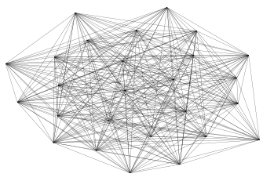
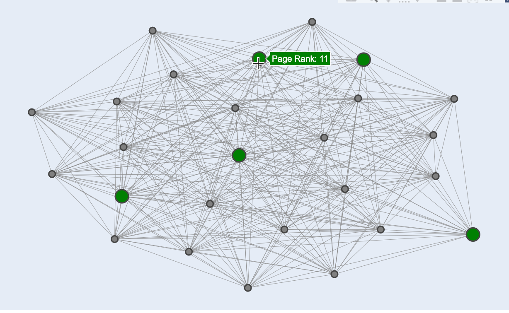

I will occassionally look around Stackoverflow for questions I can answer to practice coding and explaining my solutions. The other day,I was searching around and saw a NetworkX question. Having some experience with network analysis (although much more with iGraph), I figured I'd try my hand at answering it. Another person beat me to the post, but at his encouragement I added my own spin on it using Plotly. So, if you find yourself struggling to plot a coherent network graph, read on!

## Question


**Does anyone know how to color the top 20 nodes over the rest of the nodes in NetworkX? I would like to color the top 20 nodes with green and the rest with gray. However, the output only shows gray because the green nodes were under the gray nodes. Would it be possible to make those green nodes over the gray nodes? In addition, would it be possible to show the top 20 green nodes to be sized in 20 and the rest of gray nodes to be sized in 10? Currently, all the nodes are sized in 10.**

## Answer

If you're ok using a non networkx package, you can do what you're asking to do with Plotly, which gives the added benefit of interactivity:


### Import packages and set up minimum reproducible example


```python
import pandas as pd
import numpy as np
import networkx as nx
import matplotlib.pyplot as plt
import plotly.graph_objects as go
import string

df = pd.DataFrame({'ID': list(string.ascii_uppercase),
                   'PageRank': np.random.randint(10, 100, len(string.ascii_uppercase))})

edges = pd.DataFrame({'from': np.random.choice(list(string.ascii_uppercase), 1000),
                      'to': np.random.choice(list(string.ascii_uppercase), 1000)})

G = nx.from_pandas_edgelist(edges, source='from', target='to')
pos = nx.spring_layout(G)
lc = nx.draw_networkx_edges(G, pos, width=0.2)
lc
plt.ylim(-1,1)
plt.xlim(-1,1)
plt.axis('off')
```


    (-1.0, 1.0, -1.0, 1.0)


    

    


### Capture attributes 
Ok so far not a particularly exciting graph, let's see if we can do the request on make it more exciting with plotly. Two starting steps:

1. Separate top 5 nodes and rest of nodes by page rank
2. Set page rank as an attribute for nodes. We'll use this to add a tooltip


```python
# Separate 
top_5_lst = df.sort_values('PageRank')['ID'].head(5).tolist()
not_top_5_lst = df.loc[~df['ID'].isin(top_5_lst), 'ID'].tolist()

# Set as attribute
rank_dict = dict(zip(df.ID, df.PageRank))
for entry in rank_dict:
    rank_dict[entry] = {'Page Rank': rank_dict[entry]}
    
nx.set_node_attributes(G, rank_dict)
```

### Build edges

We run a loop to build edges between the nodes. We append **None** to after every edge coordinate so that Plotly doesn't try to connect them


```python
edge_x = []
edge_y = []
for edge in G.edges():
    x0, y0 = pos[edge[0]]
    x1, y1 = pos[edge[1]]
    edge_x.append(x0)
    edge_x.append(x1)
    edge_x.append(None)
    edge_y.append(y0)
    edge_y.append(y1)
    edge_y.append(None)

edge_trace = go.Scatter(
    x=edge_x, y=edge_y,
    line=dict(width=0.5, color='#888'),
    hoverinfo='none',
    mode='lines')

```

### Build Nodes

Here we set up our nodes. If they're in the top 5 by page rank we add them to one list, otherwise we add them to another. This accomplishes two things. First it is a very easy way to set the color of the top 5 group. More importantly, it also places those top 5 nodes in front of the other nodes, since they are applied to the Plotly canvas after


```python
# Not Top 5 Nodes
g1_node_x = []
g1_node_y = []
g1_texts = []
# Top 5 Nodes
g2_node_x = []
g2_node_y = []
g2_texts = []
for node in G.nodes():
    x, y = pos[node]
    if node in not_top_5_lst:
        g1_node_x.append(x)
        g1_node_y.append(y)
        g1_texts.append('Page Rank: '+str(G.nodes[node]['Page Rank']))
    else:
        g2_node_x.append(x)
        g2_node_y.append(y)
        g2_texts.append('Page Rank: '+str(G.nodes[node]['Page Rank']))

node_trace = go.Scatter(
    x=g1_node_x, y=g1_node_y,
    mode='markers',
    hoverinfo='text',
    marker=dict(
        color='grey',
        size=10,
        line_width=2))

node_trace2 = go.Scatter(
    x=g2_node_x, y=g2_node_y,
    mode='markers',
    hoverinfo='text',
    marker=dict(
        color='green',
        size=20,
        line_width=2))

node_trace.text = g1_texts
node_trace2.text = g2_texts
```

### Build your chart
Finally, create your plotly figure and add in each trace. Then update your layout as desired


```python
fig = go.Figure(edge_trace)
fig = fig.add_trace(node_trace)
fig = fig.add_trace(node_trace2)

fig = fig.update_layout(
                        showlegend=False,
                        hovermode='closest',
                        margin=dict(b=20,l=20,r=20,t=20, pad=4),
                        width=800,
                        height=500,
                        annotations=[ dict(
                            text="",
                            showarrow=False,
                            xref='paper', yref='paper',
                            x=0.005, y=-0.002 )],
                        xaxis=dict(showgrid=False, zeroline=False, showticklabels=False),
                        yaxis=dict(showgrid=False, zeroline=False, showticklabels=False)
                       )
fig.show()
```




Easy peasy. If you networks are interesting to you I strongly recommend giving the visNetwork package a try in R. It's awesome, especially for dashboards
https://datastorm-open.github.io/visNetwork/

