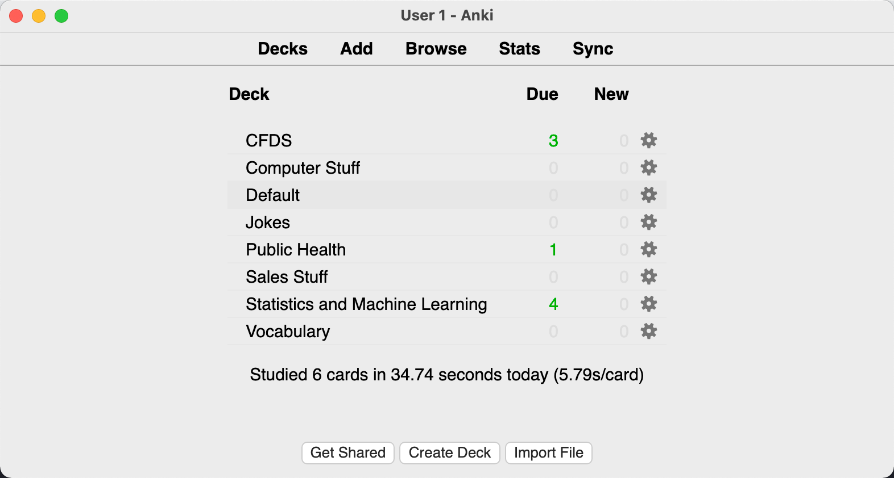
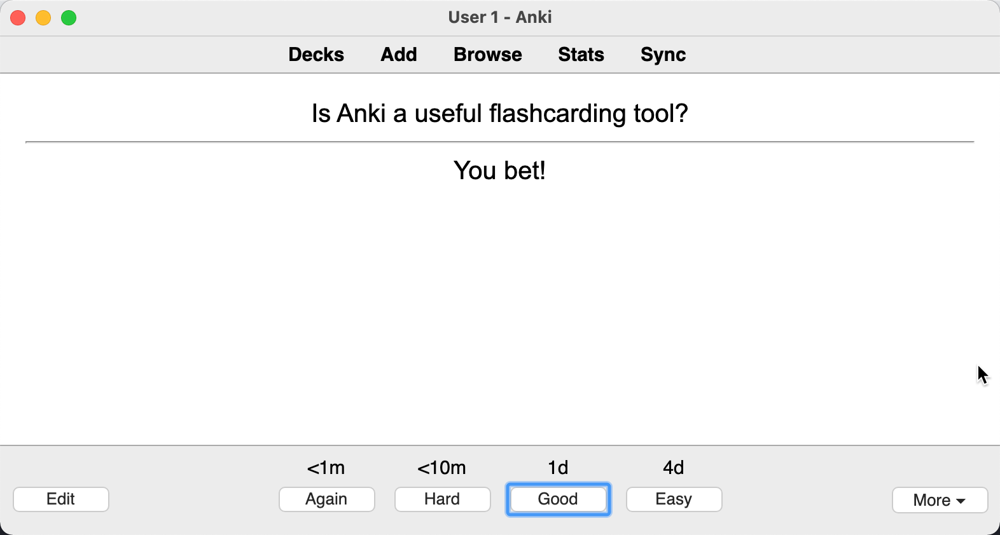

Here are some questions for any Data Science practitioners or really anyone who cares about their memory: 
- Have you ever learned something, be it a concept, formula, maxim, or story, and told yourself, "I will remember this", and then forgot?
- Have you ever not told yourself, "I will remember this", because it seemed so obvious you would that you didn't even bother to remark upon it to yourself, and then forgot?
- As you try to recall examples of either, is it possible that right now, you're forgetting the very fact that you forgot some things you told yourself you would remember?
- Do you perhaps hear something and are so congnizant of your own terrible memory that you acknowledge to yourself that you probably won't remember it even if you want to? 

If the last bullet applies to you, I applaud your self-awareness. If any of these apply to you, then think about using Anki.

## What is Anki?

Fundamentally, Anki is a free and simple application used to make flashcards. You can record front-and-back style flash cards, paste in images, add audio files, etc. It can be downloaded locally or used online. 

## Why Anki?

If an application for building flashcards does not sound particularly compelling to you, I get it. When my friend first told me about how she used Anki flashcards to study human anatomy in medical school at the University of Pittsburgh, I hardly acknowledged the comment. I didn't decide to give it a try until I read a long rant witten by someone who used Anki to memorize the command line on his computer at the same time I started learning basic bash scripting.

So, I downloaded the application and made a few flash cards. It was not a particularly overwhelming experience as far as flash cards go. You make a deck of cards with a question in the front and an answer in the back. You give the deck a title and quiz yourself. If you remembered what you wrote down, you could click a box that said 'Easy'. Otherwise you could click 'Good' or 'Hard' if you kind of remembered, or 'Again' if you couldn't remember at all. The button you clicked determined how long it would take for the deck to quiz you again. 

Not entirely convinced this application would be a boon for my hippocampus but still feeling compelled to give it a fair chance, I began to build more flashcards. My girlfriend is an epidemiologist, so instead of focusing on the command line, I made another deck on terms in Public Health I knew she often talked about but couldn't quite define myself. I made another deck breaking down some concepts in Machine Learning that were particularly relevant for my job at DataRobot, and then another with some points about our product.

At some point along the way, I started to see why people loved Anki. Everything came down to those four buttons: Easy, Good, Hard, Again. 

## Committing to Long Term Memory

Many tests have been conducted to assess memory, and it turns out there's a substantial difference between how we can commit knowledge to short term and long term memory1. Often in the short term, multiple reviews of material are not necessary2. If someone told me what they had for breakfast earlier today, I'll probably remember what they said if I was paying attention. There's some non-zero chance that I won't, but the probability that I retained this information is relatively high. Your short term memory is pretty good at retaining little pieces of information without a lot of review. As time marches goes on, the probability that I'll remember what you ate for breakfast drops, presumably very quickly because I don't really care. But even with information I do care about, I become substantially less likely to remember the content beyond some fuzzy details. In other words, there's a high chance it didn't quite make it to my long term memory.

What if I really, really want to remember something and I say to myself, "I *must* remember this"? What do you think? I *might* remember but honestly, I will probably forget and knowing me and most other humans, it will be sooner rather than later. Even if the probability of forgetting was low, my memory would still be a chance event rather than a choice. 

"But wait", you say. "What if I study?". Great idea, intuitively reviewing a concept, as in studying it more than once is a great way to bring it into your long term memory3. That's why teachers tell students to build flash cards. Just by constructing their own flashcards, students review content at least once. And then every time they study them, they learn the content more confidentally. It turns out that periodically reviewing flash cards can be broken down into two concepts called *active recall testing* and *spaced repetition*. These concepts have existed in scientific literature for [many years4](https://www.gwern.net/docs/spaced-repetition/1939-spitzer.pdf).

Except, handwriting flashcards is a pain and we all know that you forget content in flashcards after a while if you don't keep reviewing. So, you need to continually review your deck. But how often? Somehow, you need to apply a kind of logical spacing between your reviews. More so, you should also review concepts you are less confident about more often than concepts you know. Finally, you need a systematic way to space out those reviews *even as you dynamically add more content to review*. If you were making an ordinary flash card deck, this would be annoying at least and infuriating at worst. In fact, it's not even sustainable. If you build 10 flashcards, you could run through them once a week let's say. It wouldn't take much of your time. If you built 100 flashcards, it would be annoying but still possible to do on a weekly basis. If you built 1,000 flashcards, well, you get the idea.

The dynamic spacing between review is what makes Anki so useful5. When you click 'Easy', the time to wait for the next review is longer than when you click 'Good' or 'Hard'. And if you click 'Easy' a second time, the review interval increases again (same with 'Good' or 'Hard' but more slowly). Eventually, the days you wait between reviews for a given card can be months or even *years*. And, if somewhere along the way, the content slipped your mind, you can just click 'Again' and the review interval restarts. And if you don't like the rate of increase, you can customize the default settings. Truthfully, I could rant on for a while about why Anki useful, but I'm not a neuroscientist and their [documentation](https://docs.ankiweb.net/background.html) provides excellent background on its own.

## Anki is Widely Applicable

As you might have noticed in the screenshot above, I have decks for Pubilc Health, Machine Learning, Vocabulary, Sales, Company Product, Computing and even Jokes. It might seem surprising that I made flashcards on so many topics. And you might be justifiably skeptical of people who could claim to learn something like statistics through rote memorization. I do agree that memorization is by no means a replacement for learning a complex idea in the first place, but I'd argue it's incredibly useful to solidify your understanding of a complex idea. Let me illustrate with an example on model interpretability. For the non-data scientists reading this, I apologize for referencing a topic you might find a little boring. Rather than trying to understand the example, try instead to think about how you could do something similar in your subject of interest.

### LIME

To show how you can use Anki to learn and retain complex ideas, I'm going to talk about LIME, which is a technique used in model interpretability and not cooking.  LIME stands for Locally Interpretable Model-Agnostic Explanations. It answers the question, "How would a prediction change if a data point's feature values were slightly changed in a trained model". The algorithm for LIME follows four steps:
1. Sample new data points by creating perturbations around a given data point
2. Weight the synthetic data points by their proximity to the original data point
3. Apply these synthetic data points to the current trained model to generate predictions
4. Train a linear model fit to these data synthetic datapoints, with the target variable as the generated predictions
5. The feature explanation is the coefficients of the linear model

It turns out there are a decent amount of problems with the algorithm for LIME. Without diving further into the weeds than we already have, it generates points from a normal distribution even when they might not be possible in real data, it samples them so that explanations are not consistent between identical models, it has multiple hyperparameters that need to be tuned, it's computationally expensive to explain even one point, and the linear approximation it makes might not even be consistent. 

### Bad Flashcard 

Ok, great we all know LIME, at least in our short term memories. Now, if you have no idea what machine learning is, please understand that I'm not arguing that taking the information I just presented and copy/pasting it into a flashcard titled 'What is LIME' will make you magically understand LIME. That would be stupid for two reasons:

1. You would be making a flash card about something you did not remotely understand at any point reading my explanation. 
2. You would have put an overwhelming amount of content into a single flashcard. That is unrealistic to memorize.

### Good Flashcard(s)

So let's qualify here and say you know a thing or two about building models, someone mentioned LIME to you, and you actually want to learn what it does. You also still want to know what it does a year from now or else it's just not worth wasting your time learning it in the first place. Here's how you could confidentally accomplish that with Anki.

1. Break down what you just read. Most people cannot easily memorize every detail of an article or complex idea. It is very frustrating to see a flashcard saying 'What is Lime?" that includes a back with giant paragraphs of text. The way I broke down LIME was to make three flashcards with different points about it. 
   
      A. What does LIME stand for? And what does it do at a high level?

      B. Name each step in the LIME algorithm (hint: there are 5 steps)

      C. Can you name some problems with LIME? (hint: there are 5 listed here)

2. If you need to break it up more, then break it up more. I listed 5 problems with LIME, but maybe that's too much to remember in a card. Or maybe I need to know an example of when LIME might simulate an impossible data point or want to memorize what each hyperparameter does. That's fine. Take the time to break it up more if you want to go deeper. It will actually ***save** you time when you review because you'll only have to review the steps you struggle with the most, rather than every step in the process whenever the card comes up. Anki will space out the easier cards and you'll have a much better idea where you are weak on the concept. As you breakdown each point in the algorithm you'll also have a much better head start when you begin to review.
   

## Concluding Remarks

Anki is an easy-to-use flashcarding tool for memorizing content. It relies on scientifically backed concepts in long-term memory retention to help people remember content efficiently. Used well, it's a game changer that is applicable to any field.

## References

1. Cowan N. What are the differences between long-term, short-term, and working memory? Prog Brain Res. 2008;169:323-338.
2. Poor A. What Is Short-Term Memory? Verywell Mind. Published April 25, 2021. Accessed October 23, 2021. https://www.verywellmind.com/what-is-short-term-memory-2795348
3. Pappas C. Enhancing Long-Term Memory: 7 Strategies For eLearning Professionals. eLearning Industry.
4. Spitzer HF. Studies in retention. Journal of Educational Psychology. 1939;30(9):641-656. doi:10.1037/h0063404
5. Deng F, Gluckstein JA, Larsen DP. Student-directed retrieval practice is a predictor of medical licensing examination performance. Perspect Med Educ. 2015;4(6):308-313.
