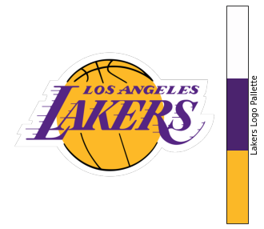
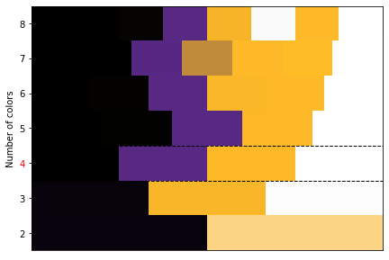
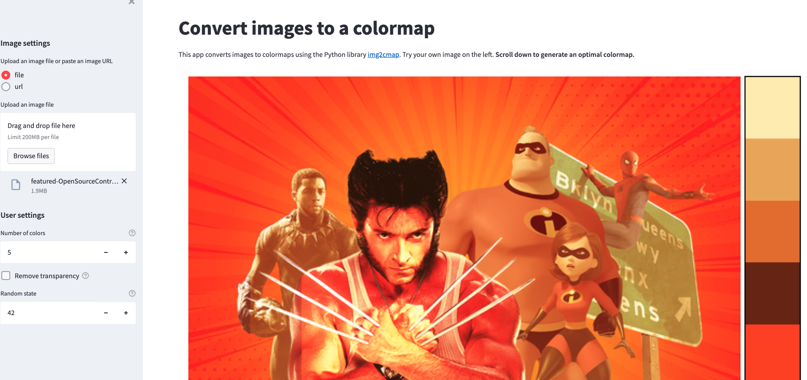
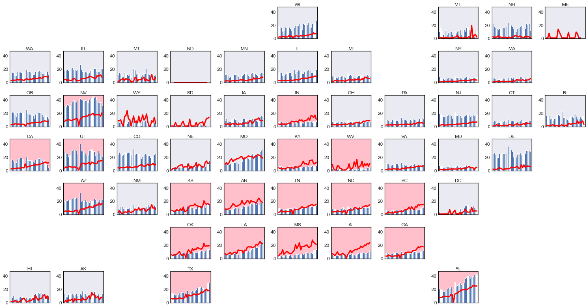

Read it here. Marshall Krassenstein makes pull requests and sometimes they are accepted. Not that I'm trying to compare myself to the superheroes listed in the above pic but, just saying, Open Source Contributor is a pretty cool title and someone did tell me I look vaguely like Hugh Jackman once.  Ok, honestly it is just one of my buddies side projects that I'm helping out with but it has 34 stars on Github, and I'm pretty proud of it. 

I've structured this post in two parts. In the first section, I describe what our package is and what you can use it for. In the second section, I describe some of the work I've put in and lessons I learned from contributing to the package.

## Introducing img2cmap

The [img2cmap](https://github.com/arvkevi/img2cmap) package creates colormaps from images in a few lines of code. You can simply pass a path to an image, tell it to generate a colormap, and get back a colormap that you can use for all of your coloring needs! 

### How does it work?

Behind the scenes, img2cmap is actually pretty simple. When the user uploads an image, it takes the pixels and turns them into a n_pixels * 3 array where the second dimension represents its red, green, and blue values. Then, it runs  k-means clustering on the data and returns the centroids of the clusters. The RGB values of the centroids are values used to create a colormap that can be extracted from the image.

```python
from img2cmap import ImageConverter

# Url to image
image_url = "https://loodibee.com/wp-content/uploads/nba-los-angeles-lakers-logo.png"

# Create converter
converter = ImageConverter(image_url)

# Generate the cmap
cmap = converter.generate_cmap(n_colors=3, palette_name="Lakers Logo Pallette", random_state=42)

```

Once you have the colormap, you can compare it to the image with some simple matplotlib style action. 

``` python
import matplotlib.pyplot as plt
from mpl_toolkits.axes_grid1 import make_axes_locatable

fig, ax = plt.subplots(figsize=(7, 5))

ax.axis("off")
img = plt.imread(image_url)
im = ax.imshow(img, cmap=cmap)

divider = make_axes_locatable(ax)
cax = divider.append_axes("right", size="10%", pad=0.05)

cb = fig.colorbar(im, cax=cax, orientation="vertical", label=cmap.name)
cb.set_ticks([])
```



### Optimizing your color pallette

Now as most analytics practitioners know, Kmeans requires you to choose a number of clusters. This often presents a tricky issue for people who are just trying to find a color pallette that represents the image well. The usual approach to deal with this problem is to try a bunch of cluster numbers, plot the SSD (Sum of Squared Deviance) as a line chart where the x axis is the number of clusters, and look for a notch or 'elbow' in the curve in the monotonically decreasing curve. Finding that notch is one way to determine the optimal number of clusters. To help with this, img2cmap includes an optimizer module that essentially does the elbow method for you.

```python 

import matplotlib as mpl
import matplotlib.patches as patches
import numpy as np

max_colors = 8
cmaps, best_n_colors, ssd = converter.generate_optimal_cmap(max_colors=max_colors, random_state=42)

best_cmap = cmaps[best_n_colors]

figopt, ax = plt.subplots(figsize=(7, 5))

ymax = max_colors + 1
xmax = max_colors
ax.set_ylim(2, ymax)
ax.set_xlim(0, max_colors)

# i will be y axis
for y, cmap_ in cmaps.items():
    # Fix small
    colors = sorted([mpl.colors.rgb2hex(c) for c in cmap_.colors])
    intervals, width = np.linspace(0, xmax, len(colors) + 1, retstep=True)
    # j will be x axis
    for j, color in enumerate(colors):
        rect = patches.Rectangle((intervals[j], y), width, 1, facecolor=color)
        ax.add_patch(rect)

ax.set_yticks(np.arange(2, ymax) + 0.5)
ax.set_yticklabels(np.arange(2, ymax))
ax.set_ylabel("Number of colors")
ax.set_xticks([])

# best
rect = patches.Rectangle((0, best_n_colors), ymax, 1, linewidth=1, facecolor="none", edgecolor="black", linestyle="--")
ax.add_patch(rect)

# minus 2, one for starting at 2 and one for 0-indexing
ax.get_yticklabels()[best_n_colors - 2].set_color("red")
```


Hopefully you noticed in the code block above that the majority of the code is just for building a nice matplotlib visual. The secret sauce of actually clustering and optimizing was done in essentially one line of code. Namely:
```python 
cmaps, best_n_colors, ssd = converter.generate_optimal_cmap(max_colors=max_colors, random_state=42)

```

### So why would I use this again? 

Wait, you read all the way up to this section and still don't know what you would use these colormaps for? I can think of two use cases where one end user might be my mom and another might be someone like me.
1. Mom: My mom loves chalk painting furniture. It's been her hobby for the last five years. Sometimes, she doesn't know what color to paint the furniture. She knows where she eventually wants to put the finished piece, and she knows she wants it to match the 'theme' of the rest of the room, but can't decide what color to use. My, what an easy case for img2cmap. All she needs to do is take a photo and run it in the package. She can then extract the colormap, choose her favorite colors from the resulting pallette and match the zen she's looking for.
2. Me: I'm a Data Scientist and I am often asked by a consultant/salesperson/manager/insert_derp_here to build a nice chart for their PowerPoint presentation. Usually they want the chart to match the 'theme' of the presentation. My usual reaction is to just pick some colors that seem nice. Now, I can be a little bit less arbitrary. I could instead take a screenshot of a slide and pass it to img2cmap. Then, I can extract the colormap, choose my favorite colors from the resulting pallette and match the slide. My colleagues will be so pleased. 

### Alright, fine it looks kind of cool. How do I try it out?

img2cmap is easy enough to get started with. If you want to incorporate it into your own workflows, just `pip install img2cmap` and follow the code example I showed above. If you want to see how it works with some of your own images before coding with it, we built an accompanying [web application](https://img2cmap.fly.dev/) that lets you upload a picture and generate a color map. Find a pithy looking image and try it out!



## My experience 

Partly by nature of my job, I tend to write hacky code. Generally speaking, I write scripts or notebooks that aren't designed to be run by others. I will sometimes create a fresh environment for the project at hand, but many times I stick to one I already have configured. Sometimes I'll write a docstring for my functions, sometimes I won't. I rarely write unit tests. 

That is part of the reason working on this project has been so important for me. With this package, the goal is to write code that works for anyone who wants to use it. It must be designed to function on multiple computers across multiple versions of Python. The code must be built in a well thought out way that is easy to understand and maintain. It must be thoroughly documented. When I worked on img2cmap, I wrote new method calls but I spent more time writing tests, docstrings, configuring workflows and building examples of the functionality. 

So without further ado, here are four lessons learned from doing this project.

### 1. Unit tests are important.
   
For the unfamiliar reader, a unit test is a way of testing a unit - the smallest piece of code that can be logically isolated in a system. In most programming languages, that can be a function, a subroutine, a method or property. These tests are designed to execute as much code in the software as possible and include assertions to ensure that the output of the code is expected. In img2cmap, we have roughly 93% code coverage. That means that 93% of the code that can be executed by the package is run by tests automatically before a change is merged into our main branch.

So long as they are well written, I learned that unit tests can be a boone to software development. If they all pass, the code is probably in good shape. If they don't pass, there is an immediate flag where something went wrong. And when one of the package authors is me, something goes wrong fairly often. I spent a lot of my time on this package writing unit tests that assessed each module I was assigned to build. As I wrote more unit tests, I increased the coverage of our code base and uncovered existing defects that would break the package for certain users. The original package author owes me a beer for that one.

### 2. You need a way to make sure your package works on more than one version of Python

As obvious as it is in hindsight, I never thought before about how a package needs to work as well on Python 3.6 as it does on Python 3.9 in order to be adopted by others. More so, I never thought about how it needed to work on MacOS, Windows and Linux operating systems. Yet 95% or more of the end users of our package for the most part don't have a Macbook or the same environment setup that I have. But what a pain this would be to check locally! Ignoring environment configurations like Anaconda, and only supporting from Python 3.6 to Python 3.10, you're still looking at making sure the code works across 5 versions of Python across 3 operating systems. That's 15 different configurations to test whenever you change code. Without the proper tools set up, managing this would be impossible. 

We used two tools to continuously check our codebase across multiple operating systems:
1.  Github Actions: This is essentially a configurable CI/CD tool that runs whenever you push a change to a repo 
2.  Tox: Tox automates Python testing across multiple Python versions. For example, running the command `tox -e py39` executes all of your unit tests using Python 3.9 if you have it installed.

Using a `.yaml` configuration file for github actions, we set up a workflow that installs and then runs our tox checks across 18 different Python setups automatically whenever a change is pushed to the img2cmap repository. Doing this protects our code from the "But it works on computer" issue of environment configuration.

### 3. Developing a package is easier when the functionality is well defined.

I actually did release a package once before this. It was called *Shmapy* and you can visit it [here](https://github.com/mpkrass7/shmapy). Shmapy was designed to build unique maps of the United States and other areas of geographic space. Here's one example of a map you could build using the package that shows Covid cases by state over time:



Pretty nifty right? Honestly, the shmapy package could probably be more useful to your average coder than img2cmap given how often people need to make pithy visualizations of geography. Yet img2cmap has consistent use and shmapy does not. Why? Well, anyone who goes in and looks at the repo will realize that I did not build shmapy well. Img2cmap does one thing and does it well. It extracts a color pallette from an image and it just works. It works because the project has a clear goal and time was actually taken to think out what the codebase *should look like*. shmapy went in kind of the opposite direction. I did not put in much effort thinking about what the package should or should not do. When people suggested something that sounded cool, I tried to add it in. My method of adding in the functionality was to make large functions even larger. I dedicated 200 lines of code to partially filling a hexagon. In other words, it attempts to do many things and does nothing particularly well. Even when I use it as the package author, I often find myself returning to the codebase to figure out why it breaks on me when I try to make certain plots. 

After building out both of these packages, I believe that a small contribution to the open source community that is close to perfect is more valuable than an ambitious contribution filled with bugs and ambiguity. My ideas mean nothing if people can't use them. Every piece of code should be well thought out, well tested, and documented completely. After this project is complete, I'm hoping to return to shmapy and refactor the entire codebase. I will strip out the less important functionality, document the code I keep thoroughly, and make the package easier to run. 

### 4. It's ok to have your pull requests rejected.

In repos that are visited by others, sometimes people open up issues as feature requests. Often times, when I would see a request I would think, "I can solve this", only to find out my solution was inefficient or kind of stupid. In my first pull request, I tried to add a method to remove transparent pixels from a user uploaded image.  I passed the unit tests and created additional tests for the new functionality. Except, I imported a heavy weight package to do what I wanted to do and my functionality did not even match what was requested. I had to start over. Then, changes were requested on that pull request, and it wasn't until my fourth commit on what was a relatively small change that I finally was able to merge into a master branch. And honestly, that's ok! One of the most intimidating things about contributing code to another person's project is that you expose your ignorance of everything from the topic at hand to software development in general. But having your requests rejected and then iterating on them until they pass muster is the best way to get better at coding. 

## Conclusion

If you're a 'not quite software engineer who likes to solve problems with code' like me, you might have thought of an idea for a package before. If you're thinking about building one or contributing to the open source community in some way, I say do it! Whether it gets adopted or not, package development is a great way to hone your craft and many guides exist. As for img2cmap, I hope you enjoy the package! Feel free to reach out at mpkrass@gmail.com if you give it a try. 

