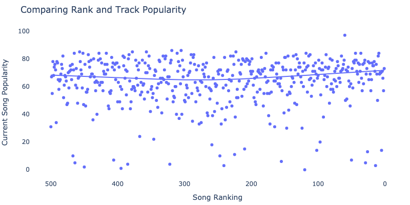
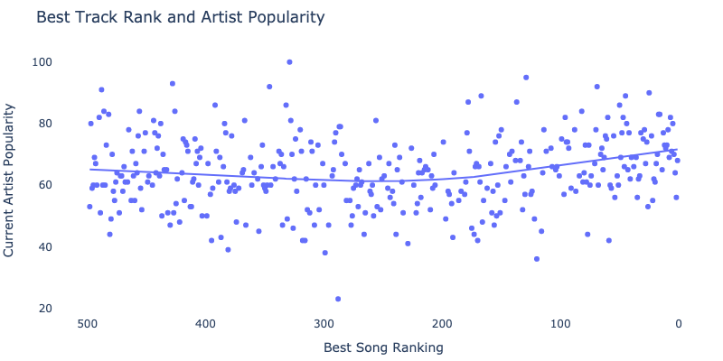
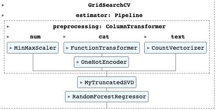
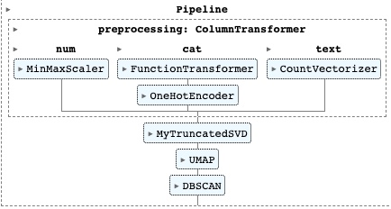
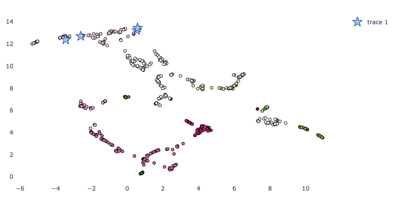
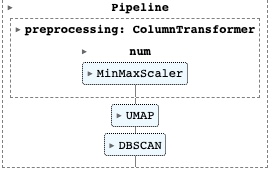
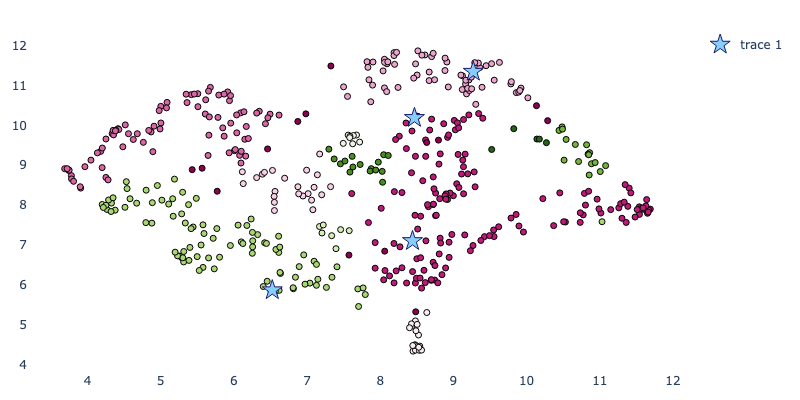
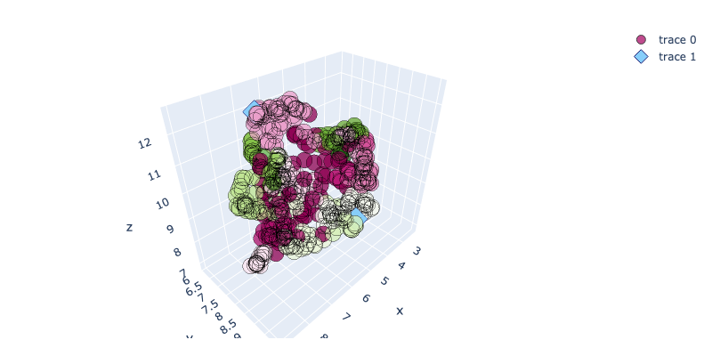

In a [previous post](https://www.marshallpk.com/post/rolling-stone-top-500/), I ranted about ranking systems and webscraped data on a fascinating list - Rolling Stone Magazine's Top 500 Greatest Songs of All Time. In this post, I pull the data again using the Spotify API and perform more in depth analytics on it including supervised learning, dimensionality reduction, and unsupervised learning. I also use Streamlit to make a web application that allows you to explore the data and see the results in a more interactive way.

## TL/DR because this article is long

For those who don't want to read the article, I built an accompanying Streamlit application for further exploration of the Rolling Stone top 500 data. Try it out [here](https://rollingstonalytics.streamlit.app/). You can also download the dataset [here](data/spotify_music_output.csv) for your own use.

## Background

Released in September 2021, Rolling Stone attempted to rank what maybe shouldn't be ranked. Across all genres over the last 100 years, they ordered from 1 to 500 what they considered to be the best songs of all time. It was the first time they made a list like this in 17 years. In constructing the list, they surveyed a bunch of artists and music critics about their 50 favorite songs and aggregated the results to create their ranking. Possibly because of who they surveyed and possibly because of how they scored the survey results, the emerging list makes the listener stop and think, "Really? Gasolina by Daddy Yankee is in the top 50?". Yet for all of its spicy takes, it makes for an excellent ~34 hour playlist, and I've been obsessed with it for almost a year.

You can read more about how they came up with this list on their [website](https://www.rollingstone.com/music/music-lists/best-songs-of-all-time-1224767/), but I site it below for reference:

*In 2004, Rolling Stone published its list of the 500 Greatest Songs of All Time. It’s one of the most widely read stories in our history, viewed hundreds of millions of times on this site. But a lot has changed since 2004; back then the iPod was relatively new, and Billie Eilish was three years old. So we’ve decided to give the list a total reboot. To create the new version of the RS 500 we convened a poll of more than 250 artists, musicians, and producers — from Angelique Kidjo to Zedd, Sam Smith to Megan Thee Stallion, M. Ward to Bill Ward — as well as figures from the music industry and leading critics and journalists. They each sent in a ranked list of their top 50 songs, and we tabulated the results.*

*Nearly 4,000 songs received votes. Where the 2004 version of the list was dominated by early rock and soul, the new edition contains more hip-hop, modern country, indie rock, Latin pop, reggae, and R&B. More than half the songs here — 254 in all — weren’t present on the old list, including a third of the Top 100. The result is a more expansive, inclusive vision of pop, music that keeps rewriting its history with every beat.*

### Why I scraped data from the Rolling Stone Top 500.. Twice

In my last post I described how and why I scraped data from the Rolling Stone top 500. In my own words, "I’ve been so into my playlist that I wanted to be more exact when I told people where certain songs ranked in the Rolling Stone top 500 list". My methodology was to use the `BeautifulSoup` library to scrape the songs off of the website and then merge in other information like genre and track time using the now deprecated iTunes API. The result had a few misses in some information but overall was pretty thorough.

So I pulled this dataset and I sent it to my little brother to run some kind of analysis on. After waiting a few months, I saw that someone else made the same playlist on Spotify that I had made in Youtube Music. For me this was a game changer, because Spotify API is free to use and returns high quality results. Besides filling in some missing records I had from linking my webscraping to the iTunes API, it also provided a bunch of quantitative metrics for evaluating and comparing music, such as the danceability and liveness of a given song.

Below, I show just how easy this was to do. In a few lines I pull more data than I ever had before on all of the songs in the top 500 list as well as metadata about the corresponding artists and albums.

## Pulling Data

### Imports 


```python
import numpy as np
import pandas as pd
import spotipy
from spotipy import SpotifyClientCredentials
import tqdm
import yaml

from IPython.core.interactiveshell import InteractiveShell
InteractiveShell.ast_node_interactivity = "all"
```

### Authentication


```python
with open('secrets.yaml') as file:
    secrets = yaml.safe_load(file)
    client_id = secrets.get('client_id')
    client_secret = secrets.get('client_secret')

client_credentials_manager = SpotifyClientCredentials(client_id=client_id, client_secret=client_secret)
sp = spotipy.Spotify(client_credentials_manager = client_credentials_manager)
```

### Pull track URIs and general info


```python
playlist_link = "https://open.spotify.com/playlist/4EdmaJCUXvXsXJKXZGvj2r"
playlist_URI = playlist_link.split("/")[-1].split("?")[0]
playlist_data = []
for i in range(5):
    playlist_data = playlist_data + sp.playlist_tracks(playlist_URI, offset=i*100)['items']
track_uris = [x["track"]["uri"] for x in playlist_data]

# Print information from Stronger by Kanye West
playlist_data[0]
```


    {'added_at': '2021-09-15T18:48:41Z',
     'added_by': {'external_urls': {'spotify': 'https://open.spotify.com/user/117710003'},
      'href': 'https://api.spotify.com/v1/users/117710003',
      'id': '117710003',
      'type': 'user',
      'uri': 'spotify:user:117710003'},
     'is_local': False,
     'primary_color': None,
     'track': {'album': {'album_type': 'album',
       'artists': [{'external_urls': {'spotify': 'https://open.spotify.com/artist/5K4W6rqBFWDnAN6FQUkS6x'},
         'href': 'https://api.spotify.com/v1/artists/5K4W6rqBFWDnAN6FQUkS6x',
         'id': '5K4W6rqBFWDnAN6FQUkS6x',
         'name': 'Kanye West',
         'type': 'artist',
         'uri': 'spotify:artist:5K4W6rqBFWDnAN6FQUkS6x'}],
       'available_markets': [],
       'external_urls': {'spotify': 'https://open.spotify.com/album/5fPglEDz9YEwRgbLRvhCZy'},
       'href': 'https://api.spotify.com/v1/albums/5fPglEDz9YEwRgbLRvhCZy',
       'id': '5fPglEDz9YEwRgbLRvhCZy',
       'images': [{'height': 640,
         'url': 'https://i.scdn.co/image/ab67616d0000b2739bbd79106e510d13a9a5ec33',
         'width': 640},
        {'height': 300,
         'url': 'https://i.scdn.co/image/ab67616d00001e029bbd79106e510d13a9a5ec33',
         'width': 300},
        {'height': 64,
         'url': 'https://i.scdn.co/image/ab67616d000048519bbd79106e510d13a9a5ec33',
         'width': 64}],
       'name': 'Graduation',
       'release_date': '2007-09-11',
       'release_date_precision': 'day',
       'total_tracks': 13,
       'type': 'album',
       'uri': 'spotify:album:5fPglEDz9YEwRgbLRvhCZy'},
      'artists': [{'external_urls': {'spotify': 'https://open.spotify.com/artist/5K4W6rqBFWDnAN6FQUkS6x'},
        'href': 'https://api.spotify.com/v1/artists/5K4W6rqBFWDnAN6FQUkS6x',
        'id': '5K4W6rqBFWDnAN6FQUkS6x',
        'name': 'Kanye West',
        'type': 'artist',
        'uri': 'spotify:artist:5K4W6rqBFWDnAN6FQUkS6x'}],
      'available_markets': [],
      'disc_number': 1,
      'duration_ms': 311866,
      'episode': False,
      'explicit': True,
      'external_ids': {'isrc': 'USUM70741299'},
      'external_urls': {'spotify': 'https://open.spotify.com/track/4fzsfWzRhPawzqhX8Qt9F3'},
      'href': 'https://api.spotify.com/v1/tracks/4fzsfWzRhPawzqhX8Qt9F3',
      'id': '4fzsfWzRhPawzqhX8Qt9F3',
      'is_local': False,
      'name': 'Stronger',
      'popularity': 31,
      'preview_url': None,
      'track': True,
      'track_number': 3,
      'type': 'track',
      'uri': 'spotify:track:4fzsfWzRhPawzqhX8Qt9F3'},
     'video_thumbnail': {'url': None}}


### Put Into a Neat Dataframe


```python
playlist_dict = {
    
    'rank': [],
    'artist_name':[],
    'track_name':[],
    
    # Track data
    'track_popularity':[],
    'track_duration_ms':[],
    'track_is_explicit':[],
    'track_number':[],
    'track_danceability': [],
    'track_energy': [],
    'track_key': [],
    'track_loudness': [],
    'track_mode': [],
    'track_speechiness': [],
    'track_acousticness': [],
    'track_instrumentalness': [],
    'track_liveness': [],
    'track_valence': [],
    'track_tempo': [],
    'track_time_signature': [],
    'track_analysis_url': [],

    # Album data
    'album_name':[],
    'album_release_date':[],
    'album_release_year':[],
    'album_image':[],
    
    # Artist data
    'artist_genre':[],
    'artist_popularity':[],
    
}
for count, i in tqdm.tqdm(enumerate(playlist_data)):
    
    # Query for More Song Data
    track_info = sp.audio_features(i['track']['id'])[0]

    playlist_dict['rank'].append(500 - count)
    playlist_dict['artist_name'].append(i['track']['artists'][0]['name'])
    playlist_dict['track_name'].append(i['track']['name'])
    

    # Song Stuff
    playlist_dict['track_popularity'].append(i['track']['popularity'])
    playlist_dict['track_duration_ms'].append(i['track']['duration_ms'])
    playlist_dict['track_is_explicit'].append(i['track']['explicit'])
    playlist_dict['track_number'].append(i['track']['track_number'])
    playlist_dict['track_danceability'].append(track_info['danceability'])
    playlist_dict['track_energy'].append(track_info['energy'])
    playlist_dict['track_key'].append(track_info['key'])
    playlist_dict['track_loudness'].append(track_info['loudness'])
    playlist_dict['track_mode'].append(track_info['mode'])
    playlist_dict['track_speechiness'].append(track_info['speechiness'])
    playlist_dict['track_acousticness'].append(track_info['acousticness'])
    playlist_dict['track_instrumentalness'].append(track_info['instrumentalness'])
    playlist_dict['track_liveness'].append(track_info['liveness'])
    playlist_dict['track_valence'].append(track_info['valence'])
    playlist_dict['track_tempo'].append(track_info['tempo'])
    playlist_dict['track_time_signature'].append(track_info['time_signature'])
    playlist_dict['track_analysis_url'].append(track_info['analysis_url'])
    
    
    # Album Stuff
    playlist_dict['album_name'].append(i['track']['album']['name'])
    playlist_dict['album_release_date'].append(i['track']['album']['release_date'])
    playlist_dict['album_release_year'].append(np.nan)
    playlist_dict['album_image'].append(i['track']['album']['images'][0]['url'])
    
    # Artist Stuff
    # Query More Artist Data
    artist_uri = i["track"]["artists"][0]["uri"]
    artist_info = sp.artist(artist_uri)
    artist_pop = artist_info["popularity"]
    artist_genres = artist_info["genres"]
    
    playlist_dict['artist_genre'].append(', '.join(artist_info['genres']))
    playlist_dict['artist_popularity'].append(artist_info['popularity'])


```

    500it [02:10,  3.84it/s]


```python

df = (
    pd.DataFrame(data = playlist_dict)
    .assign(album_release_date = lambda x: pd.to_datetime(x.album_release_date))
    .assign(album_release_year = lambda x: x.album_release_date.dt.year)
)
# Check for null values
df.isna().any().sum()
```


    0


```python
df.head()
df.tail()
df.to_csv('data/spotify_music_output.csv',index=False)
```


<div>
<style scoped>
    .dataframe tbody tr th:only-of-type {
        vertical-align: middle;
    }

    .dataframe tbody tr th {
        vertical-align: top;
    }

    .dataframe thead th {
        text-align: right;
    }
</style>
<table border="1" class="dataframe">
  <thead>
    <tr style="text-align: right;">
      <th></th>
      <th>rank</th>
      <th>artist_name</th>
      <th>track_name</th>
      <th>track_popularity</th>
      <th>track_duration_ms</th>
      <th>track_is_explicit</th>
      <th>track_number</th>
      <th>track_danceability</th>
      <th>track_energy</th>
      <th>track_key</th>
      <th>...</th>
      <th>track_valence</th>
      <th>track_tempo</th>
      <th>track_time_signature</th>
      <th>track_analysis_url</th>
      <th>album_name</th>
      <th>album_release_date</th>
      <th>album_release_year</th>
      <th>album_image</th>
      <th>artist_genre</th>
      <th>artist_popularity</th>
    </tr>
  </thead>
  <tbody>
    <tr>
      <th>0</th>
      <td>500</td>
      <td>Kanye West</td>
      <td>Stronger</td>
      <td>31</td>
      <td>311866</td>
      <td>True</td>
      <td>3</td>
      <td>0.617</td>
      <td>0.717</td>
      <td>10</td>
      <td>...</td>
      <td>0.490</td>
      <td>103.992</td>
      <td>4</td>
      <td>https://api.spotify.com/v1/audio-analysis/4fzs...</td>
      <td>Graduation</td>
      <td>2007-09-11</td>
      <td>2007</td>
      <td>https://i.scdn.co/image/ab67616d0000b2739bbd79...</td>
      <td>chicago rap, rap</td>
      <td>90</td>
    </tr>
    <tr>
      <th>1</th>
      <td>499</td>
      <td>The Supremes</td>
      <td>Baby Love</td>
      <td>67</td>
      <td>158040</td>
      <td>False</td>
      <td>3</td>
      <td>0.595</td>
      <td>0.643</td>
      <td>5</td>
      <td>...</td>
      <td>0.730</td>
      <td>135.633</td>
      <td>4</td>
      <td>https://api.spotify.com/v1/audio-analysis/5uES...</td>
      <td>Where Did Our Love Go</td>
      <td>1964-08-31</td>
      <td>1964</td>
      <td>https://i.scdn.co/image/ab67616d0000b273d5ea12...</td>
      <td>brill building pop, classic girl group, disco,...</td>
      <td>61</td>
    </tr>
    <tr>
      <th>2</th>
      <td>498</td>
      <td>Townes Van Zandt</td>
      <td>Poncho &amp; Lefty</td>
      <td>55</td>
      <td>220573</td>
      <td>False</td>
      <td>8</td>
      <td>0.636</td>
      <td>0.277</td>
      <td>1</td>
      <td>...</td>
      <td>0.685</td>
      <td>133.363</td>
      <td>4</td>
      <td>https://api.spotify.com/v1/audio-analysis/6QXt...</td>
      <td>The Late Great Townes Van Zandt</td>
      <td>1972-01-01</td>
      <td>1972</td>
      <td>https://i.scdn.co/image/ab67616d0000b273cbf571...</td>
      <td>alternative country, cosmic american, country ...</td>
      <td>53</td>
    </tr>
    <tr>
      <th>3</th>
      <td>497</td>
      <td>Lizzo</td>
      <td>Truth Hurts</td>
      <td>78</td>
      <td>173325</td>
      <td>True</td>
      <td>13</td>
      <td>0.715</td>
      <td>0.624</td>
      <td>4</td>
      <td>...</td>
      <td>0.412</td>
      <td>158.087</td>
      <td>4</td>
      <td>https://api.spotify.com/v1/audio-analysis/3HWz...</td>
      <td>Cuz I Love You (Super Deluxe)</td>
      <td>2019-04-19</td>
      <td>2019</td>
      <td>https://i.scdn.co/image/ab67616d0000b2737bebcd...</td>
      <td>dance pop, escape room, minnesota hip hop, pop...</td>
      <td>80</td>
    </tr>
    <tr>
      <th>4</th>
      <td>496</td>
      <td>Harry Nilsson</td>
      <td>Without You</td>
      <td>68</td>
      <td>201000</td>
      <td>False</td>
      <td>6</td>
      <td>0.381</td>
      <td>0.186</td>
      <td>4</td>
      <td>...</td>
      <td>0.142</td>
      <td>65.058</td>
      <td>4</td>
      <td>https://api.spotify.com/v1/audio-analysis/6MrI...</td>
      <td>Nilsson Schmilsson</td>
      <td>1971-01-01</td>
      <td>1971</td>
      <td>https://i.scdn.co/image/ab67616d0000b2734df5b5...</td>
      <td>art rock, brill building pop, classic rock, cl...</td>
      <td>59</td>
    </tr>
  </tbody>
</table>
<p>5 rows × 26 columns</p>
</div>


<div>
<style scoped>
    .dataframe tbody tr th:only-of-type {
        vertical-align: middle;
    }

    .dataframe tbody tr th {
        vertical-align: top;
    }

    .dataframe thead th {
        text-align: right;
    }
</style>
<table border="1" class="dataframe">
  <thead>
    <tr style="text-align: right;">
      <th></th>
      <th>rank</th>
      <th>artist_name</th>
      <th>track_name</th>
      <th>track_popularity</th>
      <th>track_duration_ms</th>
      <th>track_is_explicit</th>
      <th>track_number</th>
      <th>track_danceability</th>
      <th>track_energy</th>
      <th>track_key</th>
      <th>...</th>
      <th>track_valence</th>
      <th>track_tempo</th>
      <th>track_time_signature</th>
      <th>track_analysis_url</th>
      <th>album_name</th>
      <th>album_release_date</th>
      <th>album_release_year</th>
      <th>album_image</th>
      <th>artist_genre</th>
      <th>artist_popularity</th>
    </tr>
  </thead>
  <tbody>
    <tr>
      <th>495</th>
      <td>5</td>
      <td>Nirvana</td>
      <td>Smells Like Teen Spirit</td>
      <td>14</td>
      <td>301920</td>
      <td>False</td>
      <td>1</td>
      <td>0.502</td>
      <td>0.912</td>
      <td>1</td>
      <td>...</td>
      <td>0.720</td>
      <td>116.761</td>
      <td>4</td>
      <td>https://api.spotify.com/v1/audio-analysis/1f3y...</td>
      <td>Nevermind (Deluxe Edition)</td>
      <td>1991-09-26</td>
      <td>1991</td>
      <td>https://i.scdn.co/image/ab67616d0000b27328a90d...</td>
      <td>alternative rock, grunge, permanent wave, rock</td>
      <td>80</td>
    </tr>
    <tr>
      <th>496</th>
      <td>4</td>
      <td>Bob Dylan</td>
      <td>Like a Rolling Stone</td>
      <td>71</td>
      <td>369600</td>
      <td>False</td>
      <td>1</td>
      <td>0.482</td>
      <td>0.721</td>
      <td>0</td>
      <td>...</td>
      <td>0.557</td>
      <td>95.263</td>
      <td>4</td>
      <td>https://api.spotify.com/v1/audio-analysis/3AhX...</td>
      <td>Highway 61 Revisited</td>
      <td>1965-08-30</td>
      <td>1965</td>
      <td>https://i.scdn.co/image/ab67616d0000b27341720e...</td>
      <td>classic rock, country rock, folk, folk rock, r...</td>
      <td>70</td>
    </tr>
    <tr>
      <th>497</th>
      <td>3</td>
      <td>Sam Cooke</td>
      <td>A Change Is Gonna Come</td>
      <td>66</td>
      <td>191160</td>
      <td>False</td>
      <td>7</td>
      <td>0.212</td>
      <td>0.383</td>
      <td>10</td>
      <td>...</td>
      <td>0.452</td>
      <td>173.790</td>
      <td>3</td>
      <td>https://api.spotify.com/v1/audio-analysis/0KOE...</td>
      <td>Ain't That Good News</td>
      <td>1964-03-01</td>
      <td>1964</td>
      <td>https://i.scdn.co/image/ab67616d0000b2737329db...</td>
      <td>adult standards, brill building pop, classic s...</td>
      <td>64</td>
    </tr>
    <tr>
      <th>498</th>
      <td>2</td>
      <td>Public Enemy</td>
      <td>Fight The Power</td>
      <td>57</td>
      <td>282640</td>
      <td>True</td>
      <td>20</td>
      <td>0.797</td>
      <td>0.582</td>
      <td>2</td>
      <td>...</td>
      <td>0.415</td>
      <td>105.974</td>
      <td>4</td>
      <td>https://api.spotify.com/v1/audio-analysis/1yo1...</td>
      <td>Fear Of A Black Planet</td>
      <td>1990-04-10</td>
      <td>1990</td>
      <td>https://i.scdn.co/image/ab67616d0000b2732e3d1d...</td>
      <td>conscious hip hop, east coast hip hop, gangste...</td>
      <td>56</td>
    </tr>
    <tr>
      <th>499</th>
      <td>1</td>
      <td>Aretha Franklin</td>
      <td>Respect</td>
      <td>73</td>
      <td>147600</td>
      <td>False</td>
      <td>1</td>
      <td>0.805</td>
      <td>0.558</td>
      <td>0</td>
      <td>...</td>
      <td>0.965</td>
      <td>114.950</td>
      <td>4</td>
      <td>https://api.spotify.com/v1/audio-analysis/7s25...</td>
      <td>I Never Loved a Man the Way I Love You</td>
      <td>1967-03-10</td>
      <td>1967</td>
      <td>https://i.scdn.co/image/ab67616d0000b2736aa931...</td>
      <td>classic soul, jazz blues, memphis soul, soul, ...</td>
      <td>68</td>
    </tr>
  </tbody>
</table>
<p>5 rows × 26 columns</p>
</div>


## The Measures We Have

In less than two minutes, we have complete data on all 500 songs in the list! I'm almost upset with how easy this was compared with scraping the data from Rolling Stone Magazine. Great job Spotify. Still, we might wonder why I bothered to gather this info given I already did it before even if it is cleaner and more reliable. But as I said above, the other reason I went through the trouble to pull this was for the beautiful quantitative measures we can get for each song on the list. I'll show why these are so useful for my purposes in a little bit. As an example of what we have, below I show some new measures we have for the song "Stronger" by Kanye West. 


```python
sp.audio_features(track_uris[0])[0]
```


    {'danceability': 0.617,
     'energy': 0.717,
     'key': 10,
     'loudness': -7.858,
     'mode': 0,
     'speechiness': 0.153,
     'acousticness': 0.00564,
     'instrumentalness': 0,
     'liveness': 0.408,
     'valence': 0.49,
     'tempo': 103.992,
     'type': 'audio_features',
     'id': '4fzsfWzRhPawzqhX8Qt9F3',
     'uri': 'spotify:track:4fzsfWzRhPawzqhX8Qt9F3',
     'track_href': 'https://api.spotify.com/v1/tracks/4fzsfWzRhPawzqhX8Qt9F3',
     'analysis_url': 'https://api.spotify.com/v1/audio-analysis/4fzsfWzRhPawzqhX8Qt9F3',
     'duration_ms': 311867,
     'time_signature': 4}


Some explanation of what some of these metrics mean is worthwhile. I pulled these definitions straight from the spotify documentation and include them here for completeness.

- acousticness: A confidence measure from 0.0 to 1.0 of whether the track is acoustic. 1.0 represents high confidence the track is acoustic. 

- danceability: Danceability describes how suitable a track is for dancing based on a combination of musical elements including tempo, rhythm stability, beat strength, and overall regularity. A value of 0.0 is least danceable and 1.0 is most danceable.

- energy: Energy is a measure from 0.0 to 1.0 and represents a perceptual measure of intensity and activity. Typically, energetic tracks feel fast, loud, and noisy. For example, death metal has high energy, while a Bach prelude scores low on the scale. Perceptual features contributing to this attribute include dynamic range, perceived loudness, timbre, onset rate, and general entropy.

- instrumentalness: Predicts whether a track contains no vocals. "Ooh" and "aah" sounds are treated as instrumental in this context. Rap or spoken word tracks are clearly "vocal". The closer the instrumentalness value is to 1.0, the greater likelihood the track contains no vocal content. Values above 0.5 are intended to represent instrumental tracks, but confidence is higher as the value approaches 1.0.

- key: The key the track is in. Integers map to pitches using standard Pitch Class notation. E.g. 0 = C, 1 = C♯/D♭, 2 = D, and so on. If no key was detected, the value is -1. >= -1, <= 11

- liveness: Detects the presence of an audience in the recording. Higher liveness values represent an increased probability that the track was performed live. A value above 0.8 provides strong likelihood that the track is live.

- loudness: The overall loudness of a track in decibels (dB). Loudness values are averaged across the entire track and are useful for comparing relative loudness of tracks. Loudness is the quality of a sound that is the primary psychological correlate of physical strength (amplitude). Values typically range between -60 and 0 db.

- mode: Mode indicates the modality (major or minor) of a track, the type of scale from which its melodic content is derived. Major is represented by 1 and minor is 0.

- speechiness: Speechiness detects the presence of spoken words in a track. The more exclusively speech-like the recording (e.g. talk show, audio book, poetry), the closer to 1.0 the attribute value. Values above 0.66 describe tracks that are probably made entirely of spoken words. Values between 0.33 and 0.66 describe tracks that may contain both music and speech, either in sections or layered, including such cases as rap music. Values below 0.33 most likely represent music and other non-speech-like tracks.

- tempo: The overall estimated tempo of a track in beats per minute (BPM). In musical terminology, tempo is the speed or pace of a given piece and derives directly from the average beat duration.

- time_signature: An estimated time signature. The time signature (meter) is a notational convention to specify how many beats are in each bar (or measure). The time signature ranges from 3 to 7 indicating time signatures of "3/4", to "7/4". >= 3, <= 7

- valence: A measure from 0.0 to 1.0 describing the musical positiveness conveyed by a track. Tracks with high valence sound more positive (e.g. happy, cheerful, euphoric), while tracks with low valence sound more negative (e.g. sad, depressed, angry).


### Some Quick EDA

Alright now that I have my dataset, I'd like to answer some important questions. I'm currently writing this piece on July 9, 2022 and I'm wondering which tracks and which artists are most and least popular right now.


```python
(
    df[['track_name', 'artist_name', 'track_popularity', 'artist_popularity', 'rank']]
    .sort_values(by='track_popularity', ascending=False)
)
```


<div>
<style scoped>
    .dataframe tbody tr th:only-of-type {
        vertical-align: middle;
    }

    .dataframe tbody tr th {
        vertical-align: top;
    }

    .dataframe thead th {
        text-align: right;
    }
</style>
<table border="1" class="dataframe">
  <thead>
    <tr style="text-align: right;">
      <th></th>
      <th>track_name</th>
      <th>artist_name</th>
      <th>track_popularity</th>
      <th>artist_popularity</th>
      <th>rank</th>
    </tr>
  </thead>
  <tbody>
    <tr>
      <th>440</th>
      <td>Running Up That Hill (A Deal With God)</td>
      <td>Kate Bush</td>
      <td>97</td>
      <td>82</td>
      <td>60</td>
    </tr>
    <tr>
      <th>181</th>
      <td>Everybody Wants To Rule The World</td>
      <td>Tears For Fears</td>
      <td>86</td>
      <td>71</td>
      <td>319</td>
    </tr>
    <tr>
      <th>195</th>
      <td>Every Breath You Take</td>
      <td>The Police</td>
      <td>86</td>
      <td>73</td>
      <td>305</td>
    </tr>
    <tr>
      <th>143</th>
      <td>Blank Space</td>
      <td>Taylor Swift</td>
      <td>85</td>
      <td>92</td>
      <td>357</td>
    </tr>
    <tr>
      <th>122</th>
      <td>Mr. Brightside</td>
      <td>The Killers</td>
      <td>85</td>
      <td>76</td>
      <td>378</td>
    </tr>
    <tr>
      <th>...</th>
      <td>...</td>
      <td>...</td>
      <td>...</td>
      <td>...</td>
      <td>...</td>
    </tr>
    <tr>
      <th>486</th>
      <td>Waterloo Sunset</td>
      <td>The Kinks</td>
      <td>3</td>
      <td>65</td>
      <td>14</td>
    </tr>
    <tr>
      <th>259</th>
      <td>The Humpty Dance</td>
      <td>Digital Underground</td>
      <td>3</td>
      <td>54</td>
      <td>241</td>
    </tr>
    <tr>
      <th>50</th>
      <td>Powderfinger - 2016 Remaster</td>
      <td>Neil Young</td>
      <td>2</td>
      <td>60</td>
      <td>450</td>
    </tr>
    <tr>
      <th>105</th>
      <td>Planet Rock</td>
      <td>Afrika Bambaataa</td>
      <td>1</td>
      <td>42</td>
      <td>395</td>
    </tr>
    <tr>
      <th>380</th>
      <td>Oh Bondage! Up Yours!</td>
      <td>X-Ray Spex</td>
      <td>0</td>
      <td>36</td>
      <td>120</td>
    </tr>
  </tbody>
</table>
<p>500 rows × 5 columns</p>
</div>


Man, Kate Bush's Running up that hill as number 1. Given the recent release of [season 4 of Stranger Things](https://www.theringer.com/music/2022/6/7/23157824/kate-bush-running-up-that-hill-stranger-things-billboard-charts), that tracks.


As a Neil Young fan, I'm kind of sad to see Powder Finger so low although it's not really one of my favorite songs by him anyway. The Humpty Dance is amusing. If you've never listened to it, I recommend [checking it out](https://www.youtube.com/watch?v=PBsjggc5jHM&ab_channel=TommyBoy).

Following on rank against popularity, I'm curious if more currently popular songs tend to be ranked higher on the list. Below I make a simple scatter plot showing the rank against the popularity of the top 500 songs.


```python
import plotly.express as px

def plot_popularity_against_track_rank(df, outpath=None):
    fig = px.scatter(
        data_frame=df, 
        x='rank', 
        y='track_popularity', 
        hover_name='track_name', 
        title='Comparing Rank and Track Popularity',
        hover_data=['artist_name'],
        trendline="lowess"
    )
    fig = fig.update_coloraxes(showscale=False)
    fig = fig.update_xaxes(autorange="reversed")
    fig = fig.update_layout(
        plot_bgcolor="white", 
        margin=dict(t=50, l=10, b=10, r=10),
        xaxis_title='Song Ranking',
        yaxis_title="Current Song Popularity",
        width = 800, height = 400
    )
    if outpath:
        fig.write_image(outpath)
    return fig

plot_popularity_against_track_rank(df, outpath="images/track_pop.png")
```




Dammnnn, Kate Busch so far up there. And we see that there is no real link between current popularity and ranking. I mean, fair. Now I'd like to do something similar with artists in general. Below I explore the rank against popularity at the artist level by grabbing the best ranked song for each artist and compare it against the artist level popularity.


```python
artist_df = (
    df
    .groupby('artist_name')
    .agg({'rank':'min', 'artist_popularity':'max'})
    .reset_index()
    .sort_values(by='artist_popularity', ascending=False)
)
artist_df
```


<div>
<style scoped>
    .dataframe tbody tr th:only-of-type {
        vertical-align: middle;
    }

    .dataframe tbody tr th {
        vertical-align: top;
    }

    .dataframe thead th {
        text-align: right;
    }
</style>
<table border="1" class="dataframe">
  <thead>
    <tr style="text-align: right;">
      <th></th>
      <th>artist_name</th>
      <th>rank</th>
      <th>artist_popularity</th>
    </tr>
  </thead>
  <tbody>
    <tr>
      <th>21</th>
      <td>Bad Bunny</td>
      <td>329</td>
      <td>100</td>
    </tr>
    <tr>
      <th>86</th>
      <td>Drake</td>
      <td>129</td>
      <td>95</td>
    </tr>
    <tr>
      <th>127</th>
      <td>Harry Styles</td>
      <td>428</td>
      <td>93</td>
    </tr>
    <tr>
      <th>279</th>
      <td>Taylor Swift</td>
      <td>69</td>
      <td>92</td>
    </tr>
    <tr>
      <th>19</th>
      <td>BTS</td>
      <td>346</td>
      <td>92</td>
    </tr>
    <tr>
      <th>...</th>
      <td>...</td>
      <td>...</td>
      <td>...</td>
    </tr>
    <tr>
      <th>354</th>
      <td>Woody Guthrie</td>
      <td>229</td>
      <td>41</td>
    </tr>
    <tr>
      <th>320</th>
      <td>The Slits</td>
      <td>381</td>
      <td>39</td>
    </tr>
    <tr>
      <th>258</th>
      <td>Screamin' Jay Hawkins</td>
      <td>299</td>
      <td>38</td>
    </tr>
    <tr>
      <th>356</th>
      <td>X-Ray Spex</td>
      <td>120</td>
      <td>36</td>
    </tr>
    <tr>
      <th>112</th>
      <td>Funky 4 + 1</td>
      <td>288</td>
      <td>23</td>
    </tr>
  </tbody>
</table>
<p>359 rows × 3 columns</p>
</div>


Wow this definitely tracks. Props to Harry Styles and X-Ray Spex for lining up their artist popularity generally with their song popularity. Now I'll make the same plot I built above at the artist level. It turns out Kanye West and Kendrick Lamar are the two most popular artists with songs in the top 50 with `Runaway` and `Alright` respectively.


```python
def plot_popularity_against_artist_rank(df, outpath=None):

    fig = px.scatter(
        data_frame=artist_df, 
        x='rank', 
        y='artist_popularity', 
        hover_name='artist_name', 
        title='Best Track Rank and Artist Popularity',
        trendline= 'lowess'
    )
    fig = fig.update_coloraxes(showscale=False)
    fig = fig.update_xaxes(autorange="reversed")
    fig = fig.update_layout(
        plot_bgcolor="white", 
        margin=dict(t=50, l=10, b=10, r=10),
        xaxis_title='Best Song Ranking',
        yaxis_title="Current Artist Popularity",
        width = 800, height = 400
    )
    if outpath:
        fig.write_image(outpath)
    return fig

plot_popularity_against_artist_rank(artist_df, outpath="images/artist_pop.png")

```





## Advanced Analytics Part 1 - Forecast the album release date

With all of these new quantitative measures, I started to wonder if I could actually use machine learning in some way on this list. For example, maybe in different years there was a trend for the top songs to have varying amounts of accousticenss or loudness. Or, if I wanted to, I could leverage the artist genres to see if there was a correlation between the top songs and their genres. Below, I implement a simple pipeline using scikit-learn on a random forest. First, I split my data and define my datatypes. Then I provide two helper functions for handling boolean variables and for running [singular value decomposition](https://www.geeksforgeeks.org/singular-value-decomposition-svd/) on the combined results. Finally, I define my pipeline, fit it to the data, and predict release years.


```python
## Packages
from sklearn import model_selection
from sklearn.compose import ColumnTransformer
from sklearn.decomposition import TruncatedSVD
from sklearn.ensemble import RandomForestRegressor
from sklearn.feature_extraction.text import CountVectorizer
from sklearn.metrics import mean_absolute_error, mean_squared_error
from sklearn.model_selection import GridSearchCV, cross_val_score, KFold
from sklearn.pipeline import Pipeline
from sklearn.preprocessing import MinMaxScaler, OneHotEncoder, FunctionTransformer
```


```python
SEED = 42

column_type_mapping = {
    "track_danceability": "numeric",
    "track_energy": "numeric",
    "track_loudness": "numeric",
    "track_speechiness": "numeric",
    "track_acousticness": "numeric",
    "track_instrumentalness": "numeric",
    "track_liveness": "numeric",
    "track_valence": "numeric",
    "track_tempo": "numeric",
    "track_duration_ms": "numeric",
    "track_popularity": "numeric",
    "track_is_explicit": "categorical",
    "artist_popularity": "numeric",
    "track_time_signature": "categorical",
    "track_key": "categorical",
    "album_release_year": "numeric",
    "artist_genre": "text",
}


target = 'album_release_year'
features = list(column_type_mapping.keys())

numeric_cols = [i for i in features if column_type_mapping[i] == "numeric"]
categorical_cols = [i for i in features if column_type_mapping[i] == "categorical"]
text_cols = [i for i in features if column_type_mapping[i] == "text"]

X, y = df[features], df[target]
X_train, X_test, Y_train, Y_test = model_selection.train_test_split(X, y, test_size=.2, random_state=42)
```


```python
# Modified TruncatedSVD that doesn't fail if n_components > ncols
class MyTruncatedSVD(TruncatedSVD):
    def fit_transform(self, X, y=None):
        if X.shape[1] <= self.n_components:
            self.n_components = X.shape[1] - 1
        return TruncatedSVD.fit_transform(self, X=X, y=y)

def to_string(x):
    """Handle values as string.  They may be treated as booleans or numerics otherwise"""
    return x.astype(str)

```


```python
#Define the hyperparameter grid
param_grid = {
    'svd__n_components' : [5, 10, 30],
    'rf__max_depth': [5, 10, 20],
    'rf__n_estimators': [30, 100, 200]
    }

# Build Pipeline
numeric_pipeline = Pipeline(
        steps=[
            ("scaler", MinMaxScaler()),
        ]
    )

# Handle Categorical Variables
categorical_pipeline = Pipeline(
    steps=[
        ("convert_to_string", FunctionTransformer(to_string)),
        ("onehot", OneHotEncoder(categories="auto", handle_unknown="ignore")),
    ]
)


# Handle Text features (just artist genre)
text_pipeline = Pipeline(
    steps=[
        ("ngrams", CountVectorizer(ngram_range=(1, 2))),
    ]
)

# Handle each variable type as overall preprocessing
preprocessing_pipeline = ColumnTransformer(
    transformers=[
        ("num", numeric_pipeline, numeric_cols),
        ("cat", categorical_pipeline, categorical_cols),
        ("text", text_pipeline, text_cols[0])
        ]
)

# Run SVD on the results
steps = [
    ("preprocessing", preprocessing_pipeline),
    ("svd", MyTruncatedSVD(random_state=SEED),),
    ("rf", RandomForestRegressor())
    ]

pipe = Pipeline(
    steps=steps,
    verbose=False,
)

```


```python
# Run grid search to tune hyperparameters
estimator = GridSearchCV(pipe, param_grid=param_grid, cv=5, scoring='neg_mean_absolute_error', n_jobs=-1,) 
x = estimator.fit(X_train, Y_train)
```




Alright, we've fit our model, and found our hyperparameters. I also printed out the average cross validation score from the best hyperparameter settings. We have an in sample MAE of about 10. In other words, when the model predicts a release year, it's off by 10 years on average. Considering the space of songs is about 100 years in total, the performance is actually a little better than I expected it to be. There are two easy reasons to I can use to explain this: 

1. This estimate is overly optimistic as I explain in my article about [nested cross validation](https://www.marshallpk.com/post/nested-cross-validation/). When I evaluate the model on the test set, performance will probably be a little lower.
2. This estimate and the holdout set have some leakage because I randomly split my dataset instead of partioning it by the artist name. The problem with random partitioning in this case is that I have artist level features like popularity and genre that are essentially duplicated in training validation and holdout sets. For exmaple, the list of artist genres affiliated with each song of the Beatles' is `[beatlesque, british invasion, classic rock, merseybeat, psychedelic rock, rock]`. No other artist will have 'beatlesque' in their genre so when the model sees this on the holdout data, it will know the release year of the album will be much lower than with other songs. This leakage will persist in the holdout set. I should repartition my data more thoughtfully, but I'm just kind of having fun here. My article, my rules! 


```python
print(f"Best parameters found: {estimator.best_params_}")
print(f"In sample MAE: {round(abs(estimator.best_score_),2)}")
```

    Best parameters found: {'rf__max_depth': 20, 'rf__n_estimators': 200, 'svd__n_components': 30}
    In sample MAE: 10.05


Surprisingly, the MAE actually dropped by nearly two years and even the Root Mean Squared Error, a metric that penalizes far off predictions, is under 12 years. As I listed before, there is a good amount of leakage in this model from the artist level features. Still, I do feel pretty impressed with this low error on the model.


```python
preds = estimator.predict(X_test)
r2 = round((1 - np.sum(np.abs(Y_test - preds))/np.sum(np.abs(Y_test - preds.mean()))) * 100,2)
print(f'MAE: {mean_absolute_error(preds, Y_test)}')
print(f'RMSE: {round(np.sqrt(mean_squared_error(preds, Y_test)),2)}')
print(f"Fraction of deviance explained: {r2}%")

```

    MAE: 8.301839416971916
    RMSE: 11.88
    Fraction of deviance explained: 41.82%


## Advanced Analytics Part 2 - Dimensionality Reduction and Clustering

Now I want to disperse with machine learning in the predictive sense. Instead, I think I'm going to try and find tracks that are similar to each other. For example, I just moved in with this couple in Lawrenceville. One of my new roommates told me, "I think all of those 80's rock bands sound the same. Like I never know which song is AC/DC or Kiss, or the Eagles".

Now first of all, the Eagles became famous in the mid 70's. Kiss, surprisingly, also became famous in the later 70's rather than the 80's. Regardless of timelines, I would secondly debate the claim that the Eagles sound at all similar to AC/DC or Kiss. Luckily, I now have data on at least one of each of these bands most famous songs. So, I'm going to do three things here:

1. Use [UMAP](https://umap-learn.readthedocs.io/en/latest/) (a popular **dimensionality reduction** algorithm) on some columns on the dataset to project it onto a two dimensional plane
2. Run [DBSCAN](https://scikit-learn.org/stable/modules/clustering.html#dbscan) on the dataset to assign our songs to distinct groups or **clusters**.
3. Plot the results and look at where we stand

Doing this might sound complicated, and from a mathematics perspective it is. Luckily, Python has many packages to help us and running UMAP and DBSCAN on a dataset like this will be pretty easy.


```python
# Select the artists (Note that Don Henley is the lead singer of the eagles)
search_artists = ['kiss', 'ac/dc', 'eagles', 'don henley']

artist_indexes = df.loc[lambda x: x.artist_name.str.lower().isin(search_artists)].index

df.loc[lambda x: x.artist_name.str.lower().isin(search_artists)]
```


<div>
<style scoped>
    .dataframe tbody tr th:only-of-type {
        vertical-align: middle;
    }

    .dataframe tbody tr th {
        vertical-align: top;
    }

    .dataframe thead th {
        text-align: right;
    }
</style>
<table border="1" class="dataframe">
  <thead>
    <tr style="text-align: right;">
      <th></th>
      <th>rank</th>
      <th>artist_name</th>
      <th>track_name</th>
      <th>track_popularity</th>
      <th>track_duration_ms</th>
      <th>track_is_explicit</th>
      <th>track_number</th>
      <th>track_danceability</th>
      <th>track_energy</th>
      <th>track_key</th>
      <th>...</th>
      <th>track_valence</th>
      <th>track_tempo</th>
      <th>track_time_signature</th>
      <th>track_analysis_url</th>
      <th>album_name</th>
      <th>album_release_date</th>
      <th>album_release_year</th>
      <th>album_image</th>
      <th>artist_genre</th>
      <th>artist_popularity</th>
    </tr>
  </thead>
  <tbody>
    <tr>
      <th>96</th>
      <td>404</td>
      <td>KISS</td>
      <td>Rock And Roll All Nite</td>
      <td>76</td>
      <td>168840</td>
      <td>False</td>
      <td>10</td>
      <td>0.654</td>
      <td>0.929</td>
      <td>1</td>
      <td>...</td>
      <td>0.902</td>
      <td>144.774</td>
      <td>4</td>
      <td>https://api.spotify.com/v1/audio-analysis/6KTv...</td>
      <td>Dressed To Kill</td>
      <td>1975-03-19</td>
      <td>1975</td>
      <td>https://i.scdn.co/image/ab67616d0000b27365a7b0...</td>
      <td>album rock, glam rock, hard rock, metal, rock</td>
      <td>72</td>
    </tr>
    <tr>
      <th>189</th>
      <td>311</td>
      <td>Eagles</td>
      <td>Hotel California - 2013 Remaster</td>
      <td>84</td>
      <td>391376</td>
      <td>False</td>
      <td>1</td>
      <td>0.579</td>
      <td>0.508</td>
      <td>2</td>
      <td>...</td>
      <td>0.609</td>
      <td>147.125</td>
      <td>4</td>
      <td>https://api.spotify.com/v1/audio-analysis/40ri...</td>
      <td>Hotel California (2013 Remaster)</td>
      <td>1976-12-08</td>
      <td>1976</td>
      <td>https://i.scdn.co/image/ab67616d0000b273463734...</td>
      <td>album rock, classic rock, country rock, folk r...</td>
      <td>74</td>
    </tr>
    <tr>
      <th>213</th>
      <td>287</td>
      <td>AC/DC</td>
      <td>You Shook Me All Night Long</td>
      <td>81</td>
      <td>210173</td>
      <td>False</td>
      <td>7</td>
      <td>0.532</td>
      <td>0.767</td>
      <td>7</td>
      <td>...</td>
      <td>0.755</td>
      <td>127.361</td>
      <td>4</td>
      <td>https://api.spotify.com/v1/audio-analysis/2SiX...</td>
      <td>Back In Black</td>
      <td>1980-07-25</td>
      <td>1980</td>
      <td>https://i.scdn.co/image/ab67616d0000b2730b51f8...</td>
      <td>australian rock, hard rock, rock</td>
      <td>79</td>
    </tr>
    <tr>
      <th>291</th>
      <td>209</td>
      <td>Don Henley</td>
      <td>The Boys Of Summer</td>
      <td>78</td>
      <td>288733</td>
      <td>False</td>
      <td>1</td>
      <td>0.516</td>
      <td>0.549</td>
      <td>6</td>
      <td>...</td>
      <td>0.907</td>
      <td>176.941</td>
      <td>4</td>
      <td>https://api.spotify.com/v1/audio-analysis/4gve...</td>
      <td>Building The Perfect Beast</td>
      <td>1984-01-01</td>
      <td>1984</td>
      <td>https://i.scdn.co/image/ab67616d0000b273e59d7f...</td>
      <td>album rock, art rock, classic rock, country ro...</td>
      <td>63</td>
    </tr>
  </tbody>
</table>
<p>4 rows × 26 columns</p>
</div>


### Build Pipeline

The pipe I will use for this will be similar to the one I used for predicting the album release year. In fact, I can even reuse the preprocessing steps from the previous section and then just apply UMAP and DBSCAN on the results.


```python
from sklearn.cluster import DBSCAN
import umap

preprocessing_pipeline = ColumnTransformer(
    transformers=[
        ("num", numeric_pipeline, numeric_cols),
        ("cat", categorical_pipeline, categorical_cols),
        ("text", text_pipeline, text_cols[0])
        ]
)

pipeline = Pipeline(
    steps = [
        ("preprocessing", preprocessing_pipeline),
        ("svd", MyTruncatedSVD(n_components=10, random_state=SEED)),
        ("umap", umap.UMAP(random_state=42)),
        ("dbscan", DBSCAN())
    ],
    verbose=False
)

```



Now I'll use the first two steps to decompose the dataset into a two dimensional plane. This will let me plot the results in a 2D. Then, I let the full pipeline run so I can get cluster assignments. 


```python

umap_embedding = (
    pipeline[:-1]
    .set_params(umap__n_components = 2)
    .fit_transform(df)
)

fit_clustering_params = {
    "umap__n_components": 2, 
    "umap__min_dist":0.0,
    "umap__n_neighbors": 30,
    "dbscan__eps":.5,
    "dbscan__min_samples":5
}

clusters_2d = (pipeline
            .set_params(**fit_clustering_params)
            .fit_predict(df, y=None)
           )


```

    [Pipeline] ..... (step 1 of 3) Processing preprocessing, total=   0.0s
    [Pipeline] ............... (step 2 of 3) Processing svd, total=   0.0s
    [Pipeline] .............. (step 3 of 3) Processing umap, total=   2.3s
    [Pipeline] ..... (step 1 of 4) Processing preprocessing, total=   0.0s
    [Pipeline] ............... (step 2 of 4) Processing svd, total=   0.0s
    [Pipeline] .............. (step 3 of 4) Processing umap, total=   2.9s
    [Pipeline] ............ (step 4 of 4) Processing dbscan, total=   0.0s


### Plotting the results

Below I plot my two dimensional embedding and clustering results, marking the artists I was comparing with a star. In this case, Boys of Summer by Don Henley was placed right near Hotel California by the Eagles while Shook Me All Night Long by AC/DC was placed near Rock and Roll All Night by Kiss. While these were the results I expected to prove. I actually see a problem with them. Far to the left are all of the Beatles songs. Why are they all so close together? Do they really all sound the same? No, they certainly do not. The issue here is that I'm using the artist genre in my dimensionality reduction process. Because I'm running ngrams on that text field, it creates a ton of extra features. Each of these has the same weight as the numeric features. I'll need to run this again and remove the text features. I'll also throw out the categorical features for the same reason.


```python
import plotly.graph_objects as go

def plot_embedding(df, umap_embedding, clusters, artist_indexes, outpath=None):

    text = [
            f"Artist Name: {artist_name} </br> Song Name: {track_name}"
            for artist_name, track_name in zip(
                df.artist_name, df.track_name
            )
        ]
    hovertemplate = "</br>%{text}<extra></extra>"

        # Add in the listed bands from above
    filter_df = df.iloc[artist_indexes]

    text_record = [
            f"Artist Name: {artist_name} </br> Song Name: {track_name}"
            for artist_name, track_name in zip(
                filter_df.artist_name, filter_df.track_name
            )
        ]
    fig = go.Figure()

    if umap_embedding.shape[1] == 2:
        fig = fig.add_trace(
            go.Scatter(
                x=umap_embedding[:, 0],
                y=umap_embedding[:, 1],
                hovertemplate=hovertemplate,
                text=text,
                showlegend=False,
                mode="markers",
                marker_color=clusters,
                marker_line_color="black",
                marker_line_width=1,
            )
        )


        fig = fig.add_trace(
            go.Scatter(
                x=umap_embedding[artist_indexes, 0],
                y=umap_embedding[artist_indexes, 1],
                text=text_record,
                showlegend=True,
                mode="markers",
                marker_symbol="star",
                marker_line_color="midnightblue",
                marker_color="lightskyblue",
                marker_line_width=1,
                marker=dict(size=15),
            )
        )
    else:
        fig = go.Figure(data=[go.Scatter3d(
        x=umap_embedding[:, 0],
        y=umap_embedding[:, 1],
        z=umap_embedding[:, 2],
        mode='markers',
        text=text,
        marker_line_color="black",
        marker_line_width=1,
        marker=dict(
            size=10,
            color=clusters,  
            opacity=0.75
        )
        )])


        fig = fig.add_trace(
            go.Scatter3d(
                    x=umap_embedding[artist_indexes, 0],
                    y=umap_embedding[artist_indexes, 1],
                    z=umap_embedding[artist_indexes, 2],
                    text=text_record,
                    showlegend=True,
                    mode="markers",
                    marker_symbol="diamond",
                    marker_line_color="midnightblue",
                    marker_color="lightskyblue",
                    marker_line_width=1,
                    marker=dict(size=12),
            )
        )

    fig = fig.update_layout(
        title_font_size=20,
        height=400,
        width=800,
        plot_bgcolor="#ffffff",
        hoverlabel=dict(
            bgcolor="white", font_size=16, font_family="Rockwell", namelength=-1
        ),
        margin=dict(l=20, r=20, t=30, b=20),
    )
    if outpath:
        fig.write_image(outpath)
    return fig

plot_embedding(df, umap_embedding, clusters_2d, artist_indexes, outpath="images/umap_2d_first_take.png")
```




### Dimensionality Reduction and Clustering - Take 2

Below I run the same pipeline, this time only taking my numeric features. Since there will be far fewer features to run UMAP on, I also remove the Singular Value Decomposition step. 


```python
from sklearn.cluster import DBSCAN
import umap

numeric_preprocessing_pipeline = ColumnTransformer(
    transformers=[
        ("num", numeric_pipeline, numeric_cols),
        ]
)

pipeline = Pipeline(
    steps = [
        ("preprocessing", numeric_preprocessing_pipeline),
        ("umap", umap.UMAP(random_state=42)),
        ("dbscan", DBSCAN())
    ],
    verbose=False
)

```



Below I run the pipeline to get the UMAP embeddings and cluster assignments again. Because everyone loves 3D charts, I also extract the embeddings and cluster assignments in three dimensions. We'll see how this looks in a sec.


```python

umap_embedding = (
    pipeline[:-1]
    .set_params(umap__n_components = 2)
    .fit_transform(df)
)
umap_embedding_3d = (
    pipeline[:-1]
    .set_params(umap__n_components = 3)
    .fit_transform(df)
)

fit_clustering_params = {
    "umap__n_components": 2, 
    "umap__min_dist": 0.0,
    "umap__n_neighbors": 30,
    "dbscan__eps":.3,
    "dbscan__min_samples":4
}


clusters_2d = (pipeline
            .set_params(**fit_clustering_params)
            .fit_predict(df, y=None)
           )

fit_clustering_params['umap__n_components'] = 3
clusters_3d = (
    pipeline
    .set_params(**fit_clustering_params)
    .fit_predict(df, y=None)
)

```

    [Pipeline] ..... (step 1 of 2) Processing preprocessing, total=   0.0s
    [Pipeline] .............. (step 2 of 2) Processing umap, total=   2.8s
    [Pipeline] ..... (step 1 of 2) Processing preprocessing, total=   0.0s
    [Pipeline] .............. (step 2 of 2) Processing umap, total=   2.5s
    [Pipeline] ..... (step 1 of 3) Processing preprocessing, total=   0.0s
    [Pipeline] .............. (step 2 of 3) Processing umap, total=   3.2s
    [Pipeline] ............ (step 3 of 3) Processing dbscan, total=   0.0s
    [Pipeline] ..... (step 1 of 3) Processing preprocessing, total=   0.0s
    [Pipeline] .............. (step 2 of 3) Processing umap, total=   2.8s
    [Pipeline] ............ (step 3 of 3) Processing dbscan, total=   0.0s


```python
plot_embedding(df, umap_embedding, clusters_2d, artist_indexes, outpath="images/umap_2d_second_take.png")

```




Interestingly, now all of the tracks are pretty far away from each other. Does this make this representation meaningless? I think the answer is no. Looking around the chart on the far left, I found 'Crying' by Roy Orbison next to 'River' by Joni Mitchell and 'Yesterday' by the Beatles. On the far right, I see a bunch of rap songs like 'The Message' by Grandmaster Flash and 'Nuthin But a 'G' Thang' by Dr Dre. These actually kind of track. What looks less good in this group are the actual cluster assignments, which don't seem to contribute much knowledge at all. In a future implementation, I'd like to try this again using Kmeans or HDBSCAN. Then again, a friend of mine once told me that clustering is "Like reading chicken scratch". It would also be nice to see what features have the most influence on the structure of this embedding. I know I could find this if I had used PCA instead of UMAP, but I'll leave doing it to another post. In the meantime, let's look at the 3D embedding.


```python
plot_embedding(df, umap_embedding_3d, clusters_3d, artist_indexes, outpath="images/umap_3d_second_take.png")
```





Welp, it's a mess but it's my mess. There are a few conclusions I can draw from this exercise.
- The features you include in dimensionality reduction are important, and without proper handling they will have outsized influence if they are categorical or especially text. One way we could potentially handle this is by running SVD earlier on in the pipeline, exclusively on the categorical and text variables.
- Be careful with your clustering methodology. As we see from the chart above, the cluster assignments created from running DBSCAN on one set of parameters are not great.
- Unsupervised learning can be a great way to find patterns in high dimensional data but it can also be like reading signs from chicken scratch. We can drastically impact cluster assignments and embeddings by varying features to include as well as parameters for UMAP and DBSCAN.

Of course, this wouldn't be complete if I did not allow you as a reader to play around with this data yourself. As with many other projects I've undertaken, I built an accompanying Streamlit application for further exploration on UMAP and DBSCAN. Try it out [here](https://rollingstonalytics.streamlit.app/). You can also download the dataset [here](data/spotify_music_output.csv) for your own use.

If you are interested in learning more or talking to me about this subject (especially about ranking music), feel free to look me up on [Github](https://github.com/mpkrass7) or add me on [Linkedin](https://www.linkedin.com/in/marshall-krassenstein/)! The greatest reward I have from doing any of this is hearing from people who took something away from my post.


## References
- “2.3. Clustering.” Scikit-Learn, https://scikit-learn/stable/modules/clustering.html. Accessed 9 July 2022.
- “6.1. Pipelines and Composite Estimators.” Scikit-Learn, https://scikit-learn/stable/modules/compose.html. Accessed 9 July 2022.
- 500 Best Songs of All Time - Rolling Stone. https://www.rollingstone.com/music/music-lists/best-songs-of-all-time-1224767/. Accessed 9 July 2022.

## Credits
None of this has anything to do with DataRobot, the company I work at. Nonetheless, I thank all of my coworkers who came to that one deep dive session on Streamlit I did a couple weeks ago because it inspired me to build my app and make this post.


