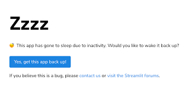
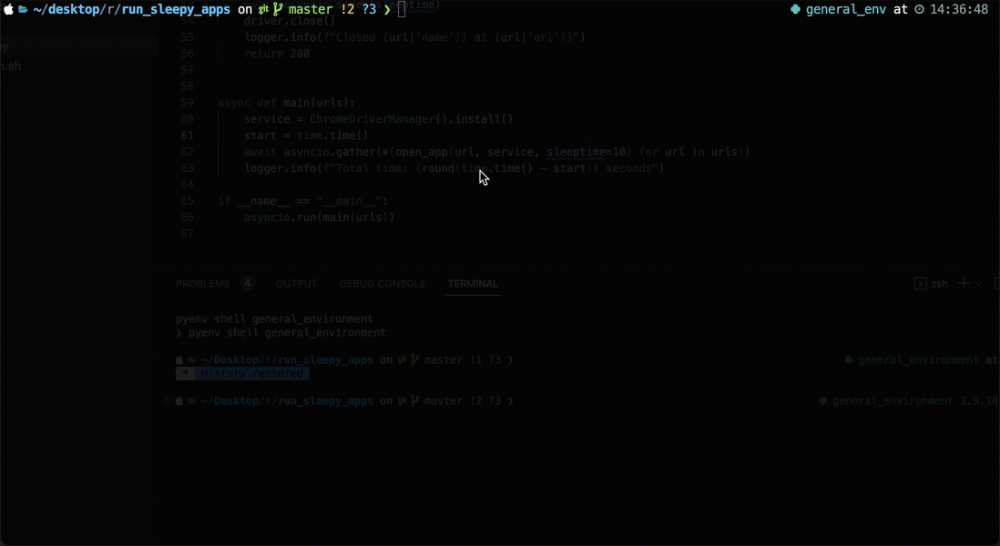
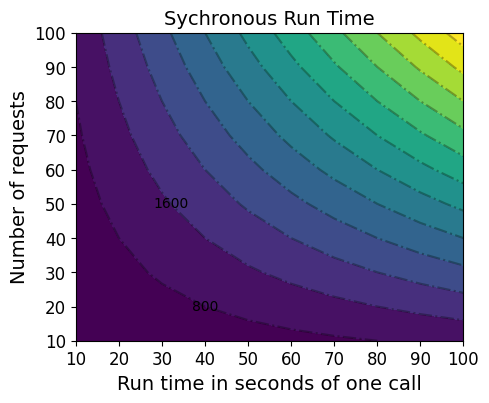
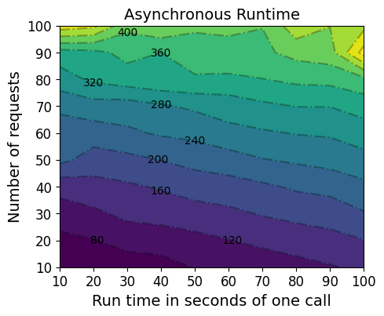
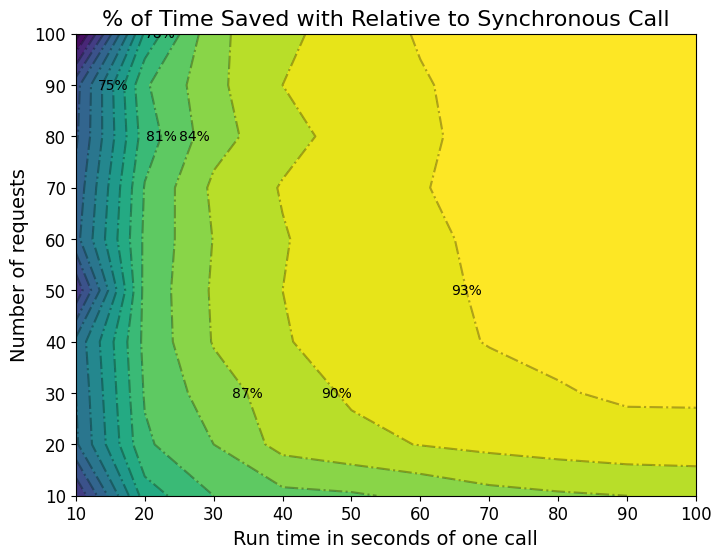

I think anyone who has perused my website or really ever worked with me knows I'm a sucker for easy frameworks to make data oriented web applications. When I worked at PNC, I forced [R Shiny](https://shiny.rstudio.com/) to work for everything from CRUD applications to interactive network graphs. At DataRobot I've built maybe a dozen applications using [Streamlit](https://streamlit.io/) and one or two more in [Dash](https://plotly.com/dash/) as well. Personally, I don't think it's incredibly gratifying to build an interactive application if it's just sitting on your computer. Otherwise, other people can't interact with it! So, when I finish building my stuff, I need to find a way to open it up to the public. Doing this is increasingly easy. In fact, Streamlit and Shiny both offer a way to deploy publicly viewable web applications for free with [Streamlit Cloud](https://streamlit.io/cloud) and [shinyapps.io](https://www.shinyapps.io/).

Here's the problem though: Free services like these are great for getting started, but generally don't keep things  running 24/7. If an app doesn't get a view for a few days, it goes to sleep and the next person who comes to visit finds themselves looking at a message like this:



Now your guest has to click a button and sit around for a server to spin up just so they can click around on your little widget, which is not a great experience for anyone. To handle this, one could simply pay for a service like [Heroku](https://www.heroku.com/) or [AWS](https://aws.amazon.com/) to host their application without downtime. I'm kind of cheap though and I don't want to pay for something I can do for free if I can avoid it. With a little bit of clever Python, it's easy enough to hack around this limitation.

### Key packages
- Selenium: Automates interactions with browsers
- Asyncio: Part of the Python standard library for writing [concurrent](https://en.wikipedia.org/wiki/Concurrency_(computer_science)) code with async/await syntax
- Cron: Command line utility to trigger jobs on a schedule on Unix-like operating systems

### Workflow

Given the tools listed, it shouldn't be too hard to guess my plan for 24/7 up time. I simply take a list of urls, open them, wait a couple of minutes, and then close them in a headless browser with `selenium`. I then schedule it to run on my computer every day using `cron`. Ordinarily, this script wouldn't finish running until I waited as long as I thought each url would need to wait to load multiplied by the amount of urls I visited.  In this case that would be 2 minutes multiplied by 7 urls. Since I've done some asynchronous programming work lately, I thought it would be cool to see how much faster I could make it finish.

```python

import asyncio
import time

from logzero import logger

from selenium import webdriver
from selenium.webdriver.chrome.options import Options
from selenium.webdriver.chrome.service import Service
from webdriver_manager.chrome import ChromeDriverManager

# List of free service hosted web applications I want to keep running
urls = [
    {
        "url": "https://pokepredict.streamlit.app/",
        "name": "Pokemon Battle Predictor",
    },
    {
        "url": "https://drplantclassifier.streamlit.app/",
        "name": "Plant Disease Classifier",
    },
    {
        "url": "https://amlbuddy.streamlit.app/",
        "name": "AML App",
    },
    {
        "url": "https://rollingstonalytics.streamlit.app/",
        "name": "Rolling Stone Top 500",
    },
    {
        "url": "https://statesmigrate.streamlit.app/",
        "name": "Migration App",
    },
    {
        "url": "https://utah-house-pricing.streamlit.app/",
        "name": "Utah Housing Market",
    },
    {
        "url": " https://marshallp.shinyapps.io/ShinyPokemonDB/",
        "name": "Shiny Pokemon DB",
    },
]


async def open_app(url, service, sleeptime=120):
    """Open a webpage, wait *sleeptime seconds, then close it"""

    # Configuration for headless browser (i.e. doesn't open a window)
    chrome_options = Options()
    chrome_options.add_argument("--headless")

    logger.info(f"Opening {url['name']} at {url['url']}...")

    driver = webdriver.Chrome(service=Service(service), options=chrome_options)

    # Go to url
    driver.get(url["url"])
    
    # Wait for 2 minutes and let function execute for other apps in the mean time
    await asyncio.sleep(sleeptime)

    # Close the browser
    driver.close()
    logger.info(f"Closed {url['name']} at {url['url']}")
    return 200


async def main(urls):
    """Open webpage on list of urls concurrently"""
    service = ChromeDriverManager().install()
    start = time.time()
    # Run everything concurrently
    await asyncio.gather(*(open_app(url, service) for url in urls))
    logger.info(f"Finished in {time.time() - start} seconds")

if __name__ == "__main__":
    asyncio.run(main(urls))
```

## Asynchronous programming and Selenium in action

Here's what the script looks like when I set it to sleep until a website has been open for 10 seconds. Notice how all of the applications are opened before the script closes any of them but then closes a bunch at once. That's because asynchronous functions allow other programs to execute while they wait for something (in this case a set period of time).



The act of opening a webpage takes a couple of seconds which is why this script finished in 30 seconds as opposed to ~10 seconds but it still completes in less than half the time taken to run them all in sequence. And if I give the web page more time to load, the effect is more dramatic. When I allow the function to execute with its default wait length of two minutes, it finishes in just 141 seconds, just 20 seconds longer than a single url was set to wait. In other words it only takes 17% more time to finish running on 7 urls than it takes a synchronous program to run on just one url. If an explicit sleep call seems like a gimmicky reason to use asynchronous programming, think about other long running operations that don't actually involve your computer. For instance, in my real person job, we use asynchronous programming often when waiting for rest API calls to post or return results. Some of these operations would take multiple minutes of my computer sitting around doing nothing while waiting on some data or a message when it could be executing a variety of other tasks.

## Scheduling the job

Once I wrote the Python code, the rest was easy. First, I created a small bash script that runs my Python function.

```bash
echo "Refreshing sleepy web apps.."
/Users/marshall.krassenstein/.pyenv/versions/general_env/bin/python run_sleepy_apps.py
```

Then, I scheduled my bash script to run on a schedule with a cron job.

```
30 8,14 * * * cd /Users/marshall.krassenstein/desktop/random_projects/run_sleepy_apps && bash run_sleepy_refresh.sh > /tmp/throwaway.log 2>/tmp/web app_refresh.log
```

Breaking this down:
`30 8,14 * * *`: Every day at 8:30am and 2:30pm.
`cd /Users/marshall.krassenstein/desktop/random_projects/run_sleepy_apps`: Change directory to where the script is located.
`bash run_sleepy_refresh.sh`: Execute the bash script.
`> /tmp/throwaway.log 2>/tmp/web app_refresh.log`: Redirect the output to a log file in case I want to check it later.

And just like that, we have a script that keeps our web applications up and running without having to pay for a server! Hurray!

### A Small Analysis on Time Savings

I planned to stop writing at this point, but I thought it would be fun to do a quick analysis on the amount of time running this script asynchronously can save when varying the amount of urls or time waited. So, I decided to run this script 100 times on a grid of 10 different numbers of requests (10-100) and 10 different wait times (10-100).
Below I compare the expected run time in seconds of synchronous run calls with the run time of asynchronous run calls. No surprise that we see the asynchronous version of the script run an order of magnitude faster by the time we get to 50 requests and 50 seconds wait time. What's more interesting is that my program in this case scaled far more when increasing the time taken for one call rather than the number of calls. I have a feeling this may have to do with the script opening up so many headless browsers and freezing my computer as the number of calls increased :).
|                                   |                                    |
| :-------------------------------: | :--------------------------------: |
|  |  |

A contour of the efficiency gains is shown below. When the script runs for more than a few seconds, the gains are shown very clearly:


## Enhancements I should make at some point:

- Cron jobs are great but a more robust scheduler that lives outside of my computer like Airflow would make this run even when my computer is off.
- My script doesn't press anything on the screen to wake apps up if they're already sleeping. It would probably take two more lines in Selenium to check if a button to 'wake app up' exists on the browser.
- My annotation on my contour plot is kind of weak and I didn't feel like cleaning it up.

Oh there are always so many random things to do!

### Credits

Most of the how to here goes to [Real Python](https://realpython.com/async-io-python/). Some additional props goes to Marcus Braun for explaining the basics of asyncio to me.

### Edit November 20, 2023

A few weeks ago I got a puppy who managed to fry my computer, thus erasing my cron jobs. Instead of creating a new one, I opted to instead put my code in a repo and use github actions to run my script. I think the result is better. Feel free to take it for your own use [here](https://github.com/mpkrass7/app-refresh)! 