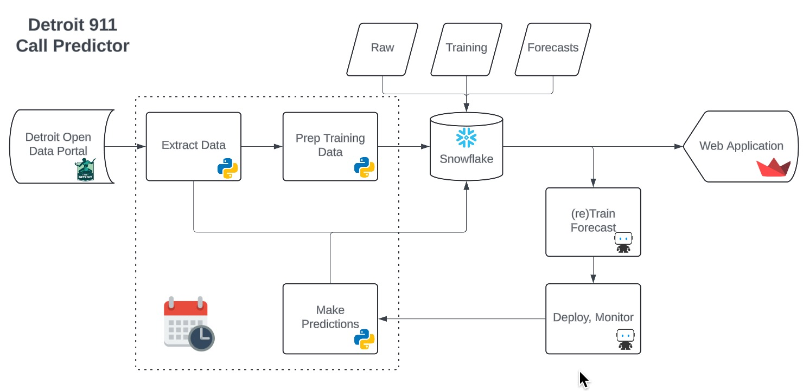
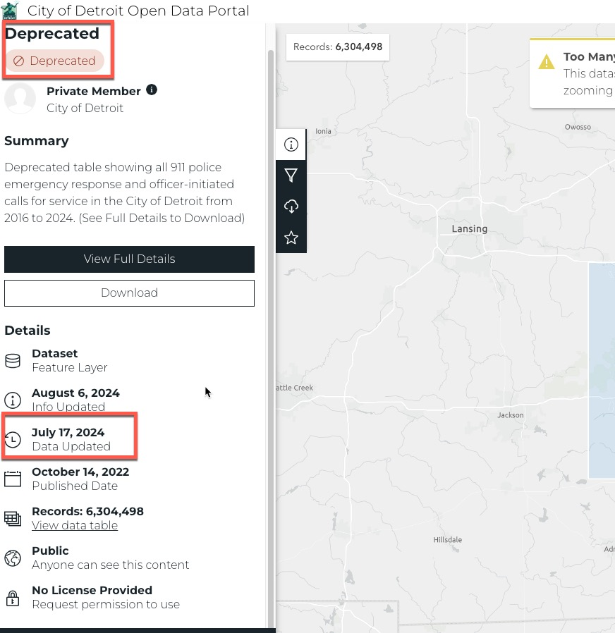
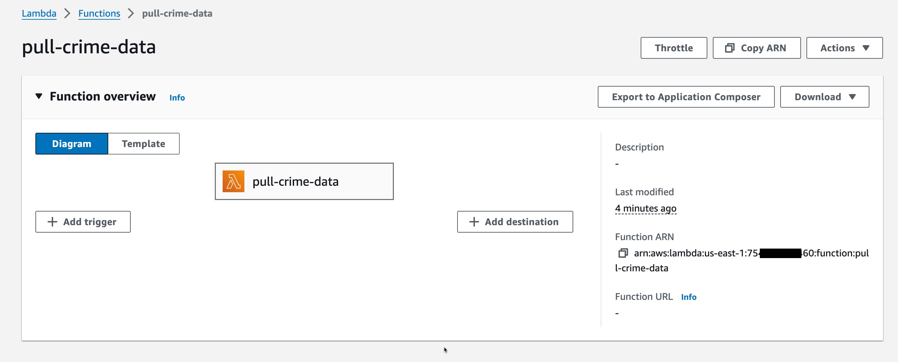
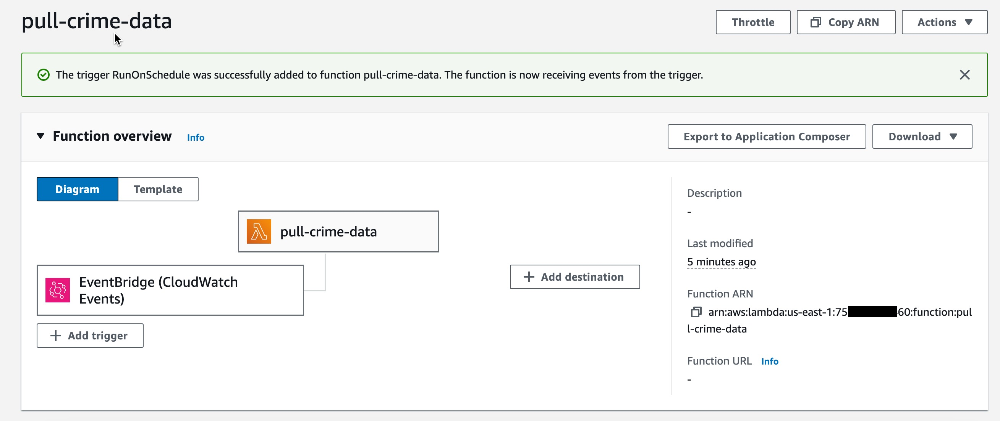

## Summary

In this post I change the way I pull data from the Detroit 911 API. I show how I connect and query the API using Python, how I store the data in a Snowflake database, and how I automate the process using Docker and AWS Lambdas.

## Background

I have been pulling data from the Detroit 911 API for two years now. I use this data to train and plot the forecast in a 911 Calls dashboard that I made in some downtime at DataRobot. It's a great demo asset that I wave around and say "Hey look at this cool thing I made. You too, can do this if you buy our stuff". I'm not joking. It has more than once takes us from "New Business Meeting" to "Proof of Value". These two terms are silly jargon to describe moving forward in the software sales cycle. The app looks like this:


I use a number of nifty tools to make it work:
- A bunch of Python to make API calls and do data munging
- Snowflake to store the training data and forecast results
- DataRobot to train (and retrain) the forecast model
- Github actions to run my Python scripts on a convenient schedule

Below is the architecture for how I keep my application up to date. So involved!



## Motivation

So I've had this app working and wooing the masses with my pithy analytics on all things 911 for a few years. I noticed recently, however, that the data and therefore the forecast hadn't updated since July. My github actions jobs were all running, making predictions and writing to Snowflake successfully. The issue had to be with the Detroit 911 API. Lo and behold, they changed the API.



My older brother works for the city in the Mayors office. My first instinct was to call him and voice my displeasure with the administration. But then I remembered that he's their head of infrastructure and does not do much related to APIs or the police department. Keeping my app updated is my responsibility. So in this post I update my data pulling code. But because I'm fancy, I don't schedule it with github actions. Instead I use Docker and AWS Lambdas as my automation tools of choice.

### Shameless plug: Shouldn't I just use DataRobot for all of this?

I certainly could. DataRobot lets users schedule notebooks that run arbitrary Python code whenever I want. DataRobot also has it's own data storage medium (the AI Catalog) which I already use in my pipeline. I'm already using it to train and host my forecast model, and in fact I'm also using it to host the final web application. And above all, it's much easier to set up a scheduled job for a notebook to run in DataRobot than it is in AWS Lambdas. It's even easier to do it in DataRobot than it is to have my code run in github actions. But hell, I've been here for nearly 4 years. I needed to know for my own sake that I could use technologies that aren't part of the DataRobot ecosystem.

## The Code to Run

Over the next few sections, I'll show the Python files I use to scrape the data and interact with DataRobot, the Dockerfile I use to build the image, and the AWS Lambda function that I use to run the Docker image. Note that I won't be going over the code in any detail here because it's not the purpose of this post. I include it only for completeness on how I got everything working. I also am not doing a DataRobot tutorial in this post so don't look out for me highlighting the AutoML process. If you're struggling with forecasting, you're welcome to reach out.

### The Python

A fortunate piece of this post is that wrote the Python script to pull data from the Detroit 911 API long ago. For the most part I just needed to update the URL and the JSON parsing. Though I will say some of this old code doesn't look particularly clean. Don't judge me.

Pulling the data is a straight forward enough `for` loop, hitting the API with an offset:

<details>

<summary>🔍 Click for Code</summary>

```python
# pull_crime_data.py

from datetime import datetime as dt
import time

from logzero import logger
import pandas as pd
import requests


ONE_YEAR_AGO = (dt.now() - pd.DateOffset(years=1)).strftime("%Y-%m-%d")

RAW_CALLS_ROUTE: str = (
    f"https://services2.arcgis.com/qvkbeam7Wirps6zC/arcgis/rest/services/Police_Serviced_911_Calls/FeatureServer/0/query?where=called_at>'{ONE_YEAR_AGO}'&outFields=*&returnGeometry=false&f=json"
)


def pull_crime_data(num_records: int) -> pd.DataFrame:
    """
    Pull data from the Detroit Police Department's 911 Call for Service API.
    API call generated here: https://data.detroitmi.gov/datasets/detroitmi::911-calls-for-service-last-30-days/about
    """

    one_year_ago = (dt.now() - pd.DateOffset(years=1)).strftime("%Y-%m-%d")
    one_year_ago_millis = (
        int(time.mktime(dt.strptime(one_year_ago, "%Y-%m-%d").timetuple())) * 1000
    )
    raw_data = pd.DataFrame()
    for i, offset in enumerate(range(0, num_records + 2000, 2000)):
        data = requests.get(RAW_CALLS_ROUTE + f"&resultOffset={offset}")
        data = data.json()
        records = [row["attributes"] for row in data.get("features")]
        df = pd.DataFrame(records).loc[lambda x: x["called_at"] > one_year_ago_millis]
        if len(df) > 0:
            start_shape = raw_data.shape
            raw_data = pd.concat((raw_data, df), axis=0)
            if raw_data.drop_duplicates().shape == start_shape:
                logger.info("DataFrame is the same size as before. Exiting loop...")
                break
        if i % 10 == 0:
            logger.info(f"Data Pulled for {offset} records")
            # be nice or pay the price
            time.sleep(1)

    return raw_data


def main():
    count_url = RAW_CALLS_ROUTE + "&returnCountOnly=true"
    record_count = requests.get(count_url)
    num_records = int(record_count.json()["count"])
    logger.info(f"Total Records in past year: {num_records}")

    detroit_crime_raw = pull_crime_data(num_records)

    detroit_crime_raw["day"] = (dt.now() + pd.DateOffset(days=1)).strftime("%Y-%m-%d")
    return detroit_crime_raw
```

</details>

The next script imports my scraper and writes the dataset into Snowflake. I use the `snowflake-connector-python` package and some creative string formatting to get the correct data into the schema I set up.

<details>

<summary>🔍 Click for Code</summary>

```python
# send_to_snowflake.py

from datetime import datetime as dt
import os

from logzero import logger
import pandas as pd
import numpy as np
import snowflake
import snowflake.connector
from snowflake.connector.pandas_tools import write_pandas
from snowflake.connector.connection import SnowflakeConnection, SnowflakeCursor

import pull_crime_data

SNOW_USERNAME = os.environ["SNOWFLAKE_USERNAME"]
SNOW_PASSWORD = os.environ["SNOWFLAKE_PASSWORD"]
SNOW_DATABASE = "SANDBOX"
SNOW_SCHEMA = "DETROIT"
SNOW_TABLE_NAME = "DETROIT_30_DAY_911_CALLS"
SNOW_LONG_TABLE_NAME = "DETROIT_911_CALLS_LONG"
SNOW_WAREHOUSE = "DEMO_WH"
SNOW_ACCOUNT = "PUBLIC"
URL = "datarobot_partner"

CURRENT_DAY = dt.now().strftime("%Y-%m-%d")
PATH = "./data/"


def read_data(path: str) -> pd.DataFrame:
    """
    Reads in the data from the given path.
    """
    return pd.read_csv(path)


def reformat_data(df: pd.DataFrame) -> pd.DataFrame:
    """Make dataset usable for training.

    Condenses raw pull from Detroit API into consistently spaced training data
    uniquely keyed by district, priority, and call hour.
    """
    df_condense = (
        df.assign(
            call_time=lambda x: (x["called_at"] / 1000).astype("datetime64[s]"),
            call_hour=lambda x: x["call_time"].dt.floor("h"),
            call_day=lambda x: x["call_time"].dt.floor("d"),
            priority=lambda x: x["priority"].replace("P", None).replace(" ", None),
            district=lambda x: "District "
            + x.council_district.fillna(0).astype(float).astype(int).astype(str),
            incidents=1,
        )
        .loc[
            lambda x: (x.call_day < CURRENT_DAY)
            | ((x.call_day == CURRENT_DAY) & (x.call_hour.dt.hour == 0))
        ]
        .loc[lambda x: x.district != "District 0"]
        .loc[lambda x: ~pd.isna(x.priority)]
        .assign(priority=lambda x: x.priority.astype(int))
        .loc[lambda x: x.priority.isin(list(range(1, 6)))]
    )

    dummy_p = pd.get_dummies(df_condense.priority.replace(" ", None))

    d_cols = [f"priority_{i}" for i in dummy_p.columns]
    dummy_p.columns = d_cols
    df_encode = pd.DataFrame(
        np.hstack((df_condense, dummy_p)), columns=list(df_condense.columns) + d_cols
    )

    df_shrink = (
        df_encode.groupby(["call_hour", "district"])
        .agg(
            {
                "incidents": "sum",
                "priority_1": "sum",
                "priority_2": "sum",
                "priority_3": "sum",
                "priority_4": "sum",
                "priority_5": "sum",
            }
        )
        .reset_index()
        .assign(association_id=lambda x: x.district + " - " + x.call_hour.astype(str))
        .assign(call_hour=lambda x: x.call_hour.astype(str))
    )
    for i in range(1, 6):
        df_shrink[f"priority_{i}"] = df_shrink[f"priority_{i}"].astype(int)
    df_long = (
        df_condense.groupby(["call_hour", "priority", "district"])["incidents"]
        .sum()
        .reset_index()
        .assign(
            series_id=lambda x: "D" + x.district.str[-1] + "P" + x.priority.astype(str),
            unique_key=lambda x: x.series_id + " " + x.call_hour.astype(str),
            call_hour=lambda x: x.call_hour.astype(str),
        )
    )[["call_hour", "district", "priority", "incidents", "series_id", "unique_key"]]
    df_long.columns = [i.upper() for i in df_long.columns]

    interpolated_df = pd.DataFrame()
    for series in df_long.SERIES_ID.unique():
        t_df = df_long.loc[lambda x: x.SERIES_ID == series].reset_index(drop=True)
        district, priority, series_id = (
            t_df.DISTRICT[0],
            t_df.PRIORITY[0],
            t_df.SERIES_ID[0],
        )
        min_date, max_date = t_df["CALL_HOUR"].min(), t_df["CALL_HOUR"].max()
        t_df["CALL_HOUR"] = pd.to_datetime(t_df["CALL_HOUR"])
        r = pd.date_range(start=min_date, end=max_date, freq="h")
        new_df = (
            t_df.set_index("CALL_HOUR")
            .reindex(r)
            .assign(
                DISTRICT=district,
                PRIORITY=priority,
                SERIES_ID=series_id,
                UNIQUE_KEY=lambda x: series_id + " " + x.index.astype(str),
            )
            .fillna(0)
            .reset_index()
            .rename(columns={"index": "CALL_HOUR"})
        )
        interpolated_df = pd.concat((interpolated_df, new_df), axis=0)
    interpolated_df["CALL_HOUR"] = interpolated_df["CALL_HOUR"].astype(str)

    return df_shrink, interpolated_df


def count_and_delete_records(
    cur: SnowflakeCursor,
    table_name: str,
    longest_ago_call_date: str,
    call_hour: str = "call_hour",
):

    sql = f"""SELECT count(*) as total FROM {SNOW_DATABASE}.{SNOW_SCHEMA}.{table_name} as a WHERE a."{call_hour}" >= TO_TIMESTAMP_NTZ('{longest_ago_call_date}')"""
    cur.execute(sql)
    count_rows = cur.fetchone()[0]

    logger.info(f"Deleting out of date information for {count_rows} records...")
    # Drop records below latest pulled call date
    sql = f"""DELETE FROM {SNOW_DATABASE}.{SNOW_SCHEMA}.{table_name} as a WHERE a."{call_hour}" >= TO_TIMESTAMP_NTZ('{longest_ago_call_date}')"""
    logger.info(f"{count_rows} records deleted")
    cur.execute(sql)


def write_new_records(cnx: SnowflakeConnection, table_name: str, df: pd.DataFrame):
    logger.info(f"Writing new records to {table_name}...")

    # Write the fresh data from the DataFrame to the table
    success, nchunks, nrows, _ = write_pandas(
        cnx,
        df,
        database=SNOW_DATABASE,
        schema=SNOW_SCHEMA,
        table_name=table_name,
        quote_identifiers=True,
    )
    if success:
        logger.info(f"Success: {nchunks} chunks, {nrows} rows written successfully")
    else:
        logger.error("Write failed")


def send_data_to_snowflake(df_wide: pd.DataFrame, df_long: pd.DataFrame) -> None:
    """
    Sends the data to Snowflake.
    """

    # Create the connection to the Snowflake database.
    cnx = snowflake.connector.connect(
        user=SNOW_USERNAME,
        password=SNOW_PASSWORD,
        account=URL,
        warehouse=SNOW_WAREHOUSE,
        database=SNOW_DATABASE,
        schema=SNOW_SCHEMA,
    )

    # Create a Cursor
    cur = cnx.cursor()

    # cur data type

    longest_ago_call_date = min(pd.to_datetime(df_wide.call_hour).astype(str))

    count_and_delete_records(cur, SNOW_TABLE_NAME, longest_ago_call_date)
    write_new_records(cnx, SNOW_TABLE_NAME, df_wide)

    count_and_delete_records(
        cur, SNOW_LONG_TABLE_NAME, longest_ago_call_date, call_hour="CALL_HOUR"
    )
    write_new_records(cnx, SNOW_LONG_TABLE_NAME, df_long)

    cnx.close()


def main(read_from_file: bool = False) -> None:
    if read_from_file:
        logger.info("Reading Data")
        df = read_data(os.path.join(PATH, "detroit_crime.csv"))
    else:
        df = pull_crime_data.main()
    logger.info("Prepping Data")
    df_wide, df_long = reformat_data(df)
    logger.info("Sending Data to Snowflake")
    send_data_to_snowflake(df_wide, df_long)
    logger.info("Finished")


if __name__ == "__main__":
    main(read_from_file=False)


```

</details>

For my last Python script I have the logic to pull predictions from the deployed DataRobot model and write them into Snowflake.

<details>

<summary>🔍 Click for Code</summary>

```python
# retrieve_predictions.py
import datetime
import os

import datarobot as dr
from logzero import logger
import pandas as pd
import snowflake
import snowflake.connector
from snowflake.connector.pandas_tools import write_pandas

SNOW_USERNAME = os.environ["SNOWFLAKE_USERNAME"]
SNOW_PASSWORD = os.environ["SNOWFLAKE_PASSWORD"]
SNOW_DATABASE = "SANDBOX"
SNOW_SCHEMA = "DETROIT"
SNOW_TABLE_NAME_WIDE = "DETROIT_30_DAY_911_CALLS"
SNOW_PREDICTION_TABLE_NAME_WIDE = "DETROIT_30_DAY_911_CALLS_PREDICTIONS"
SNOW_WAREHOUSE = "DEMO_WH"
SNOW_ACCOUNT = "PUBLIC"
URL = "datarobot_partner"


SNOW_TABLE_NAME_LONG = "DETROIT_911_CALLS_LONG"
SNOW_PREDICTION_TABLE_NAME_LONG = "DETROIT_911_CALLS_RENEW_LONG_PREDICTIONS"

DR_ENDPOINT = "https://app.datarobot.com/api/v2/"
API_KEY = os.environ["DATAROBOT_API_TOKEN"]
RETRAINING_AI_CATALOG_ID = "622f8b84b8cf90513094eeca"
BASE_TRAINING_AI_CATALOG_ID = "61ddb8eca93a7c03f6a5816b"
DEPLOYMENT_ID = "62309f2eb9797a90972f84a8"


def pull_data_from_snowflake(SNOW_TABLE):

    # Create the connection to the Snowflake database.
    cnx = snowflake.connector.connect(
        user=SNOW_USERNAME,
        password=SNOW_PASSWORD,
        account=URL,
        warehouse=SNOW_WAREHOUSE,
        database=SNOW_DATABASE,
        schema=SNOW_SCHEMA,
    )

    # # Create a Cursor
    cur = cnx.cursor()
    call_hour = "call_hour" if SNOW_TABLE == SNOW_TABLE_NAME_WIDE else "CALL_HOUR"
    sql = f"""
        SELECT *  
        FROM {SNOW_DATABASE}.{SNOW_SCHEMA}.{SNOW_TABLE} as a 
        WHERE a."{call_hour}" >= (
            SELECT ADD_MONTHS(MAX(b."{call_hour}"),-3) FROM {SNOW_DATABASE}.{SNOW_SCHEMA}.{SNOW_TABLE} as b
            )
            """
    cur.execute(sql)
    df = cur.fetch_pandas_all()
    cur.close()
    return df


def build_long_prediction_set(df: pd.DataFrame, start_hours: int, fd_hours: int) -> pd.DataFrame:

    latest_call_hour = df.CALL_HOUR.max()
    prediction_start = latest_call_hour + datetime.timedelta(hours=start_hours)
    prediction_end = latest_call_hour + datetime.timedelta(hours=fd_hours)

    priorities = [str(i) for i in range(1, 6)]
    df_predictions = df.loc[lambda x: x.PRIORITY.isin(priorities)]
    district_priority = df_predictions[["DISTRICT", "PRIORITY"]].drop_duplicates()
    # district_priority_list = list(itertools.product(*district_priority.values))
    for district, priority in district_priority.values:
        # temp = df.loc[(df.district == district) & (df.priority == priority)]

        df_future = (
            pd.DataFrame(
                pd.date_range(start=prediction_start, end=prediction_end, freq="h")
            )
            .rename(columns={0: "CALL_HOUR"})
            .assign(
                DISTRICT=district,
                PRIORITY=priority,
                SERIES_ID="D" + district[-1] + "P" + str(priority),
            )
        )
        df_predictions = pd.concat((df_predictions, df_future))

    df_prediction_file = (
        df_predictions.reset_index(drop=True)
        .assign(UNIQUE_KEY=lambda x: x.SERIES_ID + " " + x.CALL_HOUR.astype(str))
        .assign(
            CALL_HOUR=lambda x: pd.to_datetime(
                x.CALL_HOUR.astype(str) + ".001", unit="ns"
            )
        )
        .sort_values(by=["SERIES_ID", "CALL_HOUR"])
    )

    return df_prediction_file


def predict(
    data,
    deployment_id,
    forecast_point=None,
    predictions_start_date=None,
    predictions_end_date=None,
):
    """
    Make predictions on data provided using DataRobot deployment_id provided.
    See docs for details:
         https://app.datarobot.com/docs/predictions/api/dr-predapi.html

    Parameters
    ----------
    data : str
        Feature1,Feature2
        numeric_value,string
    deployment_id : str
        Deployment ID to make predictions with.
    forecast_point : str, optional
        Forecast point as timestamp in ISO format
    predictions_start_date : str, optional
        Start of predictions as timestamp in ISO format
    predictions_end_date : str, optional
        End of predictions as timestamp in ISO format

    Returns
    -------
    Response schema:
        https://app.datarobot.com/docs/predictions/api/dr-predapi.html#response-schema

    Raises
    ------
    DataRobotPredictionError if there are issues getting predictions from DataRobot
    """
    # Set HTTP headers. The charset should match the contents of the file.
    headers = {
        "Content-Type": "text/plain; charset=UTF-8",
        "Authorization": "Bearer {}".format(API_KEY),
        "DataRobot-Key": DATAROBOT_KEY,
    }

    url = API_URL.format(deployment_id=deployment_id)

    params = {
        "forecastPoint": forecast_point,
        "predictionsStartDate": predictions_start_date,
        "predictionsEndDate": predictions_end_date,
    }

    # Make API request for predictions
    predictions_response = requests.post(url, data=data, headers=headers, params=params)
    return predictions_response.json()


def predictions_to_dataframe(
    predictions: pd.DataFrame, snow_table_name: str
) -> pd.DataFrame:
    """
    Converts the predictions into a dataframe
    """

    predictions_df = pd.DataFrame()

    for row in predictions["data"]:
        temp_dict = {}
        temp_dict["seriesId"] = [row["seriesId"]]
        temp_dict["timestamp"] = [row["timestamp"]]
        temp_dict["prediction"] = [row["prediction"]]
        temp_dict["forecastDistance"] = [row["forecastDistance"]]
        temp_dict["assocation_id"] = [
            row.get("passthroughValues").get("association_id")
        ]

        if snow_table_name == SNOW_PREDICTION_TABLE_NAME_WIDE:
            temp_dict["assocation_id"] = [
                row.get("passthroughValues").get("association_id")
            ]
            temp_df = pd.DataFrame(temp_dict)
            temp_df.columns = [
                "district",
                "call_hour",
                "incidents",
                "forecast_distance",
                "association_id",
            ]

        else:
            temp_dict["assocation_id"] = [
                row.get("passthroughValues").get("UNIQUE_KEY")
            ]
            try:
                temp_dict["interval_high"] = [
                    row.get("predictionIntervals").get("80").get("high")
                ]
                temp_dict["interval_low"] = [
                    row.get("predictionIntervals").get("80").get("low")
                ]
            except:
                temp_dict["interval_high"] = [0]
                temp_dict["interval_low"] = [0]

            temp_df = pd.DataFrame(temp_dict)
            temp_df.columns = [
                "SERIES_ID",
                "CALL_HOUR",
                "INCIDENTS",
                "FORECAST_DISTANCE",
                "UNIQUE_KEY",
                "INTERVAL_HIGH",
                "INTERVAL_LOW",
            ]

        predictions_df = pd.concat((predictions_df, temp_df))

        temp_df = pd.DataFrame(temp_dict)

    call_hour = (
        "call_hour"
        if snow_table_name == SNOW_PREDICTION_TABLE_NAME_WIDE
        else "CALL_HOUR"
    )
    predictions_df[call_hour] = pd.to_datetime(
        predictions_df[call_hour]
    ).dt.tz_localize(None)
    return predictions_df


def write_latest_predictions_to_snowflake(
    df: pd.DataFrame, snow_prediction_table: str
) -> None:
    cnx = snowflake.connector.connect(
        user=SNOW_USERNAME,
        password=SNOW_PASSWORD,
        account=URL,
        warehouse=SNOW_WAREHOUSE,
        database=SNOW_DATABASE,
        schema=SNOW_SCHEMA,
    )

    # # Create a Cursor
    cur = cnx.cursor()
    if snow_prediction_table == SNOW_PREDICTION_TABLE_NAME_WIDE:
        sql = f"""
            CREATE OR REPLACE TABLE 
            {SNOW_DATABASE}.{SNOW_SCHEMA}.{snow_prediction_table} (
                district TEXT,
                call_hour TIMESTAMP_NTZ,
                incidents numeric(30,3),
                forecast_distance INTEGER,
                association_id TEXT
            );
            """
    else:
        print("Long Query")
        sql = f"""
            CREATE OR REPLACE TABLE
            {SNOW_DATABASE}.{SNOW_SCHEMA}.{snow_prediction_table} (
                SERIES_ID TEXT,
                CALL_HOUR TIMESTAMP_NTZ,
                INCIDENTS numeric(30,3),
                FORECAST_DISTANCE INTEGER,
                UNIQUE_KEY varchar(255) NOT NULL,
                INTERVAL_HIGH numeric(30,3),
                INTERVAL_LOW numeric(30,3)
            );
            """

    cur.execute(sql)

    call_hour = (
        "call_hour"
        if snow_prediction_table == SNOW_PREDICTION_TABLE_NAME_WIDE
        else "CALL_HOUR"
    )
    df[call_hour] = pd.to_datetime(df[call_hour]).astype(str)
    df.columns = [i.upper() for i in df.columns]
    # Write the data from the DataFrame to the table named
    # Update Table Name
    _, _, nrows, _ = write_pandas(
        cnx,
        df,
        database=SNOW_DATABASE,
        schema=SNOW_SCHEMA,
        table_name=snow_prediction_table,
        quote_identifiers=True,
    )
    logger.info(
        "Great success! Wrote {} rows to {}".format(nrows, snow_prediction_table)
    )
    cnx.close()
    return


def remove_old_retraining_data(client: dr.client, did: str):
    url = f"{DR_ENDPOINT}/datasets/{did}/versions/"
    dataset_versions = client.get(url).json()
    logger.info(f"Found {dataset_versions['count']} versions of {did}")
    if dataset_versions["count"] > 75:
        sorted_versions = sorted(
            dataset_versions["data"], key=lambda x: pd.to_datetime(x["creationDate"])
        )
        for version in sorted_versions[:-50]:
            url = f"{DR_ENDPOINT}/datasets/{did}/versions/{version['versionId']}"
            client.delete(url)
        logger.info(f"Deleted {dataset_versions['count'] - 50} versions of {did}")


def main():
    """
    Runs all the functions
    """
    logger.info(f"Retrieving data from Snowflake table: {SNOW_TABLE_NAME_LONG}")
    df = pull_data_from_snowflake(SNOW_TABLE=SNOW_TABLE_NAME_LONG)
    logger.info("Building/writing prediction set")

    scoring_data = build_long_prediction_set(df, 1, 168).to_csv()
    logger.info("Retrieving predictions from DataRobot")

    # Primary Deployment ***
    predictions = predict(
        scoring_data,
        DEPLOYMENT_ID_LONG,
        forecast_point=None,
        predictions_start_date=None, 
        predictions_end_date=None,
    )

    df_predictions = predictions_to_dataframe(
        predictions, SNOW_PREDICTION_TABLE_NAME_LONG
    )

    logger.info(f"Writing predictions to {SNOW_PREDICTION_TABLE_NAME_LONG}")
    write_latest_predictions_to_snowflake(
        df_predictions, SNOW_PREDICTION_TABLE_NAME_LONG
    )

    logger.info("Cleaning out old retraining data from AI Catalog")
    client = dr.Client(endpoint=DR_ENDPOINT, token=API_KEY)
    remove_old_retraining_data(client, RETRAINING_AI_CATALOG_ID)
    remove_old_retraining_data(client, BASE_TRAINING_AI_CATALOG_ID)

    return


if __name__ == "__main__":

    # Long table that predicts on priority
    main()

```

</details>

Ok one last file for this section: The lambda function itself. This is a Python file which simply imports and runs the preceding two files. It's required for AWS Lambda to actually run the code.

```python
import send_to_snowflake
import retrieve_predictions


def lambda_handler(event, context):
    # Retrieve the predictions from the model
    send_to_snowflake.main()
    retrieve_predictions.main()
    return "Data sent to Snowflake"
```

### The Dockerfile

AWS Lambdas come with two parts: The lambda functions themselves and the container that runs the lambda. I use Docker to build the container though I could just as easily upload my code and dependencies to AWS. Below is the Dockerfile I use to build the container. It's a simple file that installs the necessary packages and copies the Python scripts into the container. To figure out the appropriate build and run commands specifically for lambdas I went straight to the [AWS documentation](https://docs.aws.amazon.com/lambda/latest/dg/python-image.html#python-image-instructions).

<details>

<summary>🔍 Click for Code</summary>

```Dockerfile
# Slim python 3.10
FROM public.ecr.aws/lambda/python:3.10

ARG LAMBDA_TASK_ROOT=${LAMBDA_TASK_ROOT} 

# Copy requirements.txt
COPY requirements.txt ${LAMBDA_TASK_ROOT}
COPY constraints.txt ${LAMBDA_TASK_ROOT}

# Install the specified packages
RUN pip install -r requirements.txt -c constraints.txt

# Copy function code
COPY pull_crime_data.py ${LAMBDA_TASK_ROOT}
COPY send_to_snowflake.py ${LAMBDA_TASK_ROOT}
COPY predict.py ${LAMBDA_TASK_ROOT}
COPY retrieve_predictions.py ${LAMBDA_TASK_ROOT}
COPY lambda_function.py ${LAMBDA_TASK_ROOT}


# Define build-time ARG variables
ARG SNOWFLAKE_USERNAME
ARG SNOWFLAKE_PASSWORD
ARG DATAROBOT_API_TOKEN

# Set environment variables using ENV
ENV SNOWFLAKE_USERNAME=${SNOWFLAKE_USERNAME}
ENV SNOWFLAKE_PASSWORD=${SNOWFLAKE_PASSWORD}
ENV DATAROBOT_API_TOKEN=${DATAROBOT_API_TOKEN}

# Set the CMD to your handler (could also be done as a parameter override outside of the Dockerfile)
CMD [ "lambda_function.handler" ]
```

</details>

### Building and Running the Docker Image

Ok that was a lot of code. But now that it's all here, the rest of the post is just a few commands to get everything running. The AWS docs helpfully provide a curl command for testing the lambda function (it worked) as well as code both to log into the AWS console and deploy the lambda function. I'll include my build and test commands below. The build command is a bit longer since I define a bunch of environment variables in the command itself.

```sh 
# Build the docker image
docker build --build-arg SNOWFLAKE_USERNAME=$SNOWFLAKE_USERNAME --build-arg SNOWFLAKE_PASSWORD$SNOWFLAKE_PASSWORD --build-arg DATAROBOT_API_TOKEN=$DATAROBOT_API_TOKEN --tag detroit_crime_pull --platform linux/amd64 .

# Run the docker image
docker run --platform linux/amd64 -p 9000:8080 --read-only detroit_crime_pull
```

### Deploying the Lambda Function

Deploying to AWS is just as easy as testing the image. At this point I could export the image as a .tar.gz file and upload it to AWS, but the documentation makes it even easier. 

<details>

<summary>🔍 Click for Code</summary>

```sh
# Login
aws ecr get-login-password --region us-east-1 | docker login --username AWS --password-stdin 75xxxxxxxx60.dkr.ecr.us-east-1.amazonaws.com

# Create the repository
aws ecr create-repository --repository-name detroit-crime-pull  --region us-east-1 --image-scanning-configuration scanOnPush=true --image-tag-mutability MUTABLE

# Tag the image
docker tag detroit_crime_pull:latest 75xxxxxxxx60.dkr.ecr.us-east-1.amazonaws.com/detroit-crime-pull:latest

# Push the image
docker push 75xxxxxxxx60.dkr.ecr.us-east-1.amazonaws.com/detroit-crime-pull:latest

# Create the lambda function
aws lambda create-function \
  --function-name pull-crime-data \
  --package-type Image \
  --code ImageUri=75xxxxxxxx60.dkr.ecr.us-east-1.amazonaws.com/detroit-crime-pull:latest \
  --role arn:aws:iam::75xxxxxxxx60:role/lambda-role # You can create a role in the console if you don't have one

# Test the lambda function
aws lambda invoke --function-name pull-crime-data response.json

# Response:
{
    "StatusCode": 200,
    "FunctionError": "Unhandled",
    "ExecutedVersion": "$LATEST"
}
```

</details>

At this point, the lambda function is up and works. I can check the logs in AWS to see that the function ran successfully and if I go to the console I can see it happily sitting there.



All that's left is to add a trigger so that it runs on a schedule. I chose to just set this up in the console because I didn't feel like writing more code.



### Conclusion

Hurray for Lambdas! Hurray for Docker! I have my data pipeline up and running again. I'm sure I'll have to update it in a few months when Detroit inevitably changes their API. They application I typically demo is on DataRobot, but I also published it on Streamlit cloud. Feel free to give it a look [here](https://detroit911.streamlit.app/).
