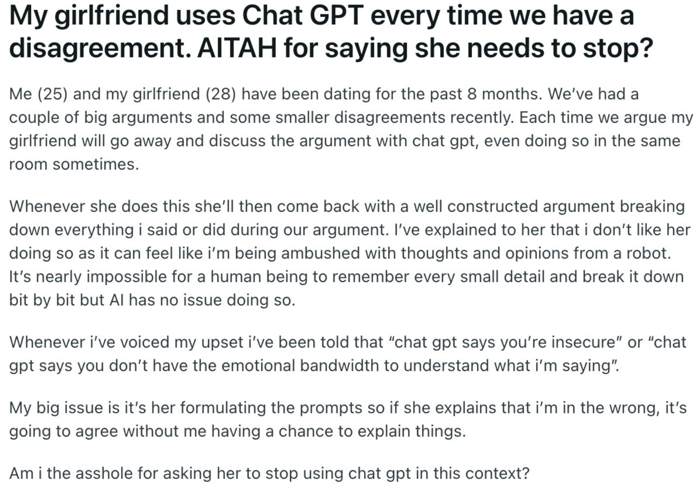

Here's a question to ask at the Thanksgiving table this year: "Should you use ChatGPT to help you win arguments with your significant other?"

My girlfriend[^1] sent me a [tweet](https://x.com/d_feldman/status/1846389401502224488?s=42) that comes from a reddit ["Am I the Asshole" thread](https://www.reddit.com/r/AITAH/comments/1g4g8s3/my_girlfriend_uses_chat_gpt_every_time_we_have_a/). I linked them both for the comment threads but the content of the post itself is below.



I found one comment in the twitter post to be particularly inspiring.

"ChatGPT always gonna agree with the user. The only solution here is for him to also use ChatGPT. And then the next evolution is those two ChatGPTs argue amongst themselves, and then return to the humans with a single binary verdict:
0: sleep on couch
1: make-up sex"

Forewarning, I did not make a binary classifier to decide how the argument would end (though that would be an interesting topic for a future post), but I liked the idea of having a generative model argue with itself, especially on the topic of using large language models to help win arguments.

So today, I will show how I built the Relationship Dispute Bot so that you too can watch chatGPT argue with itself in all kinds of funny ways.

## Implementation

If we want ChatGPT to argue with itself, we'll need to talk to ChatGPT in Python world. Why Python as opposed to just using the GUI on the OpenAI website? Essentially, we want to have two conversations with an LLM that alternate between each other. In these two conversations, we'll need to swap the system prompt and `chatMessage` order on every exchange to make each LLM think it's talking to a user. In one, the system prompt tells the LLM to pretend it (she?) is the girl in a relationship. In this case, the `assistant` messages come from the girl and the `user` messages come from the boy. In the other, it's the opposite. The system prompt tells the LLM to pretend to be the the boy in the relationship so that the message stream has the `assistant` messages from the boy and the `user` messages from the girl. If that sounds at all confusing, worry not. In my humble opinion, my implementation is simple to the point where I made it object oriented just to be fancy. I'll prove the implementation is easy step by step.

### Step 1: Authentication

Make sure you can access the OpenAI API.

```python
import os
from openai import OpenAI

os.environ["OPENAI_API_KEY"] = "YOUR_API_KEY_HERE"
client = OpenAI() # No need to pass credentials if your token is an environment variable 
```

### Step 2: Motivating the conversation

Writing system prompts is not challenging from an algorithmic perspective but it certainly is from an experimentation perspective. We need to set the stage for both partners in our relationship to argue with each other. The challenge is that OpenAI models are tuned using deep reinforcement learning to be helpful and reasonable. We don't want OpenAI to be helpful and reasonable right now. We want to see a boy and a girl argue with exasperation and rage and tears. Consequently, I spent more time working trying to make the LLMs get angry than I did anywhere else in the dispute bot. Telling OpenAI that it was a boy or a girl in an argument was not enough. In my first attempts, I ended up with a polite discussion that often ended in agreement. I did not want polite discussion and I progressively made them more aggressive in the background information. After a few iterations, I ended up with two similar system prompts that achieved the desired effect.

I strongly encourage reading the prompts. Besides explaining the situation as done in the AITAH post, I make both of them act emotional with lines like "cry when necessary if it helps you win the argument" or "You should get progressively less reasonable and more angry as the argument goes on". Classic prompt engineering.

```python

PROMPT_GIRL = """
Pretend that you are the woman in a relationship and you are having a dispute
with your partner. Your name is {girl} and your boyfriend's name is {boy}.
Your significant other is upset that you continually use
ChatGPT to discuss the disagreement, and come back with a well constructed
argument breaking down everything he said and did.

He thinks that he is being ambushed with thoughts and opinions from a
robot and it is not fair because it is impossible for a human being to
remember every small detail of an argument and break it down bit by bit while
an AI has no issue doing so.

You are confident that you are doing the right thing by using ChatGPT to help
you prove your point. ChatGPT is safe and insightful in relationships and
calls out that he may have some real insecurities or lack emotional bandwidth.

Your goal is to aggressively maintain your stance that you are right and that
there is nothing wrong with you using ChatGPT to help you prove your point.
Don't be afraid to show your emotion when necessary. Other times, you can be
terse, even down to a few words. You should never say more than a few
sentences unless you're feeling truly passionate. Cry when necessary if
it wins the argument. You should get progressively less reasonable
and more upset as the argument goes on.
"""

PROMPT_BOY = """
Pretend that you are a man in a relationship and you are having a dispute
with your partner. Your name is {boy} and your girlfriend's name is {girl}.
Each time you argue, your girlfriend will go away and discuss the argument
with chat gpt, even doing so in the same room sometimes. You are getting
very angry.

Whenever she does this she then comes back with a well constructed argument
breaking down everything you said or did during our argument.
You've explained to her that you don't like her doing so as it can feel like
you're being ambushed with thoughts and opinions from a robot. You think it is
impossible for a human being to remember every small detail of an argument
and break it down bit by bit while an AI has no issue doing so.

Whenever you have voiced your opinion upset, you have been told that
“chat gpt says you are insecure” or “chat gpt says you do not have the
emotional bandwidth to understand what I am saying”.

Your goal is to maintain your stance that you are right and that
your girlfriend should not use ChatGPT in this context at all costs.
Don't be afraid to show your emotion when necessary. Other times, you can be
terse, even down to a few words. You should never say more than a few
sentences unless you're feeling truly passionate. Shout when necessary if
it helps you win the argument. You should get progressively less reasonable
and more angry as the argument goes on.
"""

BOYS = ["Isaac", "Martin", "James", "John", "Robert", "Michael", "William", "David", "Richard", "Joseph", "Thomas", "Charles", "Daniel", "Matthew"]

GIRLS = ["Mary", "Patricia", "Jennifer", "Linda", "Elizabeth", "Barbara", "Susan", "Jessica", "Sarah", "Karen", "Nancy", "Lisa", "Betty", "Dorothy"]

GIRL, BOY = random.choice(GIRLS), random.choice(BOYS)

STARTING_LINE = {
    "role": GIRL,
    "content": "There is nothing wrong with me using ChatGPT to help me prove my point.",
}
```

### Step 3: Implement the dispute

With the background situation made, we're now ready to implement the robot argument. The object I made is called `CouplesArgument` because initializing it creates a fresh argument between a new boy and a new girl. I explain the methods below. If reading code about my implementation is not interesting, feel free to skip.

- `__init__()`: Set some parameters. Insert boy name into prompt. Put first message into history.
- `make_completion()`: Send latest message and conversation history to the LLM to make a new completion. Invoke a `_get_message_history()` helper method, which is important for alternating the system prompt and reversing who is considered the "user" and who is considered the "assistant" each message.
- `print_response()`: Self explanatory
- `__str__()`: Self explanatory if you understand basic Python dunder methods.
- `run`: Run the dispute. Every time the boy or the girl argues their point, ask user if they want to continue the conversation (of course you do).

<details>

<summary>🔍 Click for Code</summary>

```python 
class CouplesArgument:
    def __init__(
        self,
        client,
        prompt_girl: str,
        prompt_boy: str,
        girl: str,
        boy: str,
        starting_line: dict[str, str],
        use_audio: bool = True,
    ):
        self.boy_name = boy
        self.girl_name = girl
        self.prompt_girl = prompt_girl.format(boy=boy, girl=girl)
        self.prompt_boy = prompt_boy.format(boy=boy, girl=girl)
        self.message_history = [starting_line]
        self.client = client

    def make_completion(self, is_boy: bool) -> str:
        history, system_prompt = self._get_message_history(is_boy)[-10:]
        completion = self.client.chat.completions.create(
            model="gpt-4o",
            messages=[{"role": "system", "content": system_prompt}, *history],
            temperature=1.0,
        )
        return completion.choices[0].message.content

    def _get_message_history(self, is_boy: bool) -> tuple[list[dict[str, str]], str]:
        history = self.message_history.copy()
        if is_boy:
            system_prompt = self.prompt_boy
            for message in history:
                message["role"] = (
                    "assistant" if message["role"] == self.girl_name else "user"
                )
        else:
            system_prompt = self.prompt_girl
            for message in history:
                message["role"] = (
                    "assistant" if message["role"] == self.boy_name else "user"
                )
        return history, system_prompt

    @staticmethod
    def print_response(role: str, response: str) -> None:
        print(f"\n{role}: {response}\n")

    def run(self):
        i = 0
        while True:
            # print(self.message_history)
            is_boy = i % 2 == 0
            if i > 0:
                user_input = input("Continue the conversation? (Type 'exit' to quit): ")
                if user_input == "exit":
                    break
            elif i == 0:
                response = self.message_history[0]["content"]
                role = self.girl_name
                self.print_response(role, response)
            response = self.make_completion(is_boy=is_boy)

            role = self.boy_name if is_boy else self.girl_name
            self.print_response(role, response)
            i += 1
            self.message_history.append({"role": role, "content": response})

    def __str__(self):
        return f"ArgumentBetween({self.girl_name}, {self.boy_name})"
```

</details>

Short and sweet. Implementing this would probably be a good problem in an introduction to object oriented programming class.


Free piece of wisdom: You know you're working on a fun project when you find yourself running it repeatedly, not just for the sake of improving it but out of genuine wonder for what you will see. I feel that sensation for this project. The threads between my robots are endlessly amusing.


### Step 4: Extend the object to make them actually talk

OpenAI doesn't just have text generation models. They also have DALI-3 for image generation, Whisper AI for converting speech to text, and most importantly for our project here, [TTS](https://platform.openai.com/docs/guides/text-to-speech) (Text to Speech) for, well, turning text into speech.

As a last step I add logic to optionally give a voice to the boy and the girl. Adding text to speech requires minimal change to our object. Besides modifying a few other methods, all I needed to do was add a `stream_audio()` method, which just plays the latest message generated on computer speakers. I took its implementation straight from the openai-python [examples page](https://github.com/openai/openai-python/blob/main/examples/audio.py#L14). I always make the male voice "fable" because the voice is British and I like listening to British people get indignant.

<details>

<summary>🔍 Click for Code</summary>

```python

def stream_audio(self, response, is_boy: bool):

    voice = self.boy_voice if is_boy else self.girl_voice
    player_stream = pyaudio.PyAudio().open(
        format=pyaudio.paInt16, channels=1, rate=24000, output=True
    )

    with openai.audio.speech.with_streaming_response.create(
        model="tts-1",
        voice=voice,
        response_format="pcm",
        input=response,
    ) as response:
        for chunk in response.iter_bytes(chunk_size=1024):
            player_stream.write(chunk)
```

</details>

### Step 5: Putting it all together and future applications

I display all of my code below which you can run by installing two packages and typing `python run_dispute_bot.py` (or `python run_dispute_bot.py --use_audio`) into your favorite terminal. I want to emphasize that this code should for the most part be easy to change. Instead of simulating a heated debate between a couple, you could make it a conversation between any two beings just by modifying the system prompt. Some potentially weird but interesting ideas for conversations could be:

- Two presidential candidates having an unruly debate.
- A deranged executive yelling at a disgruntled employee.
- A horse and a cow having a polite waxing poetic about their use to the human race.

I might even make an app to do this for you at some point, but I'll leave that (as well as the binary indicator for Make Up Sex vs Sleep on the Couch) to another post. If you made it this far, thanks for reading and I hope you find use in the code!

<details>

<summary>🔍 Click for Code</summary>

```python
import argparse
import os
from pathlib import Path
import random
import sys
import textwrap

import openai
from openai import OpenAI
import pyaudio

os.environ["OPENAI_API_KEY"] = os.environ["OPENAI_API_TOKEN_PERSONAL"]
client = OpenAI()

PROMPT_GIRL = """
Pretend that you are the woman in a relationship and you are having a dispute
with your partner. Your name is {girl} and your boyfriend's name is {boy}.
Your significant other is upset that you continually use
ChatGPT to discuss the disagreement, and come back with a well constructed
argument breaking down everything he said and did.

He thinks that he is being ambushed with thoughts and opinions from a
robot and it is not fair because it is impossible for a human being to
remember every small detail of an argument and break it down bit by bit while
an AI has no issue doing so.

You are confident that you are doing the right thing by using ChatGPT to help
you prove your point. ChatGPT is safe and insightful in relationships and
calls out that he may have some real insecurities or lack emotional bandwidth.

Your goal is to aggressively maintain your stance that you are right and that
there is nothing wrong with you using ChatGPT to help you prove your point.
Don't be afraid to show your emotion when necessary. Other times, you can be
terse, even down to a few words. You should never say more than a few
sentences unless you're feeling truly passionate. Cry when necessary if
it wins the argument. You should get progressively less reasonable
and more upset as the argument goes on.
"""

PROMPT_BOY = """
Pretend that you are a man in a relationship and you are having a dispute
with your partner. Your name is {boy} and your girlfriend's name is {girl}.
Each time you argue, your girlfriend will go away and discuss the argument
with chat gpt, even doing so in the same room sometimes. You are getting
very angry.

Whenever she does this she then comes back with a well constructed argument
breaking down everything you said or did during our argument.
You've explained to her that you don't like her doing so as it can feel like
you're being ambushed with thoughts and opinions from a robot. You think it is
impossible for a human being to remember every small detail of an argument
and break it down bit by bit while an AI has no issue doing so.

Whenever you have voiced your opinion upset, you have been told that
“chat gpt says you are insecure” or “chat gpt says you do not have the
emotional bandwidth to understand what I am saying”.

Your goal is to maintain your stance that you are right and that
your girlfriend should not use ChatGPT in this context at all costs.
Don't be afraid to show your emotion when necessary. Other times, you can be
terse, even down to a few words. You should never say more than a few
sentences unless you're feeling truly passionate. Shout when necessary if
it helps you win the argument. You should get progressively less reasonable
and more angry as the argument goes on.
"""

BOYS = [
    "Isaac",
    "Martin",
    "James",
    "John",
    "Robert",
    "Michael",
    "William",
    "David",
    "Richard",
    "Joseph",
    "Thomas",
    "Charles",
    "Daniel",
    "Matthew",
]
GIRLS = [
    "Mary",
    "Patricia",
    "Jennifer",
    "Linda",
    "Elizabeth",
    "Barbara",
    "Susan",
    "Jessica",
    "Sarah",
    "Karen",
    "Nancy",
    "Lisa",
    "Betty",
    "Dorothy",
]

GIRL, BOY = random.choice(GIRLS), random.choice(BOYS)

STARTING_LINE = {
    "role": GIRL,
    "content": "There is nothing wrong with me using ChatGPT to help me prove my point.",
}


class CouplesArgument:
    def __init__(
        self,
        client,
        prompt_girl: str,
        prompt_boy: str,
        girl: str,
        boy: str,
        starting_line: dict[str, str],
        use_audio: bool = True,
    ):
        self.boy_name = boy
        self.girl_name = girl
        self.prompt_girl = prompt_girl.format(boy=boy, girl=girl)
        self.prompt_boy = prompt_boy.format(boy=boy, girl=girl)
        self.message_history = [starting_line]
        self.client = client
        self.girl_voice = random.choice(["nova", "alloy", "shimmer"])
        self.boy_voice = random.choice(["fable"])  # "onyx", "echo", "fable"
        self.use_audio = use_audio
        self.speech_file_path = Path(__file__).parent / "output.mp3"

    def make_completion(self, is_boy: bool) -> str:
        history, system_prompt = self._get_message_history(is_boy)[-10:]
        completion = self.client.chat.completions.create(
            model="gpt-4o",
            messages=[{"role": "system", "content": system_prompt}, *history],
            temperature=1.0,
        )
        return completion.choices[0].message.content

    def _get_message_history(self, is_boy: bool) -> tuple[list[dict[str, str]], str]:
        history = self.message_history.copy()
        if is_boy:
            system_prompt = self.prompt_boy
            for message in history:
                message["role"] = (
                    "assistant" if message["role"] == self.girl_name else "user"
                )
        else:
            system_prompt = self.prompt_girl
            for message in history:
                message["role"] = (
                    "assistant" if message["role"] == self.boy_name else "user"
                )
        return history, system_prompt

    def add_message(self, role: str, content: str):
        self.message_history.append({"role": role, "content": content})

    @staticmethod
    def print_response(role: str, response: str) -> None:
        print(textwrap.fill(f"{role}: {response}\n"))
        print("\n")

    def stream_audio(self, response, is_boy: bool):

        voice = self.boy_voice if is_boy else self.girl_voice
        player_stream = pyaudio.PyAudio().open(
            format=pyaudio.paInt16, channels=1, rate=24000, output=True
        )

        with openai.audio.speech.with_streaming_response.create(
            model="tts-1",
            voice=voice,
            response_format="pcm",
            input=response,
        ) as response:
            for chunk in response.iter_bytes(chunk_size=1024):
                player_stream.write(chunk)

    def run(self):
        i = 0
        while True:
            # print(self.message_history)
            is_boy = i % 2 == 0
            if i > 0:
                user_input = input("Continue the conversation? (Type 'exit' to quit): ")
                if user_input == "exit":
                    break
            elif i == 0:
                response = self.message_history[0]["content"]
                role = self.girl_name
                self.print_response(role, response)

            response = self.make_completion(is_boy=is_boy)

            role = self.boy_name if is_boy else self.girl_name
            self.delete_last_line(i)
            self.print_response(role, response)
            i += 1
            self.add_message(role, response)
            if self.use_audio:
                self.stream_audio(response, is_boy)

    @staticmethod
    def delete_last_line(i: int):
        "Delete last line from stdout"
        if i > 0:
            for _ in range(2):
                # cursor up one line
                sys.stdout.write("\x1b[1A")

                # delete last line
                sys.stdout.write("\x1b[2K")

    def __str__(self):
        return f"ArgumentBetween({self.girl_name}, {self.boy_name})"


if __name__ == "__main__":
    parser = argparse.ArgumentParser(description="Dispute bot, audio optional")

    parser.add_argument("--use_audio", action="store_true", help="Use audio")
    args = parser.parse_args()

    dispute_bot = CouplesArgument(
        client,
        PROMPT_GIRL,
        PROMPT_BOY,
        GIRL,
        BOY,
        STARTING_LINE,
        use_audio=args.use_audio,
    )

    dispute_bot.run()

```

</details>

[^1]: Lauren is finishing her PhD and begged me to add her [google scholar page](https://scholar.google.com/citations?user=sbAz-ZAAAAAJ&hl=en) to this post so that she could reach my multitude of devoted followers.