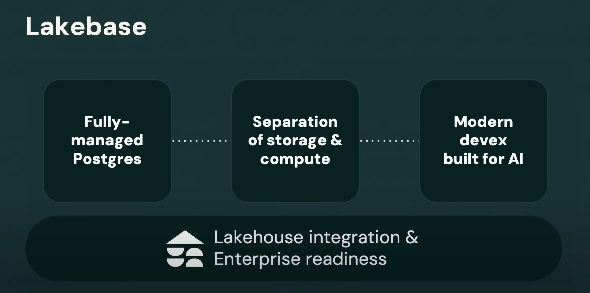
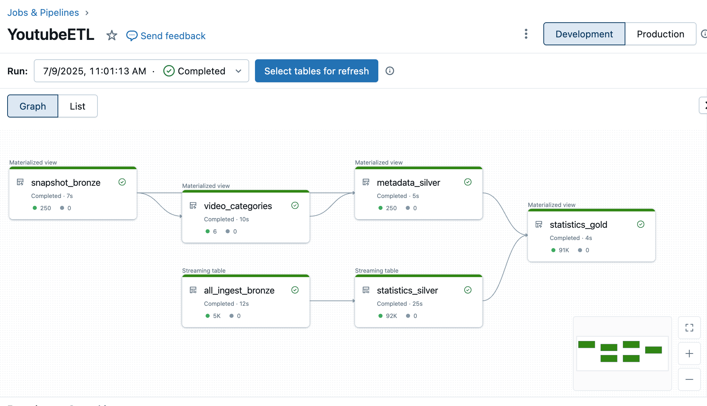
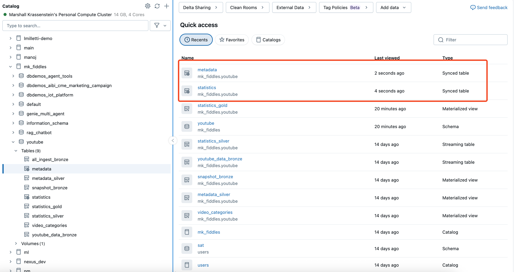
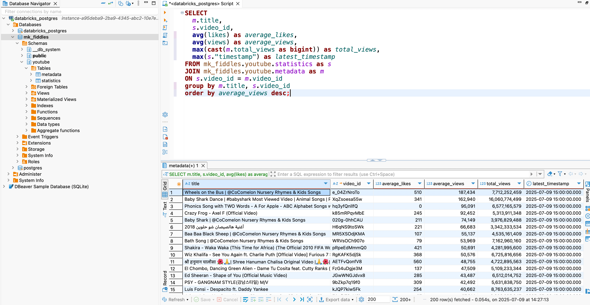

## Quick Summary

In this post I show how to create tables in Lakebase from Unity Catalog tables. I create a Lakebase database, run a job to synchronize Unity Catalog tables, and ensure the data in Lakebase is up to date in one helpful Python script, all without any ETL overhead.

You can view the complete script on [github here](https://github.com/mpkrass7/m_pkfire/blob/master/content/post/2025-07-09-uc-2-lakebase/lakebase_from_uc.py) or expand the snippet below:

<details>

<summary>🔍 Click for Code</summary>

```python
from typing import Any
from dataclasses import dataclass

from databricks.sdk import WorkspaceClient
from databricks.sdk.service.database import (
    DatabaseInstance,
    SyncedTableSpec,
    SyncedDatabaseTable,
    NewPipelineSpec,
    SyncedTableSchedulingPolicy,
)
from databricks.sdk.errors import NotFound
import pyperclip


@dataclass
class TableMapping:
    """
    Represents a mapping between a source table and a destination table.
    """
    source_table: str
    destination_table: str
    primary_key: str
    time_key: str | None = None


# Set the names and catalog/schema for the lakebase instance and tables.
LAKEBASE_INSTANCE_NAME = "youtube-lakebase-instance"
CATALOG = "mk_fiddles"
SCHEMA = "youtube"

# Define the mappings for the tables to be synced
statistics = TableMapping(
    source_table="statistics_gold",
    destination_table="statistics",
    primary_key="video_id",
    time_key="timestamp",
)
metadata = TableMapping(
    source_table="metadata_silver",
    destination_table="metadata",
    primary_key="video_id",
)
# Initialize the WorkspaceClient
# Set your configuration if you're not already logged in
w = WorkspaceClient()

def get_or_create_lakebase_instance(w: WorkspaceClient) -> dict[str, Any]:
    """
    Return lakebase instance if name matches or create a new one.
    """

    try:
        return w.database.get_database_instance(LAKEBASE_INSTANCE_NAME)
    except NotFound:
        database_instance = DatabaseInstance(
            name=LAKEBASE_INSTANCE_NAME, capacity="CU_1", stopped=False
        )
        db = w.database.create_database_instance(database_instance=database_instance)

        return db


def create_synced_table(
    w: WorkspaceClient, table_mapping: TableMapping
) -> SyncedDatabaseTable:
    """
    Create a synced table in the lakebase instance based on the provided table mapping.

    The create call is idempotent, meaning if the table already exists,
    it will not create a new one but return the existing synced table.
    """
    full_source_table_name = f"{CATALOG}.{SCHEMA}.{table_mapping.source_table}"
    full_destination_table_name = (
        f"{CATALOG}.{SCHEMA}.{table_mapping.destination_table}"
    )

    sync_db_table = SyncedDatabaseTable(
        name=full_destination_table_name,
        database_instance_name=LAKEBASE_INSTANCE_NAME,
        logical_database_name=CATALOG,
        spec=SyncedTableSpec(
            new_pipeline_spec=NewPipelineSpec(
                storage_catalog=CATALOG,
                storage_schema=SCHEMA,
            ),
            scheduling_policy=SyncedTableSchedulingPolicy.SNAPSHOT,
            source_table_full_name=full_source_table_name,
            primary_key_columns=[table_mapping.primary_key],
            timeseries_key=table_mapping.time_key,
        ),
    )
    print("Creating synced table:", full_destination_table_name)
    synced_table = w.database.create_synced_database_table(sync_db_table)

    return synced_table

def run_sync_pipelines(
    w: WorkspaceClient,
    pipeline_ids: list[str],
) -> None:
    """
    Sync multiple tables based on the provided table mappings.
    """

    print("Updating pipelines for statistics and metadata tables...")

    for pipeline_id in pipeline_ids:
        w.pipelines.start_update(pipeline_id)
    for pipeline_id in pipeline_ids:
        w.pipelines.wait_get_pipeline_idle(pipeline_id)


def copy_lakebase_token_to_clipboard(w: WorkspaceClient, request_id: str) -> None:
    """
    Generate a database credential for the lakebase instance and copy it to the clipboard.
    """
    credential = w.database.generate_database_credential(
        instance_names=[LAKEBASE_INSTANCE_NAME],
        request_id=request_id,
    )
    pyperclip.copy(credential.token)
    print("Lakebase instance created with credentials copied to clipboard.")
    print(
        "Paste the token in postgres connection string to connect to the lakebase instance."
    )


if __name__ == "__main__":
    
    database = get_or_create_lakebase_instance(w)

    statistics_response = create_synced_table(w, statistics)
    metadata_response = create_synced_table(w, metadata)

    run_sync_pipelines(
        w,
        pipeline_ids=[
            statistics_response.data_synchronization_status.pipeline_id,
            metadata_response.data_synchronization_status.pipeline_id,
        ],
    )

    copy_lakebase_token_to_clipboard(w, request_id="lakebase-from-uc-clip-token")

```

</details>

## Motivation

Lakebase was one of the biggest announcements at Databricks' Data & AI Summit this year. 

There's all kinds of important features and capabilties in Lakebase that make it useful for most transactional database needs with some extra benefits unique to Databricks. I list a few of the [big points](https://www.databricks.com/blog/what-is-a-lakebase) below:
- Openness: Lakebases are built on open source standards, e.g. Postgres.
- Separation of storage and compute: Lakebases store their data in modern data lakes (object stores) in open formats, which enables scaling compute and storage separately, leading to lower TCO and eliminating lock-in.
- Serverless: Lakebases are lightweight, and can scale elastically instantly, up and down, all the way to zero. At zero, the cost of the lakebase is just the cost of storing the data on cheap data lakes.
- Modern development workflow: Branching a database should be as easy as branching a code repository, and it should be near instantaneous.
- Built for AI agents: Lakebases are designed to support a large number of AI agents operating at machine speed, and their branching and checkpointing capabilities allow AI agents to experiment and rewind.
- Lakehouse integration: Lakebases should make it easy to combine operational, analytical, and AI systems without complex ETL pipelines.

This post is not ambitious in its coverage of Lakebase. It does not boast about performance capabilties, integrate lakebase tables with a webapp, or setup autonomous agents. What it does show is how to quickly get an OLTP database setup in Lakebase with Unity Catalog data - no ETL pipelines or any data movement needed. In return we get blazing fast query performance for whatever applications we might want to build in the future.



Databricks describes how to create synced tables in its [OLTP database documentation](https://docs.databricks.com/aws/en/oltp/) via UI. Yet the process of setting up multiple synced tables via point and click interface is annoyingly manual. The docs do show a few curl requests for creating synced tables but the context around these requests is limited, spread across multiple pages, and the Databricks SDK is preferred over rest API calls in any case.

## Datasets

While the script I write is generalizable to any Unity Catalog table, I want to introduce the datasets I'm using, which come from an actual declarative pipeline I built on Databricks. It uses the [Youtube Data API](https://developers.google.com/youtube/v3) to pull information on the [250 most viewed videos of all time](https://www.youtube.com/playlist?list=PLirAqAtl_h2r5g8xGajEwdXd3x1sZh8hC) every hour. Not that it's relavant for this post but building a pipeline to efficiently grab and transform Youtube data has been an interesting project in and of iteself and reviewing the staggeringly high consumption of children's music videos is a fascinating exercise. Perhaps it will be the subject of a future post.



From this pipeline, I'll use two tables:

- statistics_gold: Contains hourly views, comments, and likes for each video
- metadata_silver: Contains metadata like the description, duration and publish date of each video

## Preliminaries

We'll first need to import our packages and set up a few variables that define what we want to set up and what tables we want to sync from Unity Catalog. We'll define:

- Our Lakebase instance name
- The existing catalog to sync
- The existing schema within the catalog to sync
- Both the source table name within the existing schema and the destination table name within our lakebase instance
- Primary key and, if needed, time key to enforce deduplication constraints and make database access more efficient
- Our workspace client, which has a bunch of methods we'll need for setting everything up.

Since I'm creating two synced tables, I add a small dataclass object for storing some of the above details, which makes the implementation slightly cleaner. If you're following and running the code here, the variables are the only things you will need to change in order to have this script work with your own pipelines.

<details>

<summary>🔍 Click for Code</summary>

```bash
# Install dependencies
pip install pyperclip databricks-sdk
```

```python
from dataclasses import dataclass

from databricks.sdk import WorkspaceClient

# Pick a name for your lakebase instance
LAKEBASE_INSTANCE_NAME = "youtube-lakebase-instance"

# Catalog and schema from Unity Catalog
CATALOG = "mk_fiddles"
SCHEMA = "youtube"

@dataclass
class TableMapping:
    """
    Collection of arguments for setting up synced tables
    """
    source_table: str
    destination_table: str
    primary_key: str
    time_key: str | None = None

# Define the mappings for the tables to be synced
statistics = TableMapping(
    source_table="statistics_gold",
    destination_table="statistics",
    primary_key="video_id",
    time_key="timestamp",
)
metadata = TableMapping(
    source_table="metadata_silver",
    destination_table="metadata",
    primary_key="video_id",
)

# Initialize the WorkspaceClient
# Set your configuration if you're not already logged in
w = WorkspaceClient()
```

</details>

## 1. Set up a Lakebase Instance 

Looking at the [Databricks documentation](https://docs.databricks.com/aws/en/oltp/create/#-create-a-database-instance) for setting up a Lakebase database, we immediately run into an annoying issue: The curl request in the docs uses a POST request and POST requests are not idempotent. If we follow the directions, our script would create a new instance every time we run it and we definitely don't want that. Generally, the need for idempotent transactions on Databricks is a clear indicator that we should use [Terraform](https://registry.terraform.io/providers/databricks/databricks/latest/docs) or [Databricks Asset Bundles](https://docs.databricks.com/aws/en/dev-tools/bundles/) to better CRUD our assets, but Lakebase is nascent enough that neither option is supported yet. Still, we can do better than the Databricks suggestion. I define a simple function below to ensure we only create a new instance if one matching our name doesn't already exist. 

<details>

<summary>🔍 Click for Code</summary>

```python
from typing import Any

from databricks.sdk.service.database import (
    DatabaseInstance
)
from databricks.sdk.errors import NotFound

def get_or_create_lakebase_instance(w: WorkspaceClient) -> dict[str, Any]:
    """
    Return lakebase instance if name matches or create a new one.
    """

    try:
        return w.database.get_database_instance(LAKEBASE_INSTANCE_NAME)
    except NotFound:
        database_instance = DatabaseInstance(
            name=LAKEBASE_INSTANCE_NAME, capacity="CU_1", stopped=False
        )
        db = w.database.create_database_instance(database_instance=database_instance)

        return db

```

</details>


## 2. Create Synced Tables

Once we have a Lakebase instance that can house our tables, our next step is to setup a synced table. The docs once again show how to do this via CURL request but the background information supplied is limited. 

I once again convert these curl requests into a Databircks SDK call below. Reading the code, you might notice that I abandoned my earlier complaint about non idempotent operations here. This is not covered in our documentation anywhere but it turns out that the `create_synced_table` method, despite executing a POST request in the background is actually idempotent in its implementation. Thus, we can execute our create synced table call as often as we want without worrying about throwing errors or creating lots of synced tables.

<details>

<summary>🔍 Click for Code</summary>


```python
from databricks.sdk.service.database import (
    SyncedTableSpec,
    SyncedDatabaseTable,
    NewPipelineSpec,
    SyncedTableSchedulingPolicy,
)

def create_synced_table(
    w: WorkspaceClient, table_mapping: TableMapping
) -> SyncedDatabaseTable:
    """
    Create a synced table in the lakebase instance based on the provided table mapping.

    The create call is idempotent, meaning if the table already exists,
    it will not create a new one but return the existing synced table.
    """
    full_source_table_name = f"{CATALOG}.{SCHEMA}.{table_mapping.source_table}"
    full_destination_table_name = (
        f"{CATALOG}.{SCHEMA}.{table_mapping.destination_table}"
    )

    sync_db_table = SyncedDatabaseTable(
        name=full_destination_table_name,
        database_instance_name=LAKEBASE_INSTANCE_NAME,
        logical_database_name=CATALOG,
        spec=SyncedTableSpec(
            new_pipeline_spec=NewPipelineSpec(
                storage_catalog=CATALOG,
                storage_schema=SCHEMA,
            ),
            scheduling_policy=SyncedTableSchedulingPolicy.SNAPSHOT,
            source_table_full_name=full_source_table_name,
            primary_key_columns=[table_mapping.primary_key],
            timeseries_key=table_mapping.time_key,
        ),
    )
    print("Creating synced table:", full_destination_table_name)
    synced_table = w.database.create_synced_database_table(sync_db_table)

    return synced_table
```

</details>


## 3. Run Table Synchronization

In the snippet above, I passed a scheduling argument for the table sync that says `SyncedTableSchedulingPolicy.SNAPSHOT`. The [docs](https://docs.databricks.com/aws/en/oltp/sync-data/sync-table?language=UI#create-a-synced-table) describe another policy called 'Continous' that keeps the synced table in line with the Unity Catalog table in near real time. Continuous mode requires the source table to have [Change Data Feed](https://docs.databricks.com/aws/en/delta/delta-change-data-feed) enabled. If your table has the Change Data Feed enabled, you can change the above arugment and skip the `run_sync_pipelines` step I define below. Since I promised to have this scipt work with any Unity Catalog table, I include the code for triggering the tables to synchronize.

<details>

<summary>🔍 Click for Code</summary>


```python
def run_sync_pipelines(
    w: WorkspaceClient,
    pipeline_ids: list[str],
) -> None:
    """
    Sync multiple tables based on the provided table mappings.
    """

    for pipeline_id in pipeline_ids:
        w.pipelines.start_update(pipeline_id)
    for pipeline_id in pipeline_ids:
        w.pipelines.wait_get_pipeline_idle(pipeline_id)

```

</details>

## 4. Putting it Together 

Now we can put everything together by calling the functions we created and our result will be a lakebase instance housing two synced Unity Catalog tables! 

```python
database = get_or_create_lakebase_instance(w)

statistics_response = create_synced_table(w, statistics)
metadata_response = create_synced_table(w, metadata)

run_sync_pipelines(
    w,
    pipeline_ids=[
        statistics_response.data_synchronization_status.pipeline_id,
        metadata_response.data_synchronization_status.pipeline_id,
    ],
)
```

If you followed me this far, pat yourself on the back. We can confirm everything worked in the UI, where there are now two synced tables listed.



## 5. (Bonus) Generate a Database Key

Strictly speaking, we accomplished the mission of this blog post. Still, it would be nice if we could prove everything worked by connecting to our Lakebase Instance directly instead of looking at synced tables through the Unity Catalog. As a bonus, I include one more function that generates a database credential for our lakebase instance and helpfully copies it to the clipboard. We'll use the credential to connect to Lakebase through Dbeaver, though we could use any database tool that accepts a Postgres connection string.

<details>

<summary>🔍 Click for Code</summary>

```python
import pyperclip

def copy_lakebase_token_to_clipboard(w: WorkspaceClient) -> None:
    """
    Generate a database credential for the lakebase instance and copy it to the clipboard.
    """
    credential = w.database.generate_database_credential(
        instance_names=[LAKEBASE_INSTANCE_NAME],
        request_id="lakebase-from-uc-clip-token",
    )
    pyperclip.copy(credential.token)
    print("Lakebase instance created with credentials copied to clipboard.")
    print(
        "Paste the token in postgres connection string to connect to the lakebase instance."
    )
```
</details>

Once run, we can access Dbeaver and query our data with the blazing fast speed of Postgres SQL. And in case you had some questions about highly viewed Youtube videos, here are some important insights:
1. The Baby Shark Dance has the most views on Youtube.
2. Two of top five most frequently watched videos are the Baby Shark dance (yes there are two in the top 250 most viewed videos in all of Youtube).
3. But the most regularly accessed video at least since I started collecting this data is `Wheels on The Bus`.



## Final Thoughts

Lakebase will be an often used product at Databricks going forward for many applications. In this post, I showed how to take existing Unity Catalog tables and make them work with Lakebase with virtually no overhead.