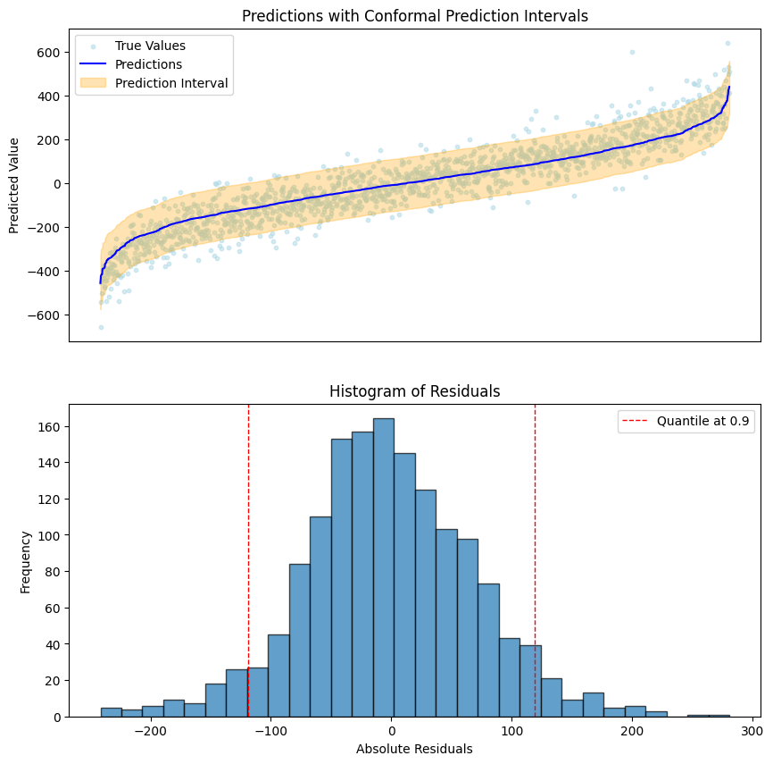
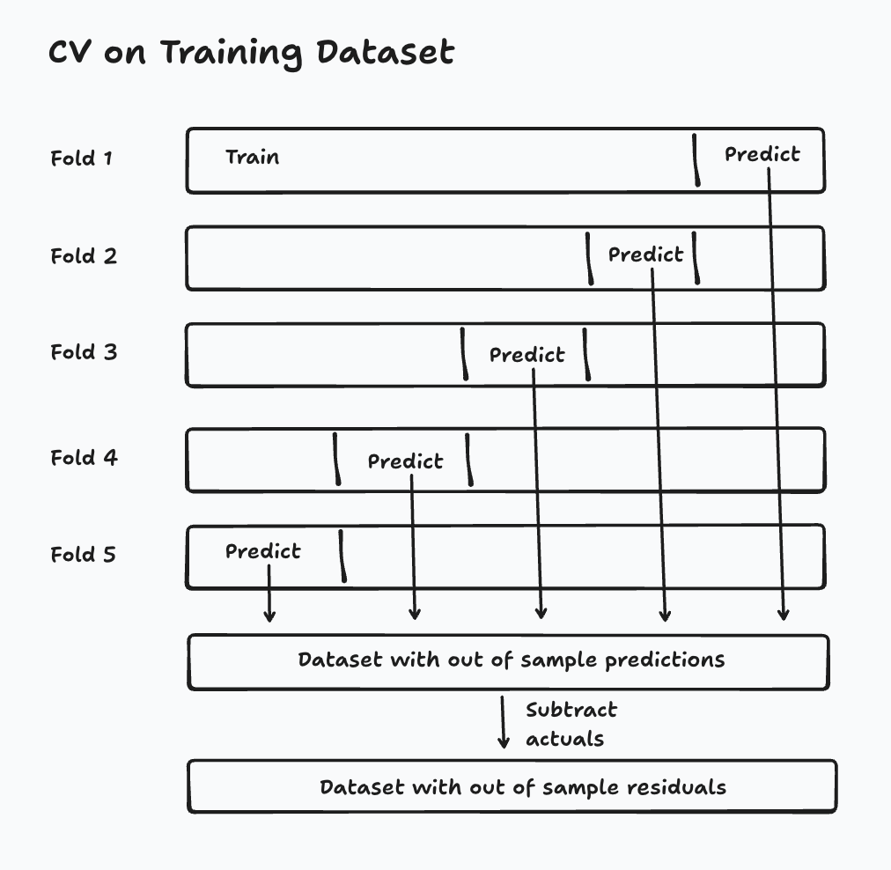
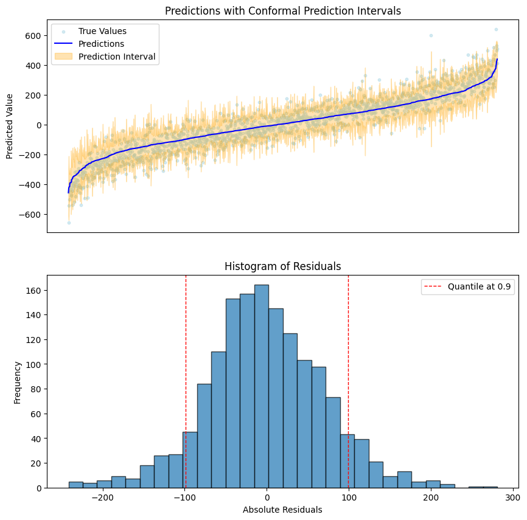

In this post I walk through two conformal inference techniques in regression problems. Absolute conformal inference is a simple way to create consistent prediction intervals around point predictions that do not vary in width. Locally weighted conformal inference is more complex but has the added benefit that the prediction interval width varies with the uncertainty of the specific data point. 

After showing how to build each technique, I follow the standard MLFlow pathways to log, register and deploy both models, allowing uncertainty quantification at scale. 


## Motivation

Conformal inference provides a model-agnostic framework for quantifying uncertainty in machine learning predictions by generating statistically valid prediction intervals around point estimates. Unlike traditional uncertainty quantification methods that rely on the specifics of a model, conformal prediction works with **any** underlying ML model—whether it's a neural network, random forest, or gradient boosting machine—by leveraging the exchangeability of data points to construct prediction sets with finite-sample coverage guarantees. Conformal inference is valuable because it transforms overconfident point predictions into calibrated uncertainty estimates, enabling practitioners to make more informed decisions by understanding not just what the model predicts, but how confident they should be in that prediction, ultimately leading to more robust and trustworthy AI systems in high-stakes applications across any industry. Conformal inference is a valuable technique in any machine learning practitioner's toolkit.

With that, let's get started!

## Absolute Conformal Inference

Absolute conformal inference is one of the easiest ways to make prediction intervals around arbitrary models. In this notebook, I generate data for a regression problem (the target is continuous), but this technique works with classification problems too! 

The idea is simple:
0. Choose a coverage level you want. The coverage level is the percentage of predictions we want to fall in our prediction interval. In the code below, we use .9 for 90% coverage.
1. Train your model
2. Make predictions on a calibration dataset
3. Compute the 90th quantile of the *absolute value* of the residuals
4. When you make future predictions (in our case on our test set), your upper bound is created by adding the quantile to the predictions. Your lower bound is created by subtracting the quantile from the predictions.

That's it. After that you can deploy the model and enjoy prediction intervals with coverage guarantees. Absolute conformal inference is great because it's simple. Its big drawback is that the prediction interval is not dependent on the evaluated data. In other words, the range of values it can take for one point prediction is no larger or smaller than the range of values it can take for another point prediction.


```python
import matplotlib.pyplot as plt
import mlflow
import mlflow.pyfunc
from mlflow.deployments import set_deployments_target

import numpy as np
import pandas as pd
from sklearn.datasets import make_regression
from sklearn.ensemble import RandomForestRegressor
from sklearn.model_selection import train_test_split

from MWIS_metric import score as MWIS_score

mlflow.set_tracking_uri("databricks")
mlflow.set_experiment("/conformal_inference")
set_deployments_target("databricks")

COVERAGE = 0.9  # Desired coverage level for prediction intervals
```


First, let's ensure we have a schema to [register](https://docs.databricks.com/aws/en/mlflow/models) our model in Unity Catalog. 


```python
CATALOG, SCHEMA, ABSOLUTE_CONFORMAL_MODEL = "mk_fiddles", "conformal_inference", "absolute_conformal_model"

spark.sql(f"CREATE SCHEMA IF NOT EXISTS {CATALOG}.{SCHEMA}")
```


We'll want to define our absolute conformal model as a custom MLFlow Python Model. Essentially, it will behave just like our standard scikit-learn model except we'll override the prediction method so that it adds a prediction interval based on our calculated quantile.


```python

class AbsoluteConformalModel(mlflow.pyfunc.PythonModel):
    def __init__(self, model, quantile: float):
        self.model = model
        self.prediction_interval = quantile

    def predict(self, model_input: pd.DataFrame) -> pd.DataFrame:
        """Combine predictions from multiple models"""
        # Get predictions from both models
        predictions = self.model.predict(model_input)
        upper_bound = predictions + self.prediction_interval
        lower_bound = predictions - self.prediction_interval

        return pd.DataFrame(
            {
                "predictions": predictions,
                "lower_bound": lower_bound,
                "upper_bound": upper_bound,
            }
        )
```


We'll need some data for our model. Since we're not tuning hyperparameters or performing model selection, we ordinarily wouldn't need to use a validation set. Here though, we need out-of-sample data to find our quantile and we want to plot the results on some held-out data later. Therefore we need a training dataset, a "calibration dataset" and a test dataset.


```python
def get_data() -> tuple[pd.DataFrame, pd.DataFrame]:
    X, y = make_regression(
        n_samples=10000, n_features=20, n_informative=10, noise=0.1, random_state=42
    )
    X = pd.DataFrame(X, columns=[f"feature_{i}" for i in range(20)])
    y = pd.DataFrame(y, columns=["target"])
    return X, y


def split_data(
    X: pd.DataFrame, y: pd.DataFrame
) -> tuple[
    pd.DataFrame, pd.DataFrame, pd.DataFrame, pd.DataFrame, pd.DataFrame, pd.DataFrame
]:
    X_train, X_temp, y_train, y_temp = train_test_split(
        X, y, test_size=0.3, random_state=42
    )
    X_cal, X_test, y_cal, y_test = train_test_split(
        X_temp, y_temp, test_size=0.5, random_state=42
    )
    return X_train, y_train, X_cal, y_cal, X_test, y_test
```


We also need to define some functions to fit a model as well as calculate our quantiles. Below, you'll notice that we're not actually taking the quantile but rather taking the quantile plus a small penalty based on the size of our data. That is a way of quantifying that we have a sample of data rather than our entire population. 


```python
def fit_model(X_train: pd.DataFrame, y_train: pd.DataFrame) -> RandomForestRegressor:
    """
    Train a regressor on the training data
    """
    hyperparameters = {
        "n_estimators": 100,
        "max_depth": None,
        "min_samples_split": 2,
        "min_samples_leaf": 1,
        "random_state": 42,
    }

    model = RandomForestRegressor(**hyperparameters)
    model.fit(X_train, y_train.values.ravel())
    return model


def compute_residuals_and_quantile_absolute_conformal(
    model: RandomForestRegressor,
    X_cal: pd.DataFrame,
    y_cal: pd.DataFrame,
    coverage: float,
) -> np.ndarray:
    """Apply quantiles with sampling correction for absolute conformal inference"""
    y_cal_pred = model.predict(X_cal)
    residuals = y_cal.values.ravel() - y_cal_pred
    quantile = np.quantile(abs(residuals), q=coverage * (1 + 1 / len(residuals)))
    return residuals, quantile
```


A plot of the residuals and the prediction intervals will be helpful to show for this analysis.  It will help us verify our coverage guarantees.


```python
from typing import Literal


def plot_output(
    predictions: pd.DataFrame,
    true_values: np.ndarray,
    residuals: np.ndarray,
    quantile: float,
    interval_type: Literal["absolute", "locally_weighted"] = "absolute",
    filename: str = None,
):
    """
    Plot histogram of residuals and prediction intervals
    1. Histogram of residuals with quantile lines
    2. Predictions with conformal prediction intervals
    """
    fig, ax = plt.subplots(nrows=2, figsize=(10, 10))

    interval, hist = ax
    hist.hist(residuals, bins=30, edgecolor="k", alpha=0.7)
    hist.set_title("Histogram of Residuals")
    hist.set_xlabel("Absolute Residuals")
    hist.set_ylabel("Frequency")
    if interval_type == "absolute":
        vline = quantile
    else: 
        vline = (predictions.residual_predictions * quantile).mean()

    hist.axvline(
        vline,
        color="red",
        linestyle="dashed",
        linewidth=1,
        label=f"Quantile at {COVERAGE}",
    )
    hist.axvline(-vline, color="red", linestyle="dashed", linewidth=1)
    hist.legend()
    sorted_predictions = predictions.assign(true_values=true_values).sort_values(
        by="predictions"
    )

    interval.scatter(
        range(len(predictions)),
        sorted_predictions.true_values,
        color="lightblue",
        alpha=0.5,
        label="True Values",
        s=10,
    )
    interval.plot(
        sorted_predictions.predictions.values, label="Predictions", color="blue"
    )
    interval.fill_between(
        range(len(predictions)),
        sorted_predictions.lower_bound,
        sorted_predictions.upper_bound,
        color="orange",
        alpha=0.3,
        label="Prediction Interval",
    )
    interval.set_title("Predictions with Conformal Prediction Intervals")
    interval.set_xlabel("")
    interval.set_xticks([])
    interval.set_ylabel("Predicted Value")
    interval.legend()
    if filename:
        plt.savefig(filename)
    return fig
```


Now we can put it together. First we'll create our conformal inference model by following the steps above. Later we'll log it, register and serve it using MLFlow.


```python
# Path to save image
plot_output_path = "../images/absolute_conformal.png"

X, y = get_data()
X_train, y_train, X_cal, y_cal, X_test, y_test = split_data(X, y)
model = fit_model(X_train, y_train)
residuals, quantile = compute_residuals_and_quantile_absolute_conformal(model, X_cal, y_cal, COVERAGE)

prediction_interval_width = round(2 * quantile, 2)
print(
    f"Prediction interval width at coverage {COVERAGE}: {prediction_interval_width}"
)

conformal_model = AbsoluteConformalModel(model, quantile=quantile)

predictions = conformal_model.predict(X_test)
fig = plot_output(predictions, y_test.values.ravel(), residuals, quantile, filename=plot_output_path)
fig.show()
```

    Prediction interval width at coverage 0.9: 237.66


    

    


Have you ever implemented a decision tree? The details are quite annoying though the bagging part to make it into a RandomForest is intuitive enough. Luckily, our knowledge of the internals doesn't matter. Our fitted model has the magical property of providing an upper and a lower bound without us needing to think about the internals of its implementation at all. 

Now we can start logging our model, some metrics around it, and our above plot. You'll notice an import of something called MWIS which stands for *Mean Winkler Interval Score* which penalizes predictions outside the interval. For a given prediction, the lowest score possible is the prediction interval size. Read more about it in [Forecasting: Principles and Practice](https://otexts.com/fpp3/distaccuracy.html#winkler-score).


```python

# Log the model with MLflow to Databricks
with mlflow.start_run():
    absolute_conformal_model_info = mlflow.pyfunc.log_model(
        artifact_path="absolute_conformal_model",
        python_model=conformal_model,
        input_example=X_test.iloc[:1],
        registered_model_name=f"{CATALOG}.{SCHEMA}.{ABSOLUTE_CONFORMAL_MODEL}",
    )
    mlflow.log_param("coverage_param", COVERAGE)
    mlflow.log_param("quantile", round(quantile, 2))
    mlflow.log_metric("prediction_interval_width", prediction_interval_width)

    mwis, actual_coverage = MWIS_score(
        y_test.values.ravel(),
        predictions.lower_bound,
        predictions.upper_bound,
        COVERAGE,
    )
    print("MWI score:", round(mwis, 3))
    print(f"Predictions coverage: {round(actual_coverage * 100, 1)}%")
    mlflow.log_metric("MWIS", round(mwis, 3))
    mlflow.log_metric("Coverage", round(actual_coverage, 2))

    mlflow.log_artifact(plot_output_path)
fig.show()
```

    MWI score: 245.14
    Predictions coverage: 91.5%


With minimal extra effort we have a model recorded and registered in the Unity Catalog. Let's verify that it is logged correctly by pulling predictions from it. I'll install uv first to make the package downloading really fast. Fair warning, this step might take a little while. I would not be mad if you skipped it.


```python
!pip install uv -q
```


```python
mlflow.models.predict(absolute_conformal_model_info.model_uri, X_test.iloc[:5],env_manager="uv")
```


    {"predictions": [{"predictions": -62.49456839573047, "lower_bound": -181.3252100591293, "upper_bound": 56.336073267668354}, {"predictions": 77.14216171682605, "lower_bound": -41.68847994657277, "upper_bound": 195.9728033802249}, {"predictions": -221.1448521278587, "lower_bound": -339.9754937912575, "upper_bound": -102.31421046445989}, {"predictions": 81.57720943627886, "lower_bound": -37.25343222711996, "upper_bound": 200.40785109967769}, {"predictions": 56.432414083054994, "lower_bound": -62.39822758034383, "upper_bound": 175.2630557464538}


## Locally Weighted Conformal Inference

In this section, we move on to a more sophisticated conformal technique for prediction intervals: Locally weighted conformal inference. Locally weighted conformal inference is more involved than absolute conformal inference. 

0. Choose a coverage level you want. The coverage level is the percentage of predictions we want to fall in our prediction interval. In the code below, we use .9 for 90% coverage.
1. Train your model
2. Make out of sample predictions (model)
3. Train a new model on the *absolute value* of the residuals (model_mad)
4. Make predictions and residuals predictions on a calibration set using the two models
5. Scale the *absolute value* of the residuals by the predicted residuals
6. Take the quantile of the scaled_residuals
7. When you make future predictions (in our case on our test set), your upper bound is created by adding the residual prediction multiplied by the quantile. Your lower bound is created by subtracting the residual prediction multiplied by the scaled quantile.

Once done, you can deploy the model and enjoy prediction intervals with coverage guarantees. Locally weighted conformal inference is more complex than absolute conformal inference but comes with the great perk that the prediction interval width varies based on the uncertainty of the point prediction. Unlike absolute conformal inference, locally weighted conformal inference allows the range of values for one point prediction to be larger or smaller than the range of values for another point prediction. 


To build our locally weighted conformal inference model, we can reuse some of the functions defined above. We need to change three things:
1. Inference logic in our mlflow model
2. Fit a model to predict residuals in addition to our original model
3. Change how we compute our quantile


```python
LOCALLY_WEIGHTED_CONFORMAL_MODEL = "locally_weighted_conformal_model"

class LwciModel(mlflow.pyfunc.PythonModel):
    """
    Locally weighted conformal inference model.
    """

    def __init__(
        self,
        model: RandomForestRegressor,
        mad_model: RandomForestRegressor,
        quantile: float,
    ):
        self.quantile = quantile
        self.model = model
        self.mad_model = mad_model

    def predict(self, model_input: pd.DataFrame) -> pd.DataFrame:
        predictions = self.model.predict(model_input)
        residual_predictions = self.mad_model.predict(model_input)
        lower_bound = predictions - (residual_predictions * self.quantile)
        upper_bound = predictions + (residual_predictions * self.quantile)
        return pd.DataFrame(
            {
                "predictions": predictions,
                "residual_predictions": residual_predictions,
                "lower_bound": lower_bound,
                "upper_bound": upper_bound,
            }
        )
```


Fitting our two models before computing a quantile leaves us in a little bit of a conundrum. If you followed me through my section on absolute conformal inference, you will have noted that we used three datasets. The first dataset was used to train the model. The second dataset (the calibration dataset) was used to calculate the quantile of the deviance of the residuals. The final (test) dataset was used to plot outputs and prove out our coverage guarantees. 

Now we need two models. Which dataset should be used to train the second one? If we want our residual predictions to be realistic it doesn't make sense to use in-sample data, which initially points us to training our second model on our calibration dataset. But then by extension, when we calculate the quantile of residuals scaled by the predicted residuals, we'd have to use our test set to calculate our quantile. Do we need a fourth dataset now to plot outputs and prove our coverage guarantees? 

From reading the literature, I could [not find specific detail](https://arxiv.org/pdf/1604.04173) on how we should split this up. An implementation I followed from [Kaggle](https://www.kaggle.com/code/carlmcbrideellis/locally-weighted-conformal-regression) simply uses the training data, which risks overfitting.

The best solution takes advantage of cross validation. In cross validation, we split our training data into a series of folds, where each fold uses 80% of data for training and 20% for generating and evaluating predictions. Generally, that evaluation decides which model 'wins' between a series of competing models or hyper parameter combinations. In my case, I don't care about choosing another model, but I do care that through this process, the model generates **out of sample predictions** on its training data. As if by magic, it gives us a new dataset where the target is the residuals from the old dataset while keeping the residuals out of sample! 



```python
from sklearn.model_selection import cross_validate

def fit_model_and_mad_model(
    X_train: pd.DataFrame, y_train: pd.DataFrame
) -> tuple[RandomForestRegressor, RandomForestRegressor]:
    """
    Fit regressor and residual regressor.

    Uses cross validation to get out of sample residuals on training data.
    """
    hyperparameters = {
        "n_estimators": 100,
        "max_depth": None,
        "min_samples_split": 2,
        "min_samples_leaf": 1,
        "random_state": 42,
    }

    model = RandomForestRegressor(**hyperparameters)
    model_mad = RandomForestRegressor(**hyperparameters)

    model_output = cross_validate(
        model,
        X_train,
        y_train.values.ravel(),
        scoring="neg_mean_absolute_error",
        cv=5,
        return_estimator=True,
        return_indices=True,
    )

    estimators = model_output["estimator"]
    indices = model_output["indices"]["test"]
    y_resids = pd.DataFrame({"y_train": y_train.values.ravel(), "predictions": np.nan})
    for estimator, index in zip(estimators, indices):
        y_resids.loc[index, "predictions"] = estimator.predict(X_train.iloc[index])
    y_resids["absolute_deviation"] = np.abs(
        y_resids["y_train"] - y_resids["predictions"]
    )
    print(f"Out of sample MAE: {round(np.mean(y_resids['absolute_deviation']), 2)}")

    model.fit(X_train, y_train.values.ravel())
    model_mad.fit(X_train, y_resids["absolute_deviation"])
    return model, model_mad
```


For computing the quantile, we do the following:
- Predict the response
- Predict the residuals
- Scale the actual residuals by the predicted residuals
- Take the nth quantile of the result based on our desired coverage

Note that we once again add a small penalty based on the size of our sample data.


```python
def compute_residuals_and_quantile_lwci(
    model: RandomForestRegressor,
    model_mad: RandomForestRegressor,
    X_cal: pd.DataFrame,
    y_cal: pd.DataFrame,
    coverage: float,
) -> np.ndarray:
    """Apply quantiles with sampling correction"""

    y_cal_pred = model.predict(X_cal)
    y_cal_residuals_pred = model_mad.predict(X_cal)

    residuals = y_cal.values.ravel() - y_cal_pred
    residuals_scaled = np.abs(residuals) / y_cal_residuals_pred

    quantile = np.quantile(abs(residuals_scaled), q=coverage * (1 + 1 / len(residuals)))
    return residuals, quantile
```


Once again, we can put everything together. First we'll create our conformal inference model. Then, we'll log it and register it with MLFlow. Finally we'll create a serving endpoint.


```python
# Path to save image
plot_output_path = "../images/locally_weighted_conformal.png"

X, y = get_data()
X_train, y_train, X_cal, y_cal, X_test, y_test = split_data(X, y)
model, model_mad = fit_model_and_mad_model(X_train, y_train)

residuals, quantile = compute_residuals_and_quantile_lwci(
    model, model_mad, X_cal, y_cal, COVERAGE
)

conformal_model = LwciModel(model, model_mad, quantile)

predictions = conformal_model.predict(X_test)

fig = plot_output(
    predictions, 
    y_test.values.ravel(), 
    residuals, 
    quantile, 
    interval_type="locally_weighted", 
    filename=plot_output_path
)
fig.show()

```

    Out of sample MAE: 56.73


    

    


Just like before our fitted model has the magical property of providing an upper and a lower bound without us needing to think about the internals of implementing a random forest at all. Only now we can see that the width of the interval is scaled by the uncertainty of the prediction.

Now we can start logging our model, some metrics around it and our plot.  


```python

with mlflow.start_run():
    lwci_model_info = mlflow.pyfunc.log_model(
        artifact_path="locally_weighted_conformal_model",
        python_model=conformal_model,
        input_example=X_test.iloc[:1],
        registered_model_name=f"{CATALOG}.{SCHEMA}.{LOCALLY_WEIGHTED_CONFORMAL_MODEL}",
    )
    mlflow.log_param("coverage_param", COVERAGE)
    mlflow.log_param("quantile", round(quantile, 2))
    average_prediction_interval_width = round(
        2 * (np.abs(residuals) * quantile).mean(), 2
    )
    mlflow.log_metric(
        "average_prediction_interval_width", average_prediction_interval_width
    )

    
    mlflow.log_artifact(plot_output_path)

    mwis, coverage = MWIS_score(
        y_test.values.ravel(),
        predictions.lower_bound,
        predictions.upper_bound,
        COVERAGE,
    )
    print("MWI score:", round(mwis, 3))
    print(f"Predictions coverage: {round(coverage * 100, 1)}%")
    mlflow.log_metric("MWIS", round(mwis, 3))
    mlflow.log_metric("Coverage", round(coverage, 2))
```

    MWI score: 201.288
    Predictions coverage: 90.7%


It is again a best practice to verify that the model works before creating a serving endpoint around it. Uncomment the cells below to test.


```python
# !pip install uv -q
```


```python
# mlflow.models.predict(lwci_model_info.model_uri, X_test.iloc[:5],env_manager="uv")
```


## Serving the Model

Everything is working in both of our models. Now it's time to serve them. Databricks serving endpoints are useful because they provide a scalable, highly available, and managed way to deploy machine learning models and features as real-time REST APIs for applications and systems to consume. Key benefits include simplicity through managed infrastructure, support for low-latency predictions, automatic scaling, and robust security within a secure network boundary. They enable seamless integration with external applications like web and mobile apps and allow for direct SQL access to models via AI Functions. 

In other words, they allow us to perform conformal inference at scale. I'll create one serving endpoint for locally weighted conformal inference. The steps are exactly the same to deploy the absolute conformal model 


```python

import time
from typing import Any

from mlflow.deployments import get_deploy_client, BaseDeploymentClient


def get_or_create_endpoint(deploy_client: mlflow.deployments.BaseDeploymentClient, endpoint_name: str, uc_model: str, registered_model_version: str = "1") -> dict[str, Any]:
    """
    Get or create a serving endpoint
    """
    
    client = get_deploy_client()
    serving_model_name = endpoint_name + "-entity"
    while True: 
        try: 
            endpoint = client.get_endpoint(endpoint_name)
            if endpoint['state']['ready'] == "NOT_READY":
                print(endpoint)
                if endpoint['state']['config_update'] == 'UPDATE_FAILED':
                    print('Serving failed :( Check the build logs')
                    return endpoint
                else:
                    time.sleep(60)
            else:
                print(f"Endpoint {endpoint_name} is ready.")
                return endpoint
        except Exception as e:
            print(f"Endpoint {endpoint_name} does not exist. Creating a new endpoint...")
            client.create_endpoint(
                name=endpoint_name,
                config={
                    "served_entities": [
                        {
                            "name": serving_model_name,
                            "entity_name": f"{CATALOG}.{SCHEMA}.{uc_model}",
                            "entity_version": registered_model_version,
                            "workload_size": "Small",
                            "scale_to_zero_enabled": True
                        }
                    ],
                    "traffic_config": {
                        "routes": [
                            {
                                "served_model_name": serving_model_name,
                                "traffic_percentage": 100
                            }
                        ]
                    }
                }
            )

```


```python
client = get_deploy_client()

endpoint_name = "locally-weighted-conformal-model"

get_or_create_endpoint(
    client, 
    endpoint_name=endpoint_name, 
    uc_model=LOCALLY_WEIGHTED_CONFORMAL_MODEL, 
    registered_model_version=model_info._registered_model_version
)
```

    Endpoint locally-weighted-conformal-model is ready.


    {'name': 'locally-weighted-conformal-model',
     'creator': 'marshall.krassenstein@databricks.com',
     'creation_timestamp': 1757681750000,
     'last_updated_timestamp': 1757681750000,
     'state': {'ready': 'READY',
      'config_update': 'NOT_UPDATING',
      'suspend': 'NOT_SUSPENDED'},
     'config': {'served_entities': [{'name': 'locally-weighted-conformal-model-entity',
        'entity_name': 'mk_fiddles.conformal_inference.locally_weighted_conformal_model',
        'entity_version': '1',
        'workload_size': 'Small',
        'workload_type': 'CPU',
        'scale_to_zero_enabled': True,
        'type': 'UC_MODEL',
        'state': {'deployment': 'DEPLOYMENT_READY',
         'deployment_state_message': 'Scaled to zero'},
        'creator': 'marshall.krassenstein@databricks.com',
        'creation_timestamp': 1757681750000}],
      'served_models': [{'name': 'locally-weighted-conformal-model-entity',
        'workload_size': 'Small',
        'workload_type': 'CPU',
        'scale_to_zero_enabled': True,
        'model_name': 'mk_fiddles.conformal_inference.locally_weighted_conformal_model',
        'model_version': '1',
        'type': 'UC_MODEL',
        'state': {'deployment': 'DEPLOYMENT_READY',
         'deployment_state_message': 'Scaled to zero'},
        'creator': 'marshall.krassenstein@databricks.com',
        'creation_timestamp': 1757681750000}],
      'traffic_config': {'routes': [{'served_model_name': 'locally-weighted-conformal-model-entity',
         'traffic_percentage': 100,
         'served_entity_name': 'locally-weighted-conformal-model-entity'}]},
      'config_version': 1},
     'id': 'ddfa2615423746afaf06b3041cb92807',
     'permission_level': 'CAN_MANAGE',
     'route_optimized': False,
     'creator_display_name': 'Marshall Krassenstein',
     'creator_kind': 'User',
     'resource_credential_strategy': 'EMBEDDED_CREDENTIALS',
     'description': ''}


```python
payload = {
  "dataframe_split": {
    "index": X_test.iloc[:5].index.tolist(),
    "columns": list(X_test.columns),
    "data": X_test.iloc[:5].values.tolist()
  }
}

response = client.predict(
            endpoint=endpoint_name,
            inputs=payload
          )

print(response)
```

    {'predictions': [{'predictions': -62.49456839573047, 'residual_predictions': 88.62607342804812, 'lower_bound': -217.81071054592053, 'upper_bound': 92.82157375445958}, {'predictions': 77.14216171682605, 'residual_predictions': 74.48775430133477, 'lower_bound': -53.39674391241931, 'upper_bound': 207.68106734607142}, {'predictions': -221.1448521278587, 'residual_predictions': 72.15888299943629, 'lower_bound': -347.6024384321672, 'upper_bound': -94.68726582355019}, {'predictions': 81.57720943627886, 'residual_predictions': 41.97131416225079, 'lower_bound': 8.022979349048441, 'upper_bound': 155.1314395235093}, {'predictions': 56.432414083054994, 'residual_predictions': 61.517387507669056, 'lower_bound': -51.376077631366684, 'upper_bound': 164.24090579747667}]}


## Conclusion

In this exploration, we demonstrated how to implement conformal inference at scale using Databricks by examining both absolute conformal inference and locally weighted conformal inference approaches. We leveraged MLflow's experiment tracking and model registry capabilities to systematically log our conformal models, capturing not only the underlying predictive models but also the calibration data and conformity scores essential for generating valid prediction intervals. We registered these models so that they were accessible from Unity Catalog and then seamlessly deployed them as serving endpoints on Databricks, enabling real-time uncertainty quantification for production machine learning workloads with the scalability and reliability that enterprise applications demand. Using Databricks or not, conformal inference is a valuable technique to have in the data scientist's toolkit.

Conformal inference does not apply exclusively to regression. Stay tuned for uncertainty quantification in classification as well as time series problems! 

