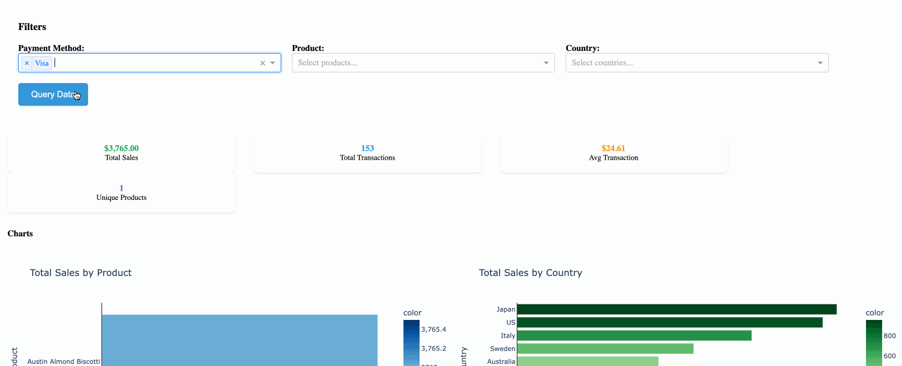
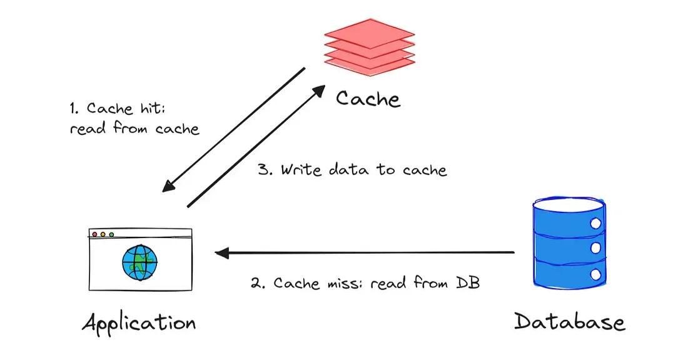
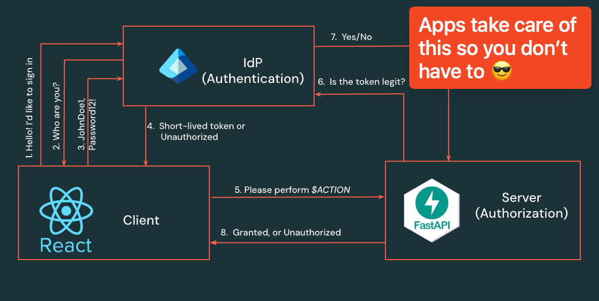

*This post is about solving one of the most frequent and frustrating problems in modern data apps: the dreaded spinning wheel of death.*

Picture this: You've built a beautiful analytics dashboard. Your stakeholders are excited. You choose some filters from dropdowns and then click "Run"... and wait. And wait. That ~15-second SQL query might as well be 15 minutes in demo-time. Your audience starts checking their phones. Someone suggests "circling back later." 

Welcome to the world of data apps without proper caching.

Today, we're investigating **in-memory caching strategies** for Python applications, with a real-world example that turns sluggish Databricks SQL queries into lightning-fast user experiences. By the end, you'll understand when to use different caching approaches and why DuckDB might just be the game-changer you've been looking for.

## Why Caching Matters

Before we jump into the technical stuff, let's talk about why this matters for your users and your business.

**User Experience:** Nothing kills engagement like slow apps. Users expect sub-second response times for interactive dashboards. When your app takes 10+ seconds to load data, you're not just testing patience - you're training users to avoid your application entirely.

**Resource Costs:** Every uncached query hits your data warehouse. On Databricks, that means spinning up compute, transferring data, and burning through your credits. Smart caching can at times reduce your warehouse costs by more than [50%](https://aws.amazon.com/blogs/database/optimize-cost-and-boost-performance-of-rds-for-mysql-using-amazon-elasticache-for-redis/) or more while improving performance.

**Developer Sanity:** There's nothing worse than building a feature that works perfectly until it doesn't scale. Proper caching architecture lets you sleep soundly knowing your app won't crumble under real-world usage.

## The Caching Strategy Spectrum: From Worst to Best

Let's walk through the common approaches to caching data, from the approaches that'll make you cry to the ones that'll make you smile.

### File/Volume Caching: The "It Works on My Machine" Approach

File-based caching feels intuitive at first. Save query results to CSV files, pickle objects, or even Databricks volumes. It's simple to implement:

```python
# The tempting but problematic approach
def get_data_with_file_cache(query):
    cache_file = f"cache/{hash(query)}.csv"
    if os.path.exists(cache_file):
        return pd.read_csv(cache_file)
    
    # Query database
    result = execute_query(query)
    result.to_csv(cache_file, index=False)
    return result
```

**Why it's problematic:**
- **I/O Bottleneck:** Reading from disk is 100x slower than memory access
- **Concurrency Nightmares:** Multiple processes trying to write the same file? Be careful with race conditions
- **Storage Bloat:** Your cache grows indefinitely until someone remembers to clean it up
- **No TTL Management:** TTL stands for "Time to live". If your data gets stale you have no automatic way to refresh it

File caching works for some use cases (think ETL pipelines with infrequent access), but for interactive applications alternative strategies are better.

### Database Caching with SQL Warehouse: Better, But Still Not Great

The next logical step is storing cache in a proper database. You might create a cache table in your Databricks SQL warehouse:

```sql
CREATE TABLE query_cache (
    query_hash STRING,
    result_json STRING,
    created_at TIMESTAMP,
    expires_at TIMESTAMP
)
```

This solves some problems - you get concurrent access, TTL management, and structured queries. You also are able to look at queries people commonly are running, which could help further down the road. But you're still paying the price of network round-trips and database connections for every cache lookup. That costs time and money.

**The middle ground: Lakebase**
Worth mentioning here is [Lakebase](https://docs.databricks.com/aws/en/oltp/), a Databricks managed PostgreSQL OLTP database that provides millisecond-level reads and writes. If you need shared caching across multiple services and can't use pure in-memory solutions, Lakebase bridges the gap between database reliability and in-memory performance. It's particularly powerful when you need caching that survives application restarts but don't want the latency overhead of analytics databases like DBSQL.

### In-Memory Caching: Where the Magic Happens

In-memory caching keeps your data in RAM, eliminating disk I/O and network latency. 

**Important concept:** Unlike frameworks like Streamlit that re-execute your entire Python code with each user interaction, Dash (and most production web frameworks) follow a traditional client-server architecture. Your Python server starts once, stays running, and handles multiple user sessions. This means any cache you create in your server code is shared across all users - when one user's query gets cached, every other user benefits from that same cached result. This server-side caching is what makes in-memory approaches so powerful for multi-user applications. 

But not all in-memory approaches are created equal.

#### The Naive Dictionary Approach

Your in memory cache could be as simple as hashing dropdown values and storing results in a [Python dictioary](https://realpython.com/lru-cache-python/):

```python
# Simple but dangerous
cache = {}

def get_data(query):
    if query in cache:
        return cache[query]
    
    result = execute_query(query)
    cache[query] = result
    return result
```

This works... until it doesn't. No TTL, no size limits, no thread safety. Your app will eventually run out of memory or serve stale data forever. If you want to implement your own cache via a dictionary make sure to add locking for thread safety and some way to manage size and expiration. if you don't, you may run into hard to pin down bugs.

#### LRU Cache: A Step in the Right Direction

Python's `functools.lru_cache` is better:

```python
from functools import lru_cache

@lru_cache(maxsize=128)
def get_data(query):
    return execute_query(query)
```

You get automatic size management and thread safety. But still no TTL, and the LRU eviction strategy might not match your data access patterns. And specifically for Dash apps, the documentation warns that `lru_cache` is designed for [caching data in a single Python process](https://dash.plotly.com/background-callback-caching), so it may not be suitable for multi-user web applications where multiple processes or threads are involved.

#### Enter DuckDB: The Sweet Spot

Here's where DuckDB shines as a caching solution. It's an in-memory analytical database that gives you:
- **SQL interface** for complex cache queries
- **Columnar storage** optimized for analytics workloads  
- **Zero configuration** - no separate database server needed
- **Blazing fast** - designed for analytical queries yet has write performance suitable for caching

Let's see how this looks in practice with a real Dash application.

## Real-World Implementation: A Dash App with DuckDB Caching

I've built a sales analytics dashboard that demonstrates smart caching in action. The app queries sales data from Databricks and uses DuckDB for intelligent in-memory caching. Let's walk through the key components.



### The Architecture

The caching system consists of three main components:

1. **QueryCache class** (`db_helpers.py`) - Manages the DuckDB cache and Databricks connections
2. **Dash app** (`app.py`) - Handles user interactions and leverages cached data
3. **Visualization layer** (`visualizations.py`) - Creates charts and tables from cached results

### Core Caching Logic

Here's the heart of our caching implementation:

```python
class QueryCache:
    def __init__(self, db_config, http_path: str, max_size_mb: int, ttl: int = 24):
        self.max_size_mb = max_size_mb
        self.current_size_mb = 0
        self.duckdb = duckdb.connect(":memory:")  # In-memory DuckDB instance
        self.db_config = db_config
        self.db_http_path = http_path
        self.ttl = ttl  # Time to live in hours
        self.create_table_if_not_exists()
        
    def create_table_if_not_exists(self):
        """Create the DuckDB cache table if it doesn't exist"""
        self.duckdb.execute("""
            CREATE TABLE IF NOT EXISTS cached_queries (
                query_hash TEXT,
                query TEXT,
                result TEXT,
                timestamp TIMESTAMP,
                result_size FLOAT,
                result_records INTEGER
            )
        """)
```

The genius here is using DuckDB as both storage and query engine for the cache itself. We can ask questions like "show me all cached queries larger than 10MB" or "delete all cache entries older than 24 hours" using plain SQL.

### Smart Cache Retrieval

We first check if the query result is in DuckDB. If it is, we check if it's still valid based on our TTL. If it's expired or not found, we hit Databricks SQL, store the result in DuckDB, and return it. Otherwise, we serve the cached result instantly. 



The `get()` method implements the full cache-or-fetch logic:

```python
def get(self, filters: dict[str, list | str]):
    query = self.build_query(filters)
    query_hash = self.hash_query(query)
    
    # Check if query is in DuckDB cache
    result = self.get_from_duckdb(query_hash)
    
    if result is not None:
        # Check if the result is not expired
        duckdb_timestamp = self.get_timestamp_from_duckdb(query_hash)
        if duckdb_timestamp and datetime.now() - duckdb_timestamp < timedelta(hours=self.ttl):
            print("DuckDB Cache Hit: Query served from DuckDB cache.")
            return result
        else:
            # If expired, remove and re-query
            self.remove_from_duckdb(query_hash)
            print("DuckDB Cache Miss: Query expired, querying Databricks SQL.")
    
    # Query Databricks if not in cache or expired
    result = self.read_table_from_databricks_sql(query)
    size, records = sys.getsizeof(result) / (1024 * 1024), len(result)
    self.store_in_duckdb(query_hash, query, result, size, records)
    print("Databricks SQL Call: Query served from Databricks SQL.")
    return result
```

This approach gives us:
- **Automatic expiration** based on configurable TTL
- **Size management** to prevent memory overflow  
- **Detailed logging** so you can see exactly what's happening
- **Graceful fallback** when cache misses occur

### Memory Management

One of the trickiest parts of in-memory caching is preventing your application from consuming all available RAM. Our implementation includes smart size management:

```python
def check_and_manage_duckdb_size(self):
    """Check if DuckDB size exceeds the limit and manage cache size"""
    db_size_mb, db_records = self.duckdb.execute(
        "SELECT coalesce(SUM(result_size), 0), coalesce(SUM(result_records), 0) FROM cached_queries"
    ).fetchone()
    
    print(f"DB Size: {round(db_size_mb, 4)} MB, DB Records: {db_records}")
    if db_size_mb > self.max_size_mb:
        # Remove older queries to manage size
        self.remove_older_queries_from_duckdb()
```

When the cache exceeds our size limit, we automatically evict the oldest entries. You could implement more sophisticated eviction policies (LRU, LFU, or based on query frequency), but for most applications, time-based eviction works perfectly.

### Integration with Dash

Dash leverages this caching easily. Here's the key callback that handles user queries:

```python
@app.callback(
    [Output("data-store", "data"), Output("results-section", "style")],
    [Input("query-button", "n_clicks")],
    [State("payment-method-dropdown", "value"), 
     State("product-dropdown", "value"),
     State("country-dropdown", "value")],
)
def query_data(n_clicks, payment_method, product, country):
    if n_clicks == 0:
        return None, {"display": "none"}
        
    # Build filters dictionary
    filters = {}
    if payment_method:
        filters["paymentMethod"] = payment_method
    if product:
        filters["product"] = product  
    if country:
        filters["country"] = country
        
    # This is where the magic happens - cache-first data retrieval
    df = query_cache.get(filters)
    
    # Convert to JSON for Dash storage
    data = df.to_dict("records")
    return data, {"display": "block"}
```

From the user's perspective, they click "Query Data" and get instant results. Behind the scenes, we're either serving from our lightning-fast DuckDB cache or transparently fetching from Databricks when needed.

## Deployment: Why Databricks Makes This Even Better

When you deploy this app on Databricks, you get additional benefits that make the caching strategy even more powerful:

### Built-in Security and Governance
Databricks handles authentication, authorization, and audit logging automatically. You don't have to worry about user authentication or data access controls - it's all managed by the platform.



### Easy

The steps for deploying a Dash app on Databricks are incredibly straig  htforward:

```bash
# Create a new Databricks App
databricks apps create your_app_name_here

# Sync your local code to Databricks
databricks sync path_to_your_code/ databricks_workspace_folder_here

# Deploy from your Databricks folder
databricks apps deploy your_app_name_here --source-code-path databricks_workspace_folder_here

```

You can make it even selectively deploy to different environments (dev, staging, prod) using [Databricks Asset Bundles](https://docs.databricks.com/aws/en/dev-tools/bundles/).

## Performance Impact: The Numbers Don't Lie

Let's talk about the real-world performance differences:

**Direct Database Query:** 1-2 seconds
- Network latency to SQL warehouse
- Query compilation and execution
- Result transfer over network

**DuckDB Cache Hit:** 3-4 milliseconds  
- In-memory lookup by query hash
- Zero network overhead
- Columnar data already in optimal format

**That's a 250-650x performance improvement.** More importantly, it's the difference between users actively engaging with your app versus abandoning it in frustration.

Memory usage is remarkably efficient too. Our sample app with 50,000 cached sales records uses about 15MB of RAM - a tiny fraction compared to the performance gains.

## Best Practices: Choosing Your Caching Strategy

Based on the patterns we've explored, here's how to choose the right caching approach:

### Use File/Volume Caching When:
- Data changes infrequently (daily ETL results)
- Single-user applications or strict sequential access
- Cache persistence across application restarts is critical
- Working with very large datasets that exceed memory limits

### Use Database Caching When:
- Multiple applications need shared cache access
- Complex query patterns for cache management
- Audit requirements for cache access
- Cache needs to survive infrastructure failures
- Consider **Lakebase** OLTP for millisecond-level caching of query results

### Use In-Memory Caching When:
- Interactive applications requiring sub-second response times
- Query results fit comfortably in available memory
- Cache can be rebuilt quickly if lost
- Single application or microservice architecture

### Use DuckDB Specifically When:
- You need SQL capabilities for cache management
- Working with analytical/columnar data
- Want zero-configuration in-memory database features
- Need transaction consistency for cache operations


## Ready to Implement?

The complete code for this Dash + DuckDB caching implementation is available on [github](https://github.com/mpkrass7/fast-cache-with-dash), including deployment configuration for Databricks. The pattern scales from prototype to production and handles the edge cases that often trip up caching implementations.

Good caching is invisible to users but transformative for their experience. When your stakeholders start commenting on how "fast" and "responsive" your applications feel, you'll know you've got it right.

The next time someone asks you to build a data app, don't just think about the visualizations and business logic. Think about the caching strategy from day one. Your users (and your future self) will thank you.

*Ready to build lightning-fast data apps? Start with smart caching, deploy on Databricks, and watch your user engagement soar.*

---

**About the Implementation:** This blog post references a Dash application demonstrating DuckDB caching with Databricks SQL queries. The complete source code includes unit tests, end-to-end testing with Playwright, and deployment configuration using Databricks Asset Bundles. 

## Credit Where it's Due

- I borrowed much of the caching strategy from Soumil Shah's implementation of a Postgres Query Cache with DuckDB: https://github.com/soumilshah1995/PostgresQueryCache-DuckDB/tree/main
- I added a CI/CD pipeline that runs unit tests and can redeploy the app on a new github release. I figured this out by following Pascal Vogel and Antonio Samaniego Jurado's blog post on automating app deployments to Databricks: https://apps-cookbook.dev/blog/automate-apps-deployments-dabs
- Claude Code helped me outline and refine the blog post
- Cursor helped me fix my dash front end and make the charts look nice