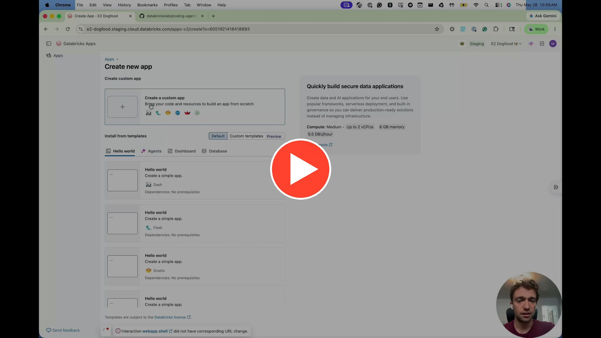

## What is CoDA?

CoDA (**Co**ding **A**gents on **D**atabricks **A**pps) is a terminal running in your browser as a Databricks App with five coding agents installed and ready to use: Claude Code, Codex, Gemini CLI, Hermes, and OpenCode. Every model call goes through the Databricks AI Gateway. You open a tab and the agents are already wired to your workspace. Since it's a Databricks app, the code, the credentials, and the context never leave Databricks. Every model call uses Foundation Model APIs, so there is no third-party egress, and actions respect your Unity Catalog permissions.

It ships with curated skills and MCP servers so you can go from idea to shipped feature fast, with the same governance you already trust for every other Databricks workload.

<video src="./coda-promo.mp4" controls preload="metadata" poster="./walkthrough-poster.jpg" style="display:block;margin:0 auto;width:100%;max-width:640px;">
  Your browser does not support embedded video. <a href="./coda-promo.mp4">Download the promo</a>.
</video>

## What's Inside

- **Claude Code** — Anthropic's agent with 39 Databricks skills and 2 MCP servers
- **Codex** — OpenAI's coding agent, pre-configured for Databricks
- **Gemini CLI** — Google's coding agent with shared skills
- **Hermes Agent** — NousResearch's multi-provider AI CLI with tool-calling
- **OpenCode** — Open-source multi-provider agent

Every agent installs at boot. On your first terminal session you paste a short-lived PAT and all CLIs are configured automatically. Tokens auto-rotate every 10 minutes.

## Why it lives on Databricks

First and most importantly, it gives you access to coding agents without running them directly on your desktop. You are getting a sandbox to go crazy without worry about accidentally deleting critical files. Secondary but still neat, it integrates with lots of pieces of Databricks including:

- **Unity Catalog** governs all data access — agents only touch what your identity allows.
- **AI Gateway** routes every LLM call through a single control plane — swap models, set rate limits, manage keys centrally.
- **MLflow Tracing** captures every session for review and evaluation.
- **App Logs to Delta** for long-term retention and dashboarding.

## Try it

Watch a recording of me setting it up in 5 minutes:

The repo lives at [databrickslabs/coding-agents-databricks-apps](https://github.com/databrickslabs/coding-agents-databricks-apps). Click "Use this template" on the repo to spin up your own copy and deploy it as a Databricks App in your workspace. 

## Random Learnings

I'm a contributor and maintainer for CoDA. Working with git and writing / reviewing code is nothing new for me. One thing that has been new for me is promoting it using this neat framework called 'remotion'. It renders scenes using react so it pairs well with coding agents. That's how I made the promo video. Another call out goes to Mureka, which I used to make the music. Specifically, I typed 'chill, ambient, happy' and clicked 'Create'. Technology is unbelievable. 

I did the same thing for my mom to help her fundraise for an ALS bikeride earlier this week. She was quite pleased. Good son points. Here's her [donate link](tst.als.net/fundraise/?p=501671): 

<video src="./als-promo.mp4" controls preload="metadata" style="display:block;margin:0 auto;width:100%;max-width:320px;">
  Your browser does not support embedded video. <a href="./als-promo.mp4">Download the video</a>.
</video>

